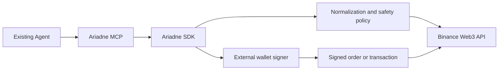

# Ariadne

## Agent-native safety and execution infrastructure for tokenized assets

Ariadne is a TypeScript SDK and MCP server for applications and existing AI agents that need to discover, compare, understand and safely prepare tokenized-stock actions on BNB Chain.

Ariadne is not an autonomous trading agent. It provides structured financial context, safety checks, simulation and an externally signed execution boundary that existing agents can use.

## Why Ariadne exists

Tokenized stocks are not a single uniform asset namespace. The same underlying ticker can be represented by different platforms, contracts, symbols, pricing references and execution modes. An agent that sees only a ticker is not ready to construct a safe action.

```text
resolve identity → compare wrappers → read market context → build plan
→ simulate → confirm → external wallet signature → broadcast
```

The SDK keeps discovery and execution separate. The MCP layer exposes the same domain model to existing clients such as Codex and Claude Code.

The product is organized as an Agent-native interaction layer: users express intent, while Ariadne resolves issuer-aware assets, organizes market context, compares representations and prepares reviewable next steps.

## System boundary



The SDK never receives or stores a private key. RFQ signing and broadcast authorization remain explicit user-wallet responsibilities.

## Verified project snapshot

The current evidence package contains 105 audited request records, 40 result snapshots and 5 safety-result records. The audit passed with 105 unique record identifiers, no broadcasted records, no coverage gaps and no recorded failures.


**Observed latency distributions.** Empirical cumulative distributions are shown for the audited development observations. The figure reports the full observed distribution rather than reducing performance to a single mean; it is not a production SLO claim.


**Observed response classifications.** The heatmap preserves the response classes actually recorded by the experiment harness across asset discovery, market context, quote preparation, safety reads, simulation, upstream error handling and retry behavior.

The complete evidence model, audit output and reproducible figure inputs are maintained under [`research/`](research/).

## Current capabilities

- Resolve tokenized-stock identity by ticker, chain, platform and contract.
- Discover and compare issuer-aware tokenized-stock representations through high-level Agent-native MCP tools.
- Prepare an ActionPlan from a user intent without silently selecting between multiple issuers.
- Screen assets by explicit preferences and summarize tokenized-stock wallet exposure without making investment recommendations.
- Compare wrappers such as Ondo and bStocks.
- Normalize token price, reference price, market state, candles and data warnings.
- Read wallet exposure, portfolio information and transaction context.
- Create and simulate ActionPlans before execution.
- Enforce allowance, balance, market-state, slippage and price-impact checks.
- Prepare RFQ signing requests without handling private keys.
- Expose 18 MCP tools for existing agents and applications, including the one-call `research_tokenized_stock` workflow.
- Record request attempts, latency, business codes and rate-limit headers.
- Retry documented transient failures while keeping broadcast operations explicit and non-automatic.

## MCP response contract

Every MCP tool returns its domain payload together with an `outcome` object:

```json
{
  "outcome": {
    "status": "success",
    "nextAction": "Review the simulation, then confirm the plan if appropriate",
    "warnings": [],
    "sideEffects": "none"
  }
}
```

`status` is one of `success`, `warning`, `blocked` or `error`. `nextAction` is an agent-readable continuation hint, while `sideEffects` makes external signing and broadcast boundaries explicit. Existing domain fields remain at the top level for compatibility.

## Safety model

```text
read → plan → simulate → confirm → sign externally → submit → poll status
```

`broadcast_confirmed_transaction` is the only explicit broadcast boundary. It requires a confirmed ActionPlan and an externally signed raw transaction. No private key handling is implemented in Ariadne.

## Quickstart

For a credential-free first experience, see [`docs/QUICKSTART.md`](docs/QUICKSTART.md) and run:

```bash
npm install
npm run mcp:demo
```

Demo Mode is deterministic and read-only. It does not create executable plans, sign or broadcast.

```bash
npm install
npm run typecheck
npm run test:domain
npm run test:simulation
npm run test:mcp
```

The no-funds simulation path does not broadcast a transaction. Copy [`docs/mcp-config.example.json`](docs/mcp-config.example.json) into the MCP client configuration and set its working directory to the absolute repository path. For the lowest-friction first run, launch `npm run mcp:demo` and ask for a natural-language tokenized-stock research brief; the Agent can select `research_tokenized_stock` without the user naming a tool.

## Evidence and limitations

The complete evaluation protocol, observations, failure taxonomy and deferred tests are in [`docs/TECHNICAL_RESEARCH_REPORT.md`](docs/TECHNICAL_RESEARCH_REPORT.md). In particular:

- Real RFQ settlement requires an external wallet signature and remains deferred.
- Funded post-trade balance and successful broadcast validation remain deferred until a funded wallet is intentionally used.
- Three documented DeFi Positions request variants returned upstream business code `50000`; Ariadne records this as an upstream blocker rather than an empty result.
- Demo video and final submission material are intentionally outside the current implementation scope.

## Repository map

- `src/` — SDK domain, services and MCP adapter;
- `scripts/` — tests and API probes;
- `research/` — evidence data, experiment records and reproducible figure generation;
- [`docs/PRD_AGENT_NATIVE_RWA.md`](docs/PRD_AGENT_NATIVE_RWA.md) — Agent-native product requirements;
- [`docs/CAPABILITY_MAP_AGENT_NATIVE_RWA.md`](docs/CAPABILITY_MAP_AGENT_NATIVE_RWA.md) — capability and Track mapping;
- [`docs/TECHNICAL_RESEARCH_REPORT.md`](docs/TECHNICAL_RESEARCH_REPORT.md) — complete technical evaluation;
- [`docs/DEVELOPER_EXPERIENCE_LOG.md`](docs/DEVELOPER_EXPERIENCE_LOG.md) — factual API development log.
