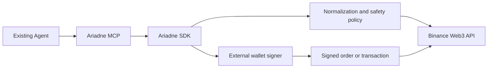

# Ariadne

## Agent-native safety and execution infrastructure for tokenized assets

Ariadne is a TypeScript SDK and MCP server for applications and existing AI agents that need to discover, compare, understand and safely prepare tokenized-stock actions on BNB Chain.

Ariadne is not an autonomous trading agent. It provides structured financial context, safety checks, simulation and an externally signed execution boundary that existing agents can use.

## Why Ariadne exists

Tokenized stocks are not a single uniform asset namespace. The same underlying ticker can be represented by different platforms, contracts, symbols, pricing references and execution modes. An agent that sees only a ticker is not ready to construct a safe action.

```text
resolve identity → compare wrappers → read market context → build plan
→ simulate → confirm → external wallet signature → broadcast
```

The SDK keeps discovery and execution separate. The MCP layer exposes the same domain model to existing clients such as Codex and Claude Code.

## System boundary



The SDK never receives or stores a private key. RFQ signing and broadcast authorization remain explicit user-wallet responsibilities.

## Verified project snapshot


The current acceptance audit contains 88 items: 80 verified and 8 incomplete or externally blocked. The full evidence model and figure-generation inputs are maintained under [`research/`](research/).

## Current capabilities

- Resolve tokenized-stock identity by ticker, chain, platform and contract.
- Compare wrappers such as Ondo and bStocks.
- Normalize token price, reference price, market state, candles and data warnings.
- Read wallet exposure, portfolio information and transaction context.
- Create and simulate ActionPlans before execution.
- Enforce allowance, balance, market-state, slippage and price-impact checks.
- Prepare RFQ signing requests without handling private keys.
- Expose 12 MCP tools for existing agents and applications.
- Record request attempts, latency, business codes and rate-limit headers.
- Retry documented transient failures while keeping broadcast operations explicit and non-automatic.

## Safety model

```text
read → plan → simulate → confirm → sign externally → submit → poll status
```

`broadcast_confirmed_transaction` is the only explicit broadcast boundary. It requires a confirmed ActionPlan and an externally signed raw transaction. No private key handling is implemented in Ariadne.

## Quickstart

```bash
npm install
npm run typecheck
npm run test:domain
npm run test:simulation
npm run test:mcp
```

The no-funds simulation path does not broadcast a transaction. Copy [`docs/mcp-config.example.json`](docs/mcp-config.example.json) into the MCP client configuration and set its working directory to the absolute repository path.

## Evidence and limitations

The complete evaluation protocol, observations, failure taxonomy and deferred tests are in [`docs/TECHNICAL_RESEARCH_REPORT.md`](docs/TECHNICAL_RESEARCH_REPORT.md). In particular:

- Real RFQ settlement requires an external wallet signature and remains deferred.
- Funded post-trade balance and successful broadcast validation remain deferred until a funded wallet is intentionally used.
- Three documented DeFi Positions request variants returned upstream business code `50000`; Ariadne records this as an upstream blocker rather than an empty result.
- Demo video and final submission material are intentionally outside the current implementation scope.

## Repository map

- `src/` — SDK domain, services and MCP adapter;
- `scripts/` — tests and API probes;
- `research/` — evidence data and reproducible figure generation;
- [`docs/TECHNICAL_RESEARCH_REPORT.md`](docs/TECHNICAL_RESEARCH_REPORT.md) — complete technical evaluation;
- [`docs/DEVELOPER_EXPERIENCE_LOG.md`](docs/DEVELOPER_EXPERIENCE_LOG.md) — factual API development log.
