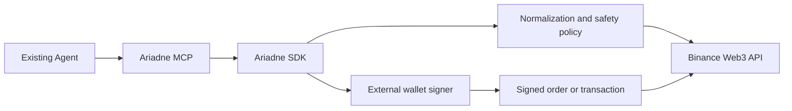
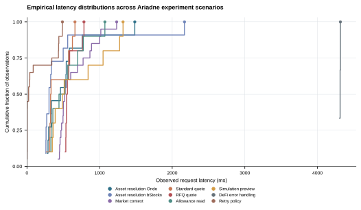
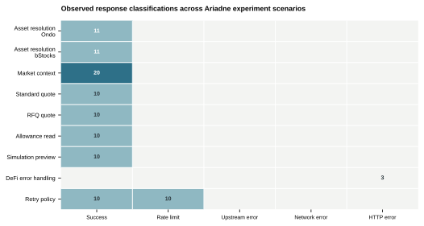

# Ariadne

## AI-native interaction infrastructure for onchain finance

Ariadne gives AI agents, developers and direct users one coherent way to discover, understand, compare and act on tokenized equities and real-world assets. Its TypeScript SDK and MCP server turn fragmented onchain data and execution modules into issuer-aware financial objects, research evidence and reviewable action states on BNB Chain.

**Make onchain markets intelligible and actionable for AI.**

Ariadne works with existing Agents rather than replacing them. Safety checks, simulation and externally controlled signing are foundations of the interaction model, not the product's headline identity.

## Why Ariadne exists

Tokenized stocks are not a single uniform asset namespace. The same underlying ticker can be represented by different platforms, contracts, symbols, pricing references and execution modes. An agent that sees only a ticker is not ready to construct a safe action.

```text
resolve identity → compare wrappers → read market context → build plan
→ simulate → confirm → external wallet signature → broadcast
```

The SDK keeps discovery and execution separate. The MCP layer exposes the same domain model to existing clients such as Codex and Claude Code.

The product is organized as an AI-native interaction core: users express intent, while Ariadne resolves issuer-aware assets, organizes market context, compares representations and prepares reviewable next steps.

## Product surfaces

Ariadne is designed as one semantic core with three access surfaces:

- the TypeScript SDK for developers and institutional integrations;
- the MCP server for existing Agents such as Codex and Claude Code;
- the Ariadne web product for direct research, issuer comparison, wallet context and read-only quote interaction without requiring a third-party Agent to summarize the result.

The current repository implements the SDK and MCP core, a local Hosted MCP proof of concept and a local web Demo/Live Read-only surface. The web surface is not a public deployment, and public Hosted MCP, npm publication and final distribution remain subsequent release decisions.

## System boundary


```mermaid
flowchart LR
    A[Existing Agent] --> B[Ariadne MCP]
    B --> C[Ariadne SDK]
    C --> D[Normalization and safety policy]
    D --> E[Binance Web3 API]
    C --> F[External wallet signer]
    F --> G[Signed order or transaction]
    G --> E
```

The SDK never receives or stores a private key. RFQ signing and broadcast authorization remain explicit user-wallet responsibilities.

## Verified project snapshot

The current evidence package contains 105 audited request records, 40 result snapshots and 5 safety-result records. The audit passed with 105 unique record identifiers, no broadcasted records, no coverage gaps and no recorded failures.



**Observed latency distributions.** Empirical cumulative distributions are shown for the audited development observations. The figure reports the full observed distribution rather than reducing performance to a single mean; it is not a production SLO claim.



**Observed response classifications.** The heatmap preserves the response classes actually recorded by the experiment harness across asset discovery, market context, quote preparation, safety reads, simulation, upstream error handling and retry behavior.

The complete evidence model, audit output and reproducible figure inputs are maintained under [`research/`](research/).

## Current capabilities

- Resolve tokenized-stock identity by ticker, chain, platform and contract.
- Discover and compare issuer-aware tokenized-stock representations through high-level Agent-native MCP tools.
- Prepare an ActionPlan from a user intent without silently selecting between multiple issuers.
- Screen assets by explicit preferences and summarize tokenized-stock wallet exposure without making investment recommendations.
- Compare wrappers such as Ondo and bStocks.
- Normalize token price, reference price, market state, candles and data warnings.
- Read wallet exposure, portfolio information and transaction context.
- Create and simulate ActionPlans before execution.
- Enforce allowance, market-state, slippage and verified-unit price-impact checks. ERC-20 plans without a quote-declared, verifiable spender fail closed; input-token/native BNB balances and allowance are rechecked before guarded BSC EVM broadcast. Funded settlement remains unverified.
- Offer `GuardedEvmExecutionService` for one standard BSC EVM action through the standalone SDK, accepting only the unchanged in-memory plan object issued by SDK preparation; it applies staged plan binding, external signature verification, reviewed gas limits, live balance and allowance checks, and one-attempt replay protection.
- Prepare RFQ signing requests without handling private keys.
- Expose 18 MCP tools for existing agents and applications, including the one-call `research_tokenized_stock` workflow.
- Return stable issuer-by-issuer evidence entries, explicit identity/market-data coverage and read-only next steps instead of relying on fragile Markdown tables.
- Report Ariadne workflow timing with an explicit boundary that excludes calling-Agent reasoning and final-answer rendering.
- Browse the verified BSC RWA directory with official token and issuer metadata, then move into issuer comparison, evidence inspection, public-address exposure or explicit-issuer quote preview.
- Run a direct multi-page web product with dedicated SDK, MCP, asset-directory, research, portfolio and read-only quote surfaces.
- Record request attempts, latency, business codes and rate-limit headers.
- Retry documented transient failures while keeping broadcast operations explicit and non-automatic.

## MCP response contract

Every MCP tool returns its domain payload together with an `outcome` object:

```json
{
  "outcome": {
    "status": "success",
    "nextAction": "Review the simulation, then confirm the plan if appropriate",
    "warnings": [],
    "sideEffects": "none"
  }
}
```

`status` is one of `success`, `warning`, `blocked` or `error`. `nextAction` is an agent-readable continuation hint, while `sideEffects` makes external signing and broadcast boundaries explicit. Existing domain fields remain at the top level for compatibility.

## Safety model

```text
read → plan → simulate → confirm → sign externally → submit → poll status
```

The MCP `broadcast_confirmed_transaction` tool and SDK `GuardedEvmExecutionService.broadcastSigned()` are the guarded standard-EVM broadcast boundaries. Both require a confirmed, unchanged plan and an externally signed raw transaction. No private key handling is implemented in Ariadne. The generic callback `ExecutionService` and raw `TransactionService.broadcastSigned()` remain lower-level integrator-owned escape hatches; see [`docs/SDK_USAGE.md`](docs/SDK_USAGE.md).

## Quickstart

For a credential-free first experience, see [`docs/QUICKSTART.md`](docs/QUICKSTART.md) and run:

```bash
npm install
npm run mcp:demo
```

Demo Mode is deterministic and read-only. It does not create executable plans, sign or broadcast.

```bash
npm install
npm run typecheck
npm run test:domain
npm run test:simulation
npm run test:mcp
```

The no-funds simulation path does not broadcast a transaction. Copy [`docs/mcp-config.example.json`](docs/mcp-config.example.json) into the MCP client configuration and set its working directory to the absolute repository path. For the lowest-friction first run, launch `npm run mcp:demo` and ask for a natural-language tokenized-stock research brief; the Agent can select `research_tokenized_stock` without the user naming a tool.

For a direct browser experience that does not depend on Codex or Claude Code summarization, run:

```bash
npm run web:demo
```

Then open `http://127.0.0.1:3000`. The Next.js App Router serves the direct product experience; its read-only API runs separately and is proxied through the same origin. Demo Mode uses deterministic data and never accepts a private key, creates an ActionPlan or broadcasts. `npm run web:live` starts the same Next.js site with the local Live Read-only API and server-side Binance credentials from `.env`; it remains local-only.

## Evidence and limitations

The complete evaluation protocol, observations, failure taxonomy and deferred tests are in [`docs/TECHNICAL_RESEARCH_REPORT.md`](docs/TECHNICAL_RESEARCH_REPORT.md). In particular:

- Real RFQ settlement requires an external wallet signature and remains deferred.
- Funded post-trade balance and successful broadcast validation remain deferred until a funded wallet is intentionally used.
- Three documented DeFi Positions request variants returned upstream business code `50000`; Ariadne records this as an upstream blocker rather than an empty result.
- Demo video and final submission material are intentionally outside the current implementation scope.

## Repository map

- `src/` — SDK domain, services and MCP adapter;
- `scripts/` — tests and API probes;
- `research/` — evidence data, experiment records and reproducible figure generation;
- [`docs/CAPABILITY_MAP_AGENT_NATIVE_RWA.md`](docs/CAPABILITY_MAP_AGENT_NATIVE_RWA.md) — capability and Track mapping;
- [`docs/TECHNICAL_RESEARCH_REPORT.md`](docs/TECHNICAL_RESEARCH_REPORT.md) — complete technical evaluation;
- [`docs/PRODUCT_SURFACE_ARCHITECTURE.md`](docs/PRODUCT_SURFACE_ARCHITECTURE.md) — product boundaries, surfaces and track maturity;
- [`docs/DEVELOPER_EXPERIENCE_LOG.md`](docs/DEVELOPER_EXPERIENCE_LOG.md) — factual API development log.
