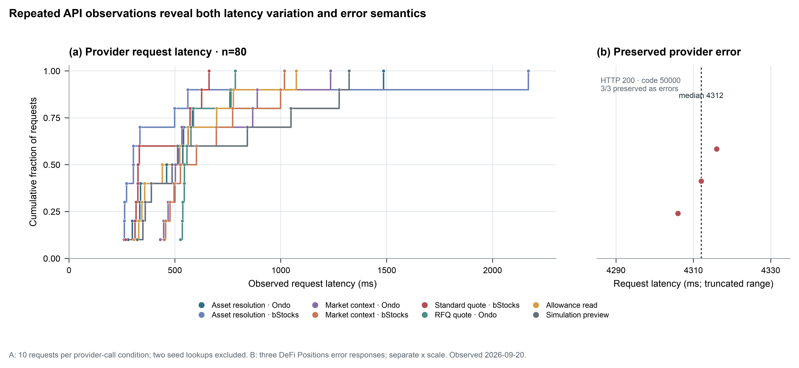
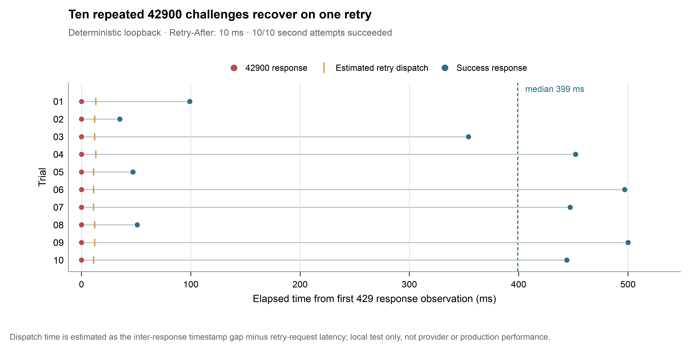

# From Intent to Auditable Action: A Developer-Experience Evaluation of Ariadne’s Tokenized-Equity SDK and MCP

**Artifact-centered technical report** 
**Evaluation window:** 20 September–10 October 2026 
**System:** Ariadne TypeScript SDK and Model Context Protocol (MCP) server, BNB Smart Chain (BSC) tokenized-stock workflows

## Abstract

This report evaluates the developer experience of Ariadne, an SDK/MCP integration layer for discovering, comparing, researching, and preparing user-reviewed actions for tokenized equities. The evaluation synthesizes six evidence streams: onboarding, documentation, provider/API behavior, Agent and wallet integration, tokenized-stock market observations, and engineering recommendations. Evidence includes dated read-only Binance Web3 observations, a local-package clean-room consumer, deterministic tests and experiment records, repository/code inspection, owner-reported use, and one owner-authorized funded BSC purchase. The evaluation found that the shared SDK/MCP domain model preserves issuer identity and data caveats, while first-use friction previously came from implicit issuer selection and empty SDK queries; both have been corrected. A one-time audit returned 488 BSC representations and confirmed research and timestamped-price coverage for all 488; unsigned quote/build readiness was 46/46 bStocks and 239/442 Ondo at the audit time. Repeated request records support two bounded experiments: latency distributions across 80 provider calls and ten deterministic local retry cycles; neither estimates production performance. The observed end-to-end wallet journey used Codex MCP, an external Edge page, and MetaMask; the MCP contract is designed for other standards-compatible Agent hosts, but host-specific routing, UI rendering, wallet prompting, and automatic final reporting have not been validated across them. One real 7 USDT bStocks NVDAB purchase succeeded and reconciled on BSC. This single route does not establish cross-asset or cross-issuer funded reliability. The report closes with concrete distribution, onboarding, provider-contract, and host-validation priorities.

**Keywords:** developer experience; Model Context Protocol; TypeScript SDK; tokenized equities; BNB Smart Chain; API integration; agent interoperability

## 1. Introduction

Tokenized equities do not form a single ticker namespace. A company can have multiple issuer-specific representations, contracts, symbols, quote paths, market states, and execution modes. An integration that discards issuer or contract identity can therefore turn an apparently simple lookup into an ambiguous or unsafe workflow.

Ariadne packages this domain behind a TypeScript SDK for application developers and an MCP server for existing Agent hosts. The Agent remains responsible for natural-language interpretation and tool choice; Ariadne resolves issuer-aware assets, normalizes market context, reports missing data, and exposes reviewable actions. MCP Apps can add a read-only visual presentation where the host supports that extension. Signing remains in an external user-controlled wallet [3].

This report separates developer experience from repository usage guidance. The README is a compact repository and setup guide; this document is the research-style evaluation. Reproducible experiments and public API-contract evidence are linked directly in the references. The goal is not to claim a representative user study. It is to make the available experience evidence, its provenance, and its limits inspectable.

## 2. Evaluation design

### 2.1 Scope and evidence sources

The evaluation covers six modules requested for the developer-experience review:

1. onboarding from repository entry to first SDK/MCP use;
2. documentation accuracy, navigation, and missing contracts;
3. API traps, failure semantics, retries, and latency;
4. Agent-host, MCP, SDK, CLI, and wallet boundaries;
5. issuer-specific BSC tokenized-stock data and execution observations;
6. integration redesign and feature/distribution recommendations.

Evidence was drawn from the public repository, dated sanitized observations in `research/data/`, append-only experiment records, workflow evidence and reviews, documented owner experience, and code/test contracts. Six separate read-only subagent reviews were used to organize those modules; the report treats their notes as an extraction aid, not as independent user evidence. Material claims point to the underlying repository records or documents.

### 2.2 Evidence classification

| Label | Meaning in this report | Example |
|---|---|---|
| **Measured** | A bounded value recorded by an instrumented run or structured audit | Repeated request latencies; ten local retry cycles; 488 returned representations |
| **Observed** | A specific provider, host, owner, or chain event documented at a date | One Codex MCP failure and recovery; one funded purchase |
| **Verified implementation** | A local code contract or deterministic/clean-room check | Explicit `assetId` selection; blank-query rejection |
| **Interpretation** | A reasoned implication of the evidence | MCP protocol supports compatible hosts in principle |
| **Unverified** | No adequate evidence in this evaluation | Equivalent wallet UX across other Agent hosts |

Synthetic fixtures, read-only provider calls, unsigned quote/build operations, and funded-chain evidence are kept distinct. A passing deterministic check is not presented as a live-provider or user outcome.

### 2.3 Experimental variables and analysis

The figures analyze retained request-level records rather than replotting summary counts. Figure 1 uses `latency_ms` as the measured outcome and request scenario as the grouping variable. It includes ten repetitions for each of eight provider-call conditions (80 calls); the two extra asset seed lookups are excluded. Three DeFi Positions error responses are shown separately because they followed a distinct provider-error branch and have a different latency range. Figure 2 treats each sequential two-attempt loopback cycle as the experimental unit. The server injects a `42900` response with `Retry-After: 10 ms`, then returns success on the single permitted retry. Per-trial recovery time is derived from the difference between the recorded response timestamps; estimated dispatch time subtracts the retry request's measured latency from that interval. No significance test or production inference is made. The issuer-specific market-context calls were run in sequential blocks rather than randomized order, so their latency contrast is descriptive and cannot be attributed causally to issuer.

### 2.4 Reproducibility and ethics

The report uses retained aggregate records and does not reproduce API credentials, raw authenticated payloads, or private wallet material. The figures are regenerated from `research/experiments/records/readonly.jsonl` and `safety.jsonl` by `research/figures/developer-experience/render_developer_experience.py`; each plotted observation is derived directly from those source records. The plotting conventions follow the repository's example figures and the [figures4papers scientific figure-making guide](https://github.com/ChenLiu-1996/figures4papers/blob/main/scientific-figure-making/SKILL.md), its [design theory](https://github.com/ChenLiu-1996/figures4papers/blob/main/scientific-figure-making/references/design-theory.md), and [export/API conventions](https://github.com/ChenLiu-1996/figures4papers/blob/main/scientific-figure-making/references/api.md). The figures are evidence views, not decorative or interpolated time series.

## 3. Results

### 3.1 Onboarding: clear entry points, but no measured first-use duration

The credential-free MCP path is documented as a short local setup: install the repository, generate Demo configuration, add it to an MCP host, and ask for catalog or stock research. Demo data are synthetic and read-only. Live mode is explicitly separate and requires credentials in a local `.env` file [1]. The SDK has an independent path: build and pack the local ESM package, install the tarball in a consuming project, search, inspect each returned identity, then select the exact `assetId` before requesting market context [2].

Two concrete onboarding defects were repaired. The SDK example formerly selected `assets[0]`, silently choosing an issuer when a ticker had multiple representations. It now prints candidates and requires the caller to pass an exact returned `assetId`. Blank and whitespace-only queries formerly reached the provider; they now fail locally with a stable `TypeError`, with a clean-room check confirming zero provider requests for those inputs. The isolated consumer also imports runtime exports and declarations and inspects both Ondo and bStocks NVDA identities [2, 7].

The available measurements do **not** establish how long a new developer takes from opening the documentation to a first successful API call. The 2,279 ms total in the 4 October SDK record covers six successful read-only requests in an already prepared isolated consumer; it excludes reading, installing prerequisites, creating credentials, Agent setup, and user decisions [8]. Accordingly, time-to-first-call and novice completion rate remain unmeasured onboarding outcomes.

### 3.2 Documentation: separation improves discoverability; provider-contract gaps remain external

The repository previously placed project positioning, capability claims, research findings, workflow evidence, and setup guidance together in README. That made it harder to distinguish instructions for using the project from evidence about how it performed. This revision refocuses README on prerequisites, installation, Demo/Live configuration, SDK entry points, development checks, and links to deeper documents. The developer-experience paper now owns the cross-cutting evaluation narrative; implementation-specific behavior is supported by the referenced public source, tests, and API-contract audit [1, 4].

The existing Quickstart and SDK guide provide distinct MCP and local SDK paths, but the SDK guide also explains MCP response semantics and tool choice because the same domain layer is consumed through both surfaces [1, 2]. No retained human report identifies a specific wrong instruction page encountered during onboarding; this absence is stated rather than replaced by an invented anecdote.

A separate documentation gap is upstream: the reviewed Binance Web3 contract did not establish directory pagination or total-count semantics, and an OpenAPI download timed out during the documented review. In a 3 October observation, platform metadata summed to 545 BSC records while the token-list response contained 488 unique identities. The 57-count difference is unexplained and cannot be called 57 missing stocks. This is a provider-contract uncertainty, not evidence that Ariadne’s setup instructions are wrong [4, 5, 8].

### 3.3 API traps and latency: status codes are insufficient, batching is contract-sensitive

Several integration findings had direct implementation impact:

- **HTTP success can contain a business failure.** On 20 September, three DeFi Positions request variants returned HTTP 200 with business code `50000`. Treating transport success as an empty positions list would conceal the upstream failure; Ariadne retains it as an error [8, 9].
- **Provider limits affected batching.** The BSC RWA price endpoint rejected 100-address batches with an invalid response while a 50-address batch matched the provider-compatible boundary. Ariadne’s adapter was corrected; the later audit then obtained timestamped market-data coverage for all 488 rows returned in that snapshot [4, 10].
- **Market category and tradability are separate fields.** A historical bStocks response had `marketStatus=unknown` alongside `openState=true`. Ariadne previously treated the unknown category as a market-closed signal; the check was corrected to preserve the unknown-category warning while evaluating the separate explicit tradability flag [4, 6].
- **Retry timing has a bounded contract.** The client honors numeric and HTTP-date `Retry-After` values, but fails fast if the requested delay exceeds the configured budget. The retry-policy evidence is a deterministic test, not a claim about provider availability [2, 8].

Historical SDK/MCP interaction latency was separately measured on 20 September in three runs per request operation and one MCP connection sample. SDK search measured 259–621 ms and market context 841–944 ms; MCP search measured 262–571 ms and market context 405–836 ms; the single MCP connect sample was 363 ms. These remain small dated samples, not percentiles, current latency, production traffic, or an SLO. Agent reasoning and final-answer rendering were excluded [8].

The request-level API experiment recorded 105 observations on 20 September: 80 repeated provider calls across eight conditions, two seed lookups, three DeFi Positions errors, and 20 attempts from ten loopback retry cycles. Across the same NVDA market-context endpoint, the exploratory median was 511 ms for Ondo and 564 ms for bStocks (10 calls per issuer). The calls were made in sequential issuer blocks, so this 53 ms difference is descriptive and does not establish an issuer effect. Figure 1 shows empirical distributions for the repeated provider calls and the separate three-record error branch; it does not fit a distribution or collapse the observations to means [9, 11].

**Figure 1.** (a) Empirical cumulative distributions of 80 observed request latencies, with ten calls in each provider-call condition. Two seed lookups and the local retry fixture are excluded. (b) Three DeFi Positions requests returned HTTP 200 with provider business code `50000`; all three were classified and preserved as errors. Panel (b) uses a separate, truncated x-axis (4,285–4,335 ms) and should not be visually compared in scale with panel (a). Raw data are dated 20 September 2026 [9, 11].

To examine retry behavior as a protocol experiment rather than a summary count, ten sequential cycles against a deterministic loopback server were analyzed separately. Each began with `42900` and proceeded to a successful second attempt. The source server supplied `Retry-After: 10 ms`; response timestamps and retry request durations imply dispatch intervals of 11–13 ms. Time from observing the first rate-limit response to observing success ranged from 35 to 500 ms (median 399 ms). These derived intervals include local process/scheduling effects and are not provider latency estimates [9, 14].

**Figure 2.** One horizontal lane per loopback trial. Red markers show the initial rate-limit response, amber ticks show estimated retry dispatch, and blue markers show the successful retry response. The dashed line marks the median response-to-success interval. The retry dispatch estimate is derived from successive recorded response timestamps minus the measured retry-request duration; it is not a directly instrumented timer. The experiment used no wallet signing or broadcast and says nothing about production reliability [9, 14].

### 3.4 AI stack and wallet: portable MCP contract, host-specific user experience

Ariadne is an SDK/MCP integration surface, not a standalone Agent or autonomous wallet. MCP tool schemas and domain responses can be consumed by other Agent hosts that implement the relevant MCP protocol; this is an architectural interoperability claim. The directly observed Agent journey used **Codex**. In that journey, the owner researched and compared BSC NVDA representations through Codex MCP, selected bStocks NVDAB, followed an external Edge purchase link, and reviewed a MetaMask request. The user—not Ariadne—controlled wallet approval [3, 6, 12].

The user-facing behavior is not proven identical across hosts. Automatic tool selection, MCP App rendering, dimensions and scrolling, browser handoff, wallet-popup delivery, and automatic final conversation reports can depend on host capabilities and configuration. The Codex path therefore establishes a real tested host, while compatible MCP Agents are a reasonable integration target; it does not certify their complete UI or wallet journey. No host-specific Claude Code or Agent Studio execution evidence was found in this evaluation [3, 5, 6].

An observed 7 October Codex MCP App diagnostic stopped at an ephemeral `codex-sandbox://` origin before wallet pairing. The project moved the purchase handoff to an external browser. On 9 October, the owner confirmed that MetaMask opened from the fresh purchase link, showing that the later tested path worked in that environment [6, 12]. One earlier `research_tokenized_stock` call returned a provider HTTP 200 internal error; lower-level discovery and comparison subsequently succeeded. The cause and failure rate were not established [6].

The SDK exposes lower-level APIs independently of MCP and does not require an Agent host. It has only been validated as a local package tarball/clean-room consumer, not as an npm-published package. The `mcp:config:*` commands are setup/launch helpers; they are not evidence of a general agentic CLI or wallet skill. The examined wallet flow uses an external EIP-1193 wallet and leaves signing to the user; this record contains no effectiveness evaluation of wallet skills or autonomous-wallet products [2, 3, 7].

### 3.5 Tokenized-stock data: useful issuer comparison, incomplete market and execution evidence

The 9 October read-only audit examined all **488 representations returned by that Binance Web3 BSC directory response**: 46 bStocks and 442 Ondo. Identity research and timestamped market-data coverage were available for 488/488. Quote and unsigned transaction construction were both ready for 46/46 bStocks and 239/442 Ondo. The other 203 Ondo entries were provider/route limitations: 176 non-trading-session responses, 25 insufficient-liquidity responses, and 2 invalid response envelopes. The audit recorded no Ariadne adapter or contract failures for these rows and made no signature or broadcast. The result is point-in-time readiness, not an assertion that every market entry is tradable or that the directory is complete [10].

The 488-row issuer audit is retained as a point-in-time result table in the source JSON rather than presented as an experimental distribution. Its counts summarize one directory snapshot and are not repeated trials [10].

One earlier NVDA snapshot illustrates why issuer identity and price provenance matter. In the 4 October Codex MCP evidence, Ondo `NVDAon` was quoted at 235.117594621150745907 against a reference of 234.715 (approximately +0.171525%); bStocks `NVDAB` was 234.54000000 against 234.357617 (approximately +0.077823%). The source timestamps were about 7.1 seconds apart. This is a single token/reference snapshot comparison—not pool spread, order-book depth, price impact, realized slippage, or investment advice. Liquidity was not returned and no freshness SLA was established [6].

The BSC catalog audit also recorded 46 rows without recognized market status in the earlier 3 October directory observation, no directory-row liquidity fields, and no per-token update timestamp in that listing response. A single quote response may carry a price timestamp, but timestamp presence does not create a freshness guarantee [4, 5, 8]. No BSC quote, depth, or funded-trade evidence for xStocks was found; quantitative comparisons in this report are therefore limited to bStocks and Ondo.

One real funded route was observed separately. On 9 October, the owner confirmed a 7 USDT BSC mainnet purchase of bStocks NVDAB. The main transaction succeeded and transferred 0.029960179248028382 NVDAB; the reviewed minimum was 0.029529313883297983 NVDAB and the reported chain fee was 0.00004711248 BNB. The transaction is publicly inspectable on [BscScan](https://bscscan.com/tx/0xfecb1e0eaa526d9dbc845c7c964307200d8fa38e47e4dd5e34aa8c89c95c7cd6); wallet screenshots were supplied by the owner and remain outside the public repository [12]. This is a single founder-funded pilot, not a representative financial or usability sample. No funded Ondo purchase is evidenced. The automatic post-broadcast Agent registration and terminal report path is implemented locally but has not yet been validated in the owner’s next real host round trip [3, 5].

### 3.6 Engineering recommendations and feature gaps

The evidence supports the following prioritized work:

1. **Treat packaging as two explicit deliverables.** Keep the SDK independently consumable and document an exact versioned install path; separately define MCP host configuration and transport. The current local tarball and local Hosted MCP demo do not meet a public one-step distribution claim. Publish only after package metadata, supported Node versions, clean-room examples, and release procedures are defined [2, 5].
2. **Make host compatibility testable.** Maintain a matrix for protocol tool calls, MCP App rendering, external browser handoff, wallet prompting, and final-message reporting. Mark Codex as the observed full journey and other compatible MCP hosts as targets until exercised. Provide explicit tool invocation when host routing is uncertain [3, 5, 6].
3. **Continue reporting provider outcomes separately from adapter defects.** Preserve HTTP status, provider business code, request attempts, exact asset identity, provider timestamp, and reason categories. Distinguish researchability from current quote/build readiness, as the 488-row audit does [4, 8, 10].
4. **Request upstream contract clarity.** Seek documented pagination, total-count semantics, filter behavior, rate-limit/retry guarantees, and market-data timestamp/freshness semantics. Until then, keep catalog numbers response-scoped and liquidity/timestamp omissions explicit [4, 5, 8].
5. **Collect actual onboarding evidence.** Instrument or observe a fresh developer following the docs from clone to first successful Demo MCP call and first Live SDK call, recording elapsed time, environment, task failures, and recovery. Do not infer onboarding time from API latency [1, 2].
6. **Keep the execution contract route-specific.** Continue marking standard BSC EVM support separately from RFQ, native-input, and multi-action flows. Do not generalize the one funded bStocks route to every issuer, token, wallet, or Agent host [2, 4, 5].

## 4. Limitations

This is an artifact-centered single-project evaluation with owner feedback, not a controlled multi-participant usability study. The owner’s experience and screenshots establish a specific Codex/Edge/MetaMask path only. The 20 September figures use ten repeated calls per provider-call condition and ten deterministic loopback retry cycles, but the request order was not randomized, the server fixture is local, and the observations are not a production sample. The estimated retry-dispatch interval is derived from response timestamps and request duration, not recorded by a dedicated dispatch timer. The three-run historical SDK/MCP measurements (one connection sample), the 3 October catalog mismatch, and the 9 October execution audit remain bounded observations. One funded purchase establishes a single bStocks NVDAB route and does not estimate reliability or market quality. Other Agent hosts, xStocks on BSC, Ondo funded execution, and the automatic Agent report round trip remain unverified. Synthetic checks verify only their declared contracts.

## 5. Conclusion

Ariadne has two practical entry surfaces over a shared domain model: the SDK for application developers and MCP for compatible Agent hosts. The strongest developer-experience improvements are explicit issuer selection, local validation of empty queries, response provenance, and visible provider limitations. The strongest integration evidence is a reproducible local SDK consumer, bounded API observations, a 488-row read-only BSC adapter audit, and one owner-authorized bStocks purchase with chain and wallet evidence. The primary unresolved productization tasks are public SDK/MCP distribution, upstream contract clarity, fresh-developer onboarding measurement, cross-host behavior validation, and a real-host check of automatic terminal reporting. The tested Codex journey supports interoperability as an architectural goal for other MCP-compatible Agents, while host-specific experience claims remain scoped to the host actually observed.

## References

1. Ariadne, [Quickstart](QUICKSTART.md).
2. Ariadne, [SDK Usage](SDK_USAGE.md).
3. Ariadne, [Product Surface Architecture](PRODUCT_SURFACE_ARCHITECTURE.md).
4. Ariadne, [Binance RWA API Contract Audit](BINANCE_RWA_API_CONTRACT_AUDIT.md), [API contract snapshot](../research/data/binance-rwa-contract.json), and [catalog observation](../research/data/provider-catalog-observation.json).
5. Ariadne, [Product Limitations](PRODUCT_LIMITATIONS.md).
6. Ariadne, [Product Experience Report](PRODUCT_EXPERIENCE_REPORT.md).
7. Ariadne, [Development Log](DEVELOPMENT_LOG.md).
8. Ariadne, [`research/data/latency-decomposition.json`](../research/data/latency-decomposition.json), [`research/data/api-observations.json`](../research/data/api-observations.json), and [`research/data/provider-catalog-observation.json`](../research/data/provider-catalog-observation.json).
9. Ariadne, [`research/experiments/audit-results.json`](../research/experiments/audit-results.json), [`readonly.jsonl`](../research/experiments/records/readonly.jsonl), and [`safety.jsonl`](../research/experiments/records/safety.jsonl).
10. Ariadne, [sanitized 9 October BSC issuer-readiness summary](../research/data/bsc-business-coverage-2026-10-09.json), derived from one bounded read-only audit; no wallet address or row-level private workflow record is included.
11. Ariadne, [figure-generation source and notes](../research/figures/developer-experience/README.md).
12. Ariadne, the owner-confirmed [BscScan transaction](https://bscscan.com/tx/0xfecb1e0eaa526d9dbc845c7c964307200d8fa38e47e4dd5e34aa8c89c95c7cd6) and owner-provided MetaMask asset-display evidence. The wallet screenshot is retained locally and is not included in the public repository.
13. ChenLiu-1996, [figures4papers scientific figure-making guide](https://github.com/ChenLiu-1996/figures4papers/tree/main/scientific-figure-making).
14. Ariadne, [`run-retry-experiment.ts`](../scripts/run-retry-experiment.ts), [`test-retry-policy.ts`](../scripts/test-retry-policy.ts), and [experiment protocol](../research/experiments/README.md).
