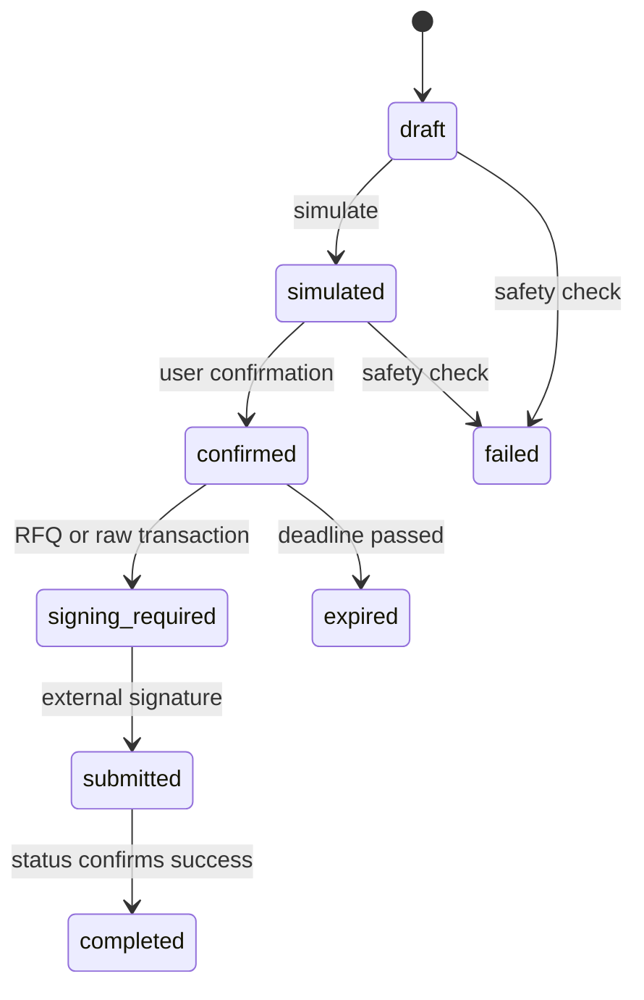
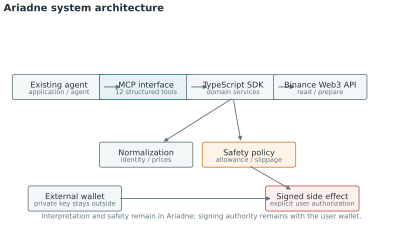
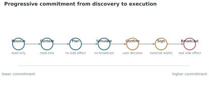
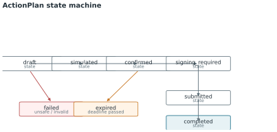
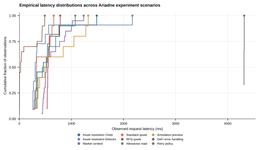
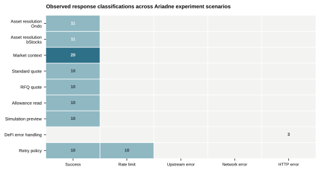
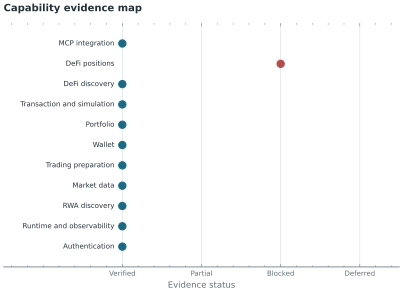
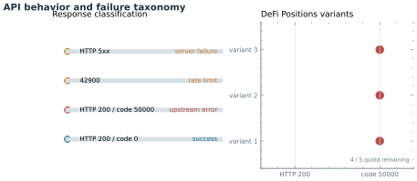
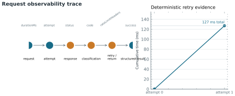

# Ariadne Technical Research Report

## Abstract

Ariadne is a TypeScript SDK and MCP server that gives existing AI agents structured access to tokenized-stock discovery, market context, portfolio information, simulation and explicitly bounded execution on BNB Chain. The system separates agent-readable planning from user-controlled signing.

This report records the design rationale, evaluation method, observed API behavior, safety boundaries, reproducibility procedures and unresolved limitations. It does not treat an upstream failure, a local mock or an unexecuted transaction as a successful live capability.

## 1. Research questions

1. Can tokenized-stock identities be normalized across issuers and wrappers?
2. Can an existing agent move from asset discovery to a constrained ActionPlan without guessing contract or market information?
3. Can simulation and safety checks prevent an unready plan from reaching execution?
4. Can external wallet signing remain outside the SDK without making the interface unusable?
5. Can API failures be represented as actionable states rather than misleading empty results?

## 2. System design



The main layers are:

- **API adapter:** HMAC authentication, timeout handling, retries, backoff and request observations.
- **Domain normalization:** consistent asset identity, decimal handling, market-state interpretation and warnings.
- **Safety policy:** allowance, balance, slippage, price-impact, market-state and plan-readiness checks.
- **ActionPlan:** an explicit state machine separating draft, simulation, confirmation and execution.
- **MCP adapter:** 12 agent-callable tools with structured responses and explicit side-effect boundaries.
- **External signing boundary:** EIP-712 signing and private-key custody remain outside Ariadne.

## 3. Evaluation method

The evaluation combines deterministic domain tests, MCP client smoke tests, live read-only API probes and documented boundary tests.

| Evidence class | Method | Interpretation |
|---|---|---|
| Domain behavior | `npm run test:domain` | Normalization, signing-request extraction and safety invariants |
| Simulation | `npm run test:simulation` | No-funds and no-broadcast safety path |
| MCP integration | `npm run test:mcp` | Tool discovery, structured calls and ActionPlan behavior |
| API capability | Service probes under `scripts/` | Live read-only responses and field normalization |
| Retry behavior | `npm run test:retry-policy` | Deterministic `42900` and `Retry-After` handling |
| Acceptance status | `npm run audit:phases` | Current evidence-backed completion summary |

## 4. Results

### 4.1 System and execution figures



**Figure 1. Ariadne system architecture.** The MCP and SDK layers interpret and constrain operations, while the external wallet retains signing authority.



**Figure 2. Progressive commitment workflow.** The workflow moves from read-only discovery to an explicit user-controlled side effect.



**Figure 3. ActionPlan state machine.** Unsafe, expired or incomplete plans cannot be broadcast as-is.

### 4.2 Audited experiment evidence

The current experiment audit passed with 105 unique request records, 40 result snapshots and 5 safety-result records. No request was broadcast, no coverage gap was detected and no audit failure was recorded. The experiment is deliberately bounded to read-only access, preparation, safety checks, simulation and deterministic client behavior.



**Figure 4. Observed latency distributions.** Each curve is an empirical cumulative distribution over the recorded `latency_ms` values for one scenario. This representation retains distribution shape and does not imply a production service-level objective.



**Figure 5. Observed response classifications.** Counts are grouped from the recorded `response_class` field. The plot distinguishes successful observations, rate-limit responses, upstream errors, network errors and HTTP errors instead of treating every non-empty response as success.

### 4.3 Capability evidence



**Figure 6. Capability evidence matrix.** Capability status is separated from the broader acceptance count so that an upstream blocker cannot be hidden by an aggregate score.

The historical phase-acceptance checklist remains available in [`docs/PHASE_ACCEPTANCE.md`](PHASE_ACCEPTANCE.md). The current experiment audit is a separate, machine-audited evidence layer; its source of truth is [`research/experiments/audit-results.json`](../research/experiments/audit-results.json).

### 4.3 Asset identity and market context

The live NVDA discovery path returned multiple wrapper identities on BSC, including Ondo and bStocks. Ariadne retains platform, symbol, chain and contract as part of the asset identity instead of collapsing them into a ticker-only response.

### 4.4 Retry and error behavior

The client treats `42900`, `50000`, `50001` and HTTP 5xx responses as retryable according to the configured policy. `Retry-After` is honored where present. Broadcast operations are not automatically retried because a duplicate side effect is materially different from a repeated read.

The retry behavior is verified deterministically by [`scripts/test-retry-policy.ts`](../scripts/test-retry-policy.ts).

The recorded deterministic trace contains two attempts: the first returns `42900`, `Retry-After` is honored, and the second returns success after 127 ms total. The raw observation is stored in [`research/data/request-traces.json`](../research/data/request-traces.json).

### 4.5 DeFi Positions upstream behavior

Three documented request variants for DeFi Positions returned HTTP 200 with business code `50000`; the observed rate limit remained 5 with 4 requests remaining. This combination is classified as an upstream service error, not a rate-limit failure. Ariadne must not convert it into an empty position list.



**Figure 7. API behavior and failure taxonomy.** HTTP status and business code are classified separately so that upstream failures, rate limits and successful responses remain distinguishable.

### 4.6 Signing and broadcast boundary

RFQ execution exposes the typed data, vendor, order identifier and signing scheme needed by an external wallet. Ariadne does not receive the private key. Real RFQ settlement, funded broadcast and post-trade balance changes remain deferred until an intentionally funded external wallet is used.



**Figure 8. Request observability trace.** Request duration, attempt number, status, business code, rate-limit headers and final classification form the evidence surface for diagnosis.

## 5. Agent and developer experience

The MCP surface is designed around progressive commitment:

1. Resolve and compare an asset.
2. Read market context and warnings.
3. Create an ActionPlan.
4. Simulate the plan.
5. Require explicit confirmation.
6. Produce a wallet-signing request.
7. Submit only an externally signed payload.

This makes the agent interface useful for read-only questions while preventing a natural-language request from implicitly becoming a broadcast operation.

## 6. Limitations and deferred experiments

| Item | Status | Reason |
|---|---|---|
| Real RFQ signature and settlement | Deferred | Requires an external wallet signature |
| Funded broadcast | Deferred | Requires funded wallet and explicit user authorization |
| Post-trade balance change | Deferred | Depends on a successful funded transaction |
| DeFi Positions | Upstream blocked | Three variants return business code `50000` |
| Destructive live `42900` test | Not performed | Avoids intentionally consuming live quota |
| Reviewer no-credential mode | Partial | Live API access requires reviewer-owned credentials |
| Demo video and final submission material | Postponed | Product implementation remains the current priority |

## 7. Reproducibility

From the repository root:

```bash
npm install
npm run typecheck
npm run test:domain
npm run test:simulation
npm run test:mcp
npm run audit:phases
    python3 research/figures/generate_figures.py
```

The legacy architecture figures are generated from `research/data/`. The audited experiment figures are generated by `research/figures/nature-sample/render_experiment_figures.py` from the append-only JSONL records under `research/experiments/`. No credentials, wallet secrets or network access are required to regenerate the static figures.

## 8. Iteration log

| Date | Hypothesis | Change | Evidence | Result |
|---|---|---|---|---|
| 2026-09-20 | Public documentation should be reviewer-readable and reproducible | Added structured evidence data and dependency-free SVG generation | JSON validation, figure validation, phase audit | Evidence pipeline established |
| 2026-09-20 | Upstream business errors must remain distinguishable from empty data | Preserved `50000` as an explicit failure state | Three documented DeFi Positions variants | Upstream blocker remains visible |
| 2026-09-20 | Execution must require user-controlled signing | Kept signing and private-key handling outside Ariadne | Domain and MCP boundary tests | External signing boundary preserved |
| 2026-09-20 | Aggregate pass counts can hide response-shape differences | Added an audited experiment layer with scenario-level records, integrity checks, an ECDF and a response-class heatmap | `research/experiments/audit-results.json`; figure preflight, PDF-text and collision QA | 105 request records audited with no broadcast and no coverage gap |

## 9. Source of truth

- [`docs/PHASE_ACCEPTANCE.md`](PHASE_ACCEPTANCE.md)
- [`docs/API_CAPABILITY_MATRIX.md`](API_CAPABILITY_MATRIX.md)
- [`docs/DEVELOPER_EXPERIENCE_LOG.md`](DEVELOPER_EXPERIENCE_LOG.md)
- [`research/data/`](../research/data/)
- [`research/figures/generate_figures.py`](../research/figures/generate_figures.py)
