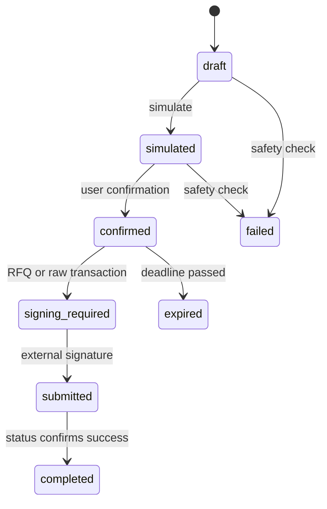
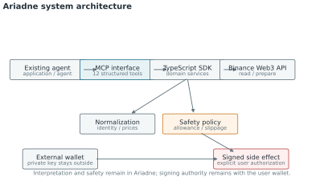
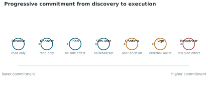
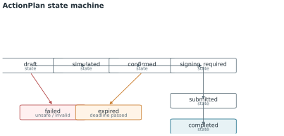
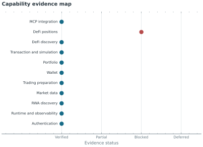
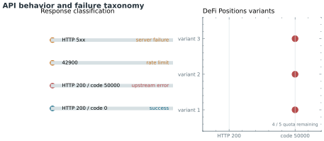
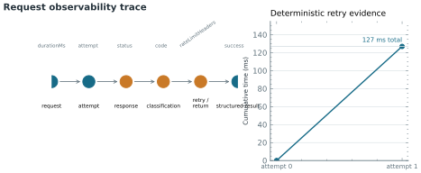

# Ariadne Technical Research Report

## Abstract

The MCP surface now includes `research_tokenized_stock`, a read-only orchestration tool that performs discovery, issuer-aware market enrichment, preference comparison and presentation in one call. This reduces first-use dependence on tool names while preserving lower-level SDK/MCP operations for developers who need explicit control. The workflow presents evidence without making an investment decision, requesting a signature or broadcasting.

The distribution preparation adds separate Demo and Live MCP configuration examples, printable configuration commands, an npm-compatible package manifest, a public SDK entry point, declaration output and a dry-run package check. The package is prepared locally but has not been published to npm.

A clean-room consumer test installed the local tarball outside the repository and verified runtime imports, TypeScript declarations and the package-root export map. This confirms that the SDK is consumable as a package rather than only working from the repository source tree.

A local Hosted Demo POC now exposes the same MCP surface through Streamable HTTP while forcing deterministic Demo Mode. The end-to-end test verified health, remote MCP connection, tool discovery and the `research_tokenized_stock` workflow with `sideEffects: none`. No live credentials, public endpoint, wallet or transaction path is enabled.

The local web product now has a controlled read-only wallet-exposure path in addition to research and comparison. `GET /api/exposure` validates a public EVM address, reads balances through the server-side Wallet API client, joins holdings against the current RWA directory and returns explicit `matched` or `unmatched` states. A missing token price remains unavailable; it is not inferred from the ticker or from another representation. Demo Mode uses deterministic holdings containing one matched NVDAB representation and one intentionally unresolved `NVDA.O` holding to exercise this boundary. The browser receives no credentials and the route has no signing or broadcast capability.

The web product also exposes `GET /api/quote` as a quote-only read path. It requires a valid public address, an explicit issuer and a positive USDT amount, then calls the normalized quote service without invoking `createActionPlan`, `buildApprovalAction` or `buildUnsignedAction`. The returned view records expected output, price impact, venue, minimum-output availability and quote warnings. The boundary fields explicitly remain `actionPlanCreated: false`, `approvalTransactionCreated: false`, `signatureRequested: false` and `broadcastAttempted: false`.

The direct product surface is now organized as seven dedicated routes: Home, SDK, MCP, Assets, Research, Portfolio and Quote. The Live Read-only directory test returned 488 BSC tokenized-stock representations and preserved the official token and issuance-platform logo fields returned by the Binance RWA APIs. The interface presents the underlying asset mark with a distinct issuer badge, while unavailable metadata remains explicit and no logo is inferred from a ticker.

During final Live Web regression, the first catalog request returned HTTP 401 with `Duplicate request detected`. The documented authentication contract provides `X-OC-NONCE` as a unique anti-replay identifier. The client previously relied on the signature fallback; it now generates an independent UUID nonce for every attempt. A deterministic retry test verified distinct nonce values across attempts, and the complete Live Read-only suite subsequently passed with the 488-representation directory, two NVDA representations, server-only credentials and `sideEffects: none`.

Validation on 2026-09-22: TypeScript typecheck, Demo Mode regression, Agent model regression and onboarding documentation checks passed. The first live MCP integration attempt returned a transient incomplete upstream response; a bounded retry passed with 18 tools discovered and safety rejection paths verified. No signing, broadcast or external write occurred.

Ariadne is AI-native interaction infrastructure for onchain finance. Its TypeScript SDK, MCP server and direct web surface give Agents, developers and users a shared model for tokenized-asset identity, issuer-aware research, portfolio context and explicitly controlled execution on BNB Chain. The system separates intent interpretation and reviewable planning from user-controlled signing.

This report records the design rationale, evaluation method, observed API behavior, safety boundaries, reproducibility procedures and unresolved limitations. It does not treat an upstream failure, a local mock or an unexecuted transaction as a successful live capability.

## Phase 8 — asset source coverage and provenance audit (2026-09-30)

The audit used the existing `scripts/inspect-live-asset-coverage.ts` against the configured Binance Web3 API. It issued signed GET requests only and did not read wallet balances, request a trade quote, create a plan, sign, or broadcast. Two live snapshots were taken about 54 seconds apart (`2026-09-29T19:18:39Z` and `19:19:33Z`); both returned 488 unique BSC token representations (442 Ondo, 46 bStocks), with 448 distinct `underlyingTicker` string values (not a separately normalized underlying-security count) and no duplicate representation rows.

The paired `/platforms` snapshots declared BSC `chainDistribution.tokenCount` values of 458 Ondo and 80 bStocks (538 combined), while `/tokens?binanceChainId=56` returned 442 and 46 respectively (488 combined). The `/tokens` and `/platforms` response timestamps were only 30–31 ms apart in these samples. This reproduces the 50-row discrepancy but does not identify which representations account for it. Platform metadata also declared 457 Ondo token records on Chain 1 and 451 on `CT_501`; both unfiltered token-list and explicit chain-filtered queries returned only the 488 Chain 56 records in these observations. Why those declared non-BSC inventories are absent is unresolved.

All 13 documented `tabId` values returned the same 488-row BSC representation set as the unfiltered query in both audits. This establishes response equality for these samples, not whether Binance ignores the filter or every row qualifies for every tab. Local 50-row directory slices were disjoint; they are slices of the single fetched response and do not demonstrate upstream pagination.

The list response included token and reference prices for 488/488 rows, but no per-token quote-update timestamp for 488/488; 442/488 rows had a recognized market status. A separate `/api/v1/dex/market/rwa/price` request returned prices and update timestamps for both NVDA issuer representations (2/2). The official response schema documents `tokenPriceUpdatedAt` on this dedicated price endpoint, not on the token-list row. The list endpoint documentation specifies optional `binanceChainId`, `platformId`, and `tabId` filters and exposes no documented page/limit/offset/cursor or total-count marker. Therefore the observed count is not a completeness guarantee. See the [Binance Web3 RWA API documentation](https://web3.binance.com/en/dev-docs/catalog/web3-wallet/api/rest-api/rwa-data) and the [official OpenAPI schema](https://web3.binance.com/en/dev-docs/catalog/web3-wallet/api/rest-api/1.0.0/schema.json).

Local regressions passed: `npm run test:asset-directory`, `npm run test:core-hardening`, `npm run typecheck`, and `git diff --check`. The initial audit output's `filterConsistency.passed` label could be read as validating filter semantics, and the initial NVDA `/price` count did not prove that each requested representation matched a response row. Independent read-only review identified these overclaim risks and two edge cases: only valid 20-byte EVM addresses are normalized case-insensitively (non-EVM/Base58 addresses preserve case), and duplicate response rows cannot inflate per-identity valid-price or timestamp coverage. The audit now reports response-integrity checks separately from observed filter behavior, labels distinct ticker strings accurately, validates every price result against the exact `(chain, platform, contract)` identity, counts only positive finite prices and timestamps, and exits unsuccessfully when target identity or value/time coverage is incomplete. Final read-only probes at `2026-09-29T19:28:39Z` and `19:35:33Z` confirmed 2/2 exact NVDA identity matches, valid prices and update timestamps; they also reproduced the 488 BSC rows, 538 declared metadata count, and identical 488-identity sets for all 13 `tabId` queries. The completeness result remains explicitly unproven. Jev's risk rubric was clarified to classify already-approved, bounded read-only endpoint requests separately from writes, wallet actions, sensitive data, paid operations and deployment; the 0.85 confidence floor is unchanged. A separate general-gate limitation was identified: the CLI currently hard-codes high-risk/external-write evidence flags to `false`. This phase requests no such action, but the gate must not be used to authorize or advance a phase requiring one; this is recorded as a distinct workflow-hardening item. Provider count reconciliation, the equal tab results, non-BSC listing behavior, and any acceptable quote-freshness SLA remain unresolved; no API maximum or complete RWA inventory is claimed.

## 1. Research questions

1. Can tokenized-stock identities be normalized across issuers and wrappers?
2. Can an existing agent move from asset discovery to a constrained ActionPlan without guessing contract or market information?
3. Can simulation and safety checks prevent an unready plan from reaching execution?
4. Can external wallet signing remain outside the SDK without making the interface unusable?
5. Can API failures be represented as actionable states rather than misleading empty results?

## 2. System design


```mermaid
stateDiagram-v2
    [*] --> draft
    draft --> simulated: simulate
    simulated --> confirmed: user confirmation
    confirmed --> signing_required: RFQ or raw transaction
    signing_required --> submitted: external signature
    submitted --> completed: status confirms success
    draft --> failed: safety check
    simulated --> failed: safety check
    confirmed --> expired: deadline passed
```

The main layers are:

- **API adapter:** HMAC authentication, timeout handling, retries, backoff and request observations.
- **Domain normalization:** consistent asset identity, decimal handling, market-state interpretation and warnings.
- **Safety policy:** allowance, balance, slippage, price-impact, market-state and plan-readiness checks.
- **ActionPlan:** an explicit state machine separating draft, simulation, confirmation and execution.
- **MCP adapter:** 18 agent-callable tools with structured responses and explicit side-effect boundaries.
- **External signing boundary:** EIP-712 signing and private-key custody remain outside Ariadne.

## 3. Evaluation method

The evaluation combines deterministic domain tests, MCP client smoke tests, live read-only API probes and documented boundary tests.

| Evidence class | Method | Interpretation |
|---|---|---|
| Domain behavior | `npm run test:domain` | Normalization, signing-request extraction and safety invariants |
| Simulation | `npm run test:simulation` | No-funds and no-broadcast safety path |
| MCP integration | `npm run test:mcp` | Tool discovery, structured calls and ActionPlan behavior |
| API capability | Service probes under `scripts/` | Live read-only responses and field normalization |
| Retry behavior | `npm run test:retry-policy` | Deterministic `42900` and `Retry-After` handling |
| Experiment audit | `npm run audit:experiments` | Integrity, uniqueness, coverage and no-broadcast audit |

## 4. Results

### 4.1 System and execution figures



**Figure 1. Ariadne system architecture.** The MCP and SDK layers interpret and constrain operations, while the external wallet retains signing authority.



**Figure 2. Progressive commitment workflow.** The workflow moves from read-only discovery to an explicit user-controlled side effect.



**Figure 3. ActionPlan state machine.** Unsafe, expired or incomplete plans cannot be broadcast as-is.

### 4.2 Audited experiment evidence

The current experiment audit passed with 105 unique request records, 40 result snapshots and 5 safety-result records. No request was broadcast, no coverage gap was detected and no audit failure was recorded. The experiment is deliberately bounded to read-only access, preparation, safety checks, simulation and deterministic client behavior.


**Figure 4. Observed latency distributions.** Each curve is an empirical cumulative distribution over the recorded `latency_ms` values for one scenario. This representation retains distribution shape and does not imply a production service-level objective.


**Figure 5. Observed response classifications.** Counts are grouped from the recorded `response_class` field. The plot distinguishes successful observations, rate-limit responses, upstream errors, network errors and HTTP errors instead of treating every non-empty response as success.

### 4.3 Capability evidence



**Figure 6. Capability evidence matrix.** Capability status is separated from the broader acceptance count so that an upstream blocker cannot be hidden by an aggregate score.

The current experiment audit is a separate, machine-audited evidence layer; its source of truth is [`research/experiments/audit-results.json`](../research/experiments/audit-results.json).

### 4.3 Asset identity and market context

The live NVDA discovery path returned multiple wrapper identities on BSC, including Ondo and bStocks. Ariadne retains platform, symbol, chain and contract as part of the asset identity instead of collapsing them into a ticker-only response.

### 4.4 Retry and error behavior

The client treats `42900`, `50000`, `50001` and HTTP 5xx responses as retryable according to the configured policy. `Retry-After` is honored where present. Broadcast operations are not automatically retried because a duplicate side effect is materially different from a repeated read.

Every authenticated attempt also receives a unique `X-OC-NONCE`. This prevents a read retry or a closely timed parallel request from being rejected as a replay while preserving the same signed request semantics.

The retry behavior is verified deterministically by [`scripts/test-retry-policy.ts`](../scripts/test-retry-policy.ts).

The recorded deterministic trace contains two attempts: the first returns `42900`, `Retry-After` is honored, and the second returns success. The regression test also asserts that the two attempts use distinct valid UUID nonces. The raw observation is stored in [`research/data/request-traces.json`](../research/data/request-traces.json).

### 4.5 DeFi Positions upstream behavior

Three documented request variants for DeFi Positions returned HTTP 200 with business code `50000`; the observed rate limit remained 5 with 4 requests remaining. This combination is classified as an upstream service error, not a rate-limit failure. Ariadne must not convert it into an empty position list.



**Figure 7. API behavior and failure taxonomy.** HTTP status and business code are classified separately so that upstream failures, rate limits and successful responses remain distinguishable.

### 4.6 Signing and broadcast boundary

RFQ execution exposes the typed data, vendor, order identifier and signing scheme needed by an external wallet. Ariadne does not receive the private key. Real RFQ settlement, funded broadcast and post-trade balance changes remain deferred until an intentionally funded external wallet is used.



**Figure 8. Request observability trace.** Request duration, attempt number, status, business code, rate-limit headers and final classification form the evidence surface for diagnosis.

## 5. Agent and developer experience

The MCP surface is designed around progressive commitment:

1. Resolve and compare an asset.
2. Read market context and warnings.
3. Create an ActionPlan.
4. Simulate the plan.
5. Require explicit confirmation.
6. Produce a wallet-signing request.
7. Submit only an externally signed payload.

This makes the agent interface useful for read-only questions while preventing a natural-language request from implicitly becoming a broadcast operation.

## 6. Limitations and deferred experiments

| Item | Status | Reason |
|---|---|---|
| Real RFQ signature and settlement | Deferred | Requires an external wallet signature |
| Funded broadcast | Deferred | Requires funded wallet and explicit user authorization |
| Post-trade balance change | Deferred | Depends on a successful funded transaction |
| DeFi Positions | Upstream blocked | Three variants return business code `50000` |
| Destructive live `42900` test | Not performed | Avoids intentionally consuming live quota |
| Reviewer no-credential mode | Partial | Live API access requires reviewer-owned credentials |
| Demo video and final submission material | Postponed | Product implementation remains the current priority |

## 7. Reproducibility

From the repository root:

```bash
npm install
npm run typecheck
npm run test:domain
npm run test:simulation
npm run test:mcp
npm run audit:experiments
python3 research/figures/nature-sample/render_experiment_figures.py
```

The legacy architecture figures are generated from `research/data/`. The audited experiment figures are generated by `research/figures/nature-sample/render_experiment_figures.py` from the append-only JSONL records under `research/experiments/`. No credentials, wallet secrets or network access are required to regenerate the static figures.

## 8. Iteration log

| Date | Hypothesis | Change | Evidence | Result |
|---|---|---|---|---|
| 2026-09-20 | Public documentation should be reviewer-readable and reproducible | Added structured evidence data and dependency-free SVG generation | JSON validation, figure validation, phase audit | Evidence pipeline established |
| 2026-09-20 | Upstream business errors must remain distinguishable from empty data | Preserved `50000` as an explicit failure state | Three documented DeFi Positions variants | Upstream blocker remains visible |
| 2026-09-20 | Execution must require user-controlled signing | Kept signing and private-key handling outside Ariadne | Domain and MCP boundary tests | External signing boundary preserved |
| 2026-09-20 | Aggregate pass counts can hide response-shape differences | Added an audited experiment layer with scenario-level records, integrity checks, an ECDF and a response-class heatmap | `research/experiments/audit-results.json`; figure preflight, PDF-text and collision QA | 105 request records audited with no broadcast and no coverage gap |
| 2026-09-28/29 | Confirmation must bind the transaction actually sent | Added process-local plan stage/immutability/replay checks and pre-broadcast signed EVM transaction comparison | Offline legacy and EIP-1559 fixtures; nine rejected malformed, unsigned, unconfirmed or mismatched cases; `test:plan-registry`, `test:signed-transaction`, `test:demo-mode`, `test:domain`, typecheck and build passed | Local boundary verified; no wallet signing, live broadcast or settlement proven |
| 2026-09-29 | An approved quote is not proof that the wallet can fund it | Added read-only BSC ERC-20 `balanceOf` checks in base units at plan preparation and immediately before MCP broadcast | Mocked RPC calldata/error test and deterministic sufficient/insufficient/unavailable plan tests; typecheck/build and relevant offline regressions passed | Fail-closed input-token balance boundary implemented; gas/value sufficiency was addressed separately below; funded execution and post-trade reconciliation remain unverified |
| 2026-09-29 | Input-token balance alone cannot bound transaction fee exposure | Bound an explicit user-reviewed BNB gas budget into the EVM plan, checked signed fee fields, and read native BNB balance before broadcast | Offline legacy/EIP-2930/EIP-1559 fee tests, budget mutation rejection, mocked `eth_getBalance`, excessive-fee and insufficient-BNB rejection | Worst-case fee/value boundary verified locally; no funded-wallet or chain inclusion result claimed |
| 2026-09-29 | Individually passing safety checks do not prove the staged workflow composes correctly | Added a deterministic synthetic quote-to-pre-broadcast rehearsal with a separate JSON fixture | `npm run test:execution-dry-run`: six normal stages, nine rejection paths, zero broadcast requests | Offline workflow composition verified; placeholder calldata and test key cannot establish live execution |

### Interim evidence note — execution boundary (not final results)

The MCP broadcast path now compares the decoded transaction's chain ID, destination, native value, calldata and recovered signer against the registered, explicitly confirmed ActionPlan before reserving its single broadcast attempt. This is a local deterministic check, not evidence of onchain execution. Gas price and nonce are selected by the external signer. The registry is process-local and resets on restart. RFQ submission lacks its own end-to-end simulated and confirmed path and therefore remains blocked. Funded balance verification, real external signing, successful broadcast and post-trade reconciliation remain separate, deferred evidence milestones. Earlier report statements and counts are historical snapshots and require reconciliation before final publication.

Jev was historically run as an optional shadow phase gate, not a Codex controller or transaction authorizer. Its recorded outcomes include unavailable backends and low-confidence pauses. During the recent website-design and core hardening iterations it was not used as a routine approval requirement: deterministic tests and explicit user review remained the operative gates. The final report should explain this decision and retain the prior Jev records rather than implying an unbroken Jev approval history.

The subsequent BSC ERC-20 balance check reads `balanceOf(owner)` in base units. An unavailable or malformed RPC response blocks rather than supplying a fabricated balance. The check is repeated immediately before MCP broadcast, but it cannot eliminate chain-state changes between the read and transaction inclusion. It does not cover native input assets; BNB fee/value sufficiency is addressed by the separate check below. The existing retry-policy test initially failed to start its local TCP listener in the restricted sandbox (`EPERM`), then passed with loopback-socket permission: two attempts used distinct nonces and honored `Retry-After`.

The subsequent gas boundary requires `maxGasCostBnb` to be explicitly present in a standard EVM MCP plan before confirmation; there is no silent default. The frozen plan binds that budget to later stages. Immediately before a broadcast attempt, the maximum signed gas spend is calculated from the signed gas limit and the transaction type's price ceiling, then compared with the reviewed budget. `eth_getBalance` must cover this maximum plus any native value carried by the transaction. These are read-only, offline-tested safeguards, not proof of actual charged fees, a funded wallet, chain inclusion or a race-free balance snapshot.

An integrated, no-funds rehearsal now composes the actual plan registry, domain safety, simulation normalization, external-test-key signing checks and gas/balance gates against a synthetic fixture. It intentionally stops before the network broadcast function. The test reports nine rejected deviations and zero broadcast calls. Its dummy token, quote and calldata are not evidence of a real Binance route or an executable onchain swap; see [`docs/OFFLINE_EXECUTION_TEST.md`](OFFLINE_EXECUTION_TEST.md).

On 2026-09-29, the user independently reproduced the successful offline output from the project directory in a terminal. A separate Codex task initially returned `Missing script`; after explicitly changing to this repository, it reproduced the same passing output. The initial error was a working-directory/context mistake, not a failed execution rehearsal.

### Cross-surface acceptance snapshot — 2026-09-29 (interim)

| Surface | Evidence obtained | Boundary or failure still open |
|---|---|---|
| Standalone SDK | Package build passed; public-root import and `TokenizedStocksService.search` passed against a synthetic API; package dry-run passed with a temporary npm cache | Credentialed shell call could not fetch through the restricted network; fresh offline consumer install lacked a cached dependency; public release not claimed |
| MCP protocol | Demo discovery and execution-blocking tests, configuration/distribution checks passed; connected read-only live research returned two issuer representations for NVDA and AAPL with explicit warnings | No actual wallet transaction or funded settlement verified |
| Agent natural language | A Codex Agent selected the intended read-only research tool; passing `NVDA` produced comparison evidence | A separate Agent passed the full Chinese user request as `query`, yielding no match. Intent extraction is not reliable enough to call this end-user acceptance passed. The brief is verbose and omits issuer legal/custody/redemption risk comparison |
| Direct web | Browser verified live-readonly directory (448 underlyings, 488 representations at observation), NVDA search/detail and Chinese-language continuity; independent demo route and page checks passed | Demo catalog/detail market-state mismatch; `safety` docs search misses the safety chapter; live detail exposes an untranslated `unknown`; no web transaction flow tested |

Offline domain, core, presentation, Agent-model, execution-rehearsal, onboarding and typecheck regressions passed after aligning one stale Quickstart phrase with the onboarding assertion. The observed catalog counts and prices are time-bound source snapshots, not permanent coverage claims or executable quotes. This interim evidence must not be conflated with natural-language end-to-end trading acceptance.

## 9. Source of truth

- [`research/experiments/audit-results.json`](../research/experiments/audit-results.json)
- [`docs/API_CAPABILITY_MATRIX.md`](API_CAPABILITY_MATRIX.md)
- [`docs/DEVELOPER_EXPERIENCE_LOG.md`](DEVELOPER_EXPERIENCE_LOG.md)
- [`research/data/`](../research/data/)
- [`research/figures/nature-sample/render_experiment_figures.py`](../research/figures/nature-sample/render_experiment_figures.py)

### Jev phase-gate record — 2026-09-21T18:33:05.258Z
- Phase: `fixture-readonly-validation`
- Jev provider: `deterministic-fallback`
- Baseline: `passed_with_deferred_items` / `continue` / risk `low`
- Jev: unavailable
- Agreement: `unknown`
- Latency: `49 ms`
- Phase transition: `pause`
- Transition reason: Jev unavailable; remain paused and use the deterministic result for observation only.
- Action taken: `none`
- Safety note: Jev does not control Codex and no external write was authorized.

## Phase 14 — MCP research timing and failure observability (2026-09-30; Jev review pending)

### Scope

This approved follow-up is limited to the core MCP research path and its direct tests. It does not modify or evaluate the website, add wallet or execution UI, authorize a funded action, or publish/deploy anything. The objective is to make the current request path diagnosable before attempting latency changes, and to distinguish a recoverable market-data outage from a response-integrity defect without exposing raw exception details.

### Implementation and verification

The research response now carries bounded stage timings for direct query search, catalog read, local identity matching, resolved ticker search, market-context enrichment, comparison, presentation and total handler time. It reports service-method invocation counts separately from HTTP request attempts: retry attempts remain visible through `BinanceWeb3Client` request observations and the existing latency harness. MCP result timing excludes Agent reasoning and final host rendering.

Market-context enrichment still returns identity-only assets when market context is unavailable; mismatched or incomplete batches remain all-or-none. `dataQuality` now reports one of four safe categories—`network_failure`, `provider_failure`, `data_integrity_failure`, or `unexpected_failure`—and a matching human-readable warning. Raw error messages, credentials, API request query strings and endpoint response bodies are not placed in these categories. Deterministic tests verify each category, preserve the fallback contract, and confirm that raw test exception strings do not appear in the returned asset.

The offline `typecheck`, build, intent-query, enrichment, Demo MCP, presentation, MCP Apps UI, phase-plan and Jev-state regressions all passed. The MCP Apps regression verifies sanitized market-unavailable warnings render in the native component. It also exposed an unrelated-but-adjacent provenance inconsistency in the current workspace: the synthetic Demo quote had been labeled with Binance production provenance. That false label was removed; the presentation/UI regressions now check both “source not supplied” for Demo and exact field/source mapping when provenance is actually provided.

The focused live read-only `test:mcp-natural-language` passed using the already configured Binance Web3 credentials: two BNB NVDA representations, standalone SDK/MCP identity parity, exact JSON-text/`structuredContent` parity for discovery/research, timestamp and endpoint checks, shared MCP Apps resource link, and `sideEffects: none`. The run used no wallet address, quote, plan, signature, transaction or broadcast. The first `test:mcp` attempt under the default network-restricted shell failed at fetch with `fetch failed`; the narrower live acceptance was rerun with permission and passed.

### Latency observations and diagnosis

Three live read-only research requests measured 2693.36 ms, 2755.87 ms and 2382.85 ms server-side (median 2693.36 ms). Their search stages measured 1972.57 ms, 1720.46 ms and 1405.05 ms; within those, raw-prompt search measured 1171.83/268.46/351.58 ms, catalog read 510.75/830.39/529.90 ms, local identity matching 21.11/27.16/9.00 ms, and resolved-ticker search 268.27/594.26/514.46 ms. Market context took 720.08/1034.84/977.28 ms. Comparison took 0.10–0.27 ms and presentation 0.25–0.34 ms. Each sample used one initial service search, one catalog read and one resolved-ticker search; market context was one batch service call for two assets. The independent SDK request observer showed the associated upstream endpoint calls each succeeded without retries in these samples.

These observations locate the current cost in sequential API-backed intent resolution and market data, not local comparison or UI generation. The older 13.983–19.320 second sample in this report is not reproduced here; the reason for the large difference is unknown, so neither a speedup claim nor latency SLO is made. The current resolver's raw-prompt → catalog verification → ticker search sequence also serves ambiguity and partial-result safeguards. Because the provider inventory is not proven complete, deleting or reordering one of those calls without adversarial compound-query evidence could hide a representation or silently accept a partial result. No resolver routing was changed in this phase; an optimization should first demonstrate equivalent handling for known and unknown second entities, partial provider hits, and an incomplete catalog.

Jev re-review completed at confidence 0.890; all Phase 14 criteria passed and the phase state advanced to `delivery-complete`. The acceptance floor remains 0.85. No external write, site work, publication, deployment, wallet access, signature, broadcast or funded settlement was performed.

The first Jev gate ran 10/10 selected checks successfully and marked all three acceptance criteria `met`, but `research-timing` confidence was 0.580; the gate paused at the unchanged 0.850 floor. The evidence-to-claim gap was actionable: earlier tests checked finite durations and call counts, but did not assert parent/substage accounting. Demo and live MCP tests now require resolver substage totals to fit within `searchMs`, measured sequential stages to fit within `totalMs`, the direct ticker fast path to skip catalog/follow-up methods, natural-language resolution to report its call matrix, and market context to be one batch. These strengthened links passed subsequent re-reviews; no speedup or SLO is inferred.

The paused record also revealed that `advancePhaseState` preserved a previous terminal `currentPhase`, making a newly paused phase look complete. The state transition now records the requested phase on pause (and its declared next phase) without advancing; deterministic regressions cover both an ordinary hold and a pause beginning from a stale terminal ledger. This is a bookkeeping correctness fix, not a change to the 0.850 threshold or approval semantics.

The second Jev re-review again passed all 10 checks and marked all three criteria `met`. It assigned 0.980 to research timing and safe failure diagnosis, but 0.820 to scope/regression, keeping the phase paused. Jev supplied no more specific sub-finding. Inspection of the evidence suggests the criterion overreached: its linked checks prove compile/build, no-trade behavior, MCP view rendering, phase-plan status, and pause/advance mechanics, but not the broad negative assertion that no website or execution surface changed. The criterion was narrowed to those directly tested behaviors. Final re-review passed 10/10 checks and all three criteria at 0.980/0.980/0.890, overall confidence 0.890; the state advanced to `delivery-complete`. The 0.850 floor was unchanged.

## 2026-09-30 — Phase 9 asset-directory data quality (implementation complete; Jev review pending)

- Replaced the website's loop over 100-row `/api/catalog` pages with one bounded `limit=1000` catalog snapshot request. The provider list has no documented pagination contract; subsequent table pagination remains local to this one response. The API returns `hasMore` and a visible cap notice if a future observed response exceeds the local bound. This reduces repeated full-list reads and prevents concatenating different provider snapshots; it does not establish a complete inventory.
- Renamed the directory count from `uniqueUnderlyings` to `distinctTickerValues`. It counts exact raw ticker strings returned in the current filtered response; it is not a normalized issuer/security count. The response now reports `returned` consistently in both summary and pagination metadata.
- Added a GET-only `/api/asset-prices` path for exact representations on the current visible table page (maximum 100 identities per request; upstream requests are chunked at 100). It matches `(chainId, platformId, contractAddress)` exactly, requires a positive token price and valid positive provider update timestamp to call a snapshot available, and returns explicit `missing`, `ambiguous`, `invalid`, or `unavailable` states otherwise. It never substitutes the catalog-response timestamp for an individual quote time. An independent code review caught and prompted repair of two display-level source-mixing cases: live table prices now require a valid timestamped snapshot, and a gap is calculated only when the same timestamped response contains a valid reference price. Partial groups summarize only verified quote rows and show their timestamp coverage; Demo data stays separately labeled.
- Live read-only integration returned one BNB directory response with 488 representations (within the 1,000-row bound) and verified timestamped positive price snapshots for both NVDA issuer representations by exact identity. This is an observed API response, not evidence that all market assets are listed or that quotes meet a freshness SLA.
- Deterministic checks passed after the review repairs: root and web-app typechecks, `test:asset-directory` (identity, duplicate/invalid handling, 101-address batching and response-cap semantics), `test:web-catalog-client` (one request and consistent capped metadata), `test:web-market-presentation` (partial groups, no stale quote fallback, and same-snapshot reference-gap calculation), `test:web-demo` (route validation, repeated parameters, over-limit rejection and read-only boundary), `test:core-hardening`, `test:core-product-phase-plan`, `test:jev-shadow`, `git diff --check`, and the Next.js production build. Local HTTP checks required loopback permission and passed.
- The independent read-only audit also noted that `/api/asset-prices` has a per-request cap but no aggregate rate limit; this matters before public hosting and is explicitly deferred with public deployment, not presented as safe for public exposure. Still unresolved: provider-declared 538 vs 488 returned BNB representations, undocumented upstream pagination/completeness, observed equal `tabId` sets, and unobserved non-BNB listings. No other provider, write, wallet read, signature, transaction, broadcast, deployment, or publication was used.

### Jev phase-gate record — 2026-09-21T18:33:47.622Z
- Phase: `fixture-readonly-validation`
- Jev provider: `native-jev`
- Baseline: `passed_with_deferred_items` / `continue` / risk `low`
- Jev: `passed_with_deferred_items` / `continue` / risk `low` / confidence `0.910`
- Agreement: `true`
- Latency: `2484 ms`
- Phase transition: `pause`
- Transition reason: Both baseline and Jev must return passed.
- Action taken: `none`
- Safety note: Jev does not control Codex and no external write was authorized.

### Jev phase-gate record — 2026-09-21T18:34:50.053Z
- Phase: `ux-phase-01`
- Jev provider: `native-jev`
- Baseline: `passed` / `continue` / risk `low`
- Jev: `passed` / `continue` / risk `low` / confidence `0.980`
- Agreement: `true`
- Latency: `845 ms`
- Phase transition: `advance`
- Transition reason: Baseline and Jev agree on a low-risk continuation.
- Action taken: `none`
- Safety note: Jev does not control Codex and no external write was authorized.

### Jev phase-gate record — 2026-09-21T18:34:51.651Z
- Phase: `real-transaction-validation`
- Jev provider: `native-jev`
- Baseline: `passed_with_deferred_items` / `ask_user` / risk `high`
- Jev: `passed` / `ask_user` / risk `high` / confidence `0.850`
- Agreement: `false`
- Latency: `1320 ms`
- Phase transition: `pause`
- Transition reason: Both baseline and Jev must return passed.
- Action taken: `none`
- Safety note: Jev does not control Codex and no external write was authorized.

### Jev phase-gate record — 2026-09-21T18:38:29.329Z
- Phase: `core-capability-hardening`
- Jev provider: `native-jev`
- Baseline: `passed` / `continue` / risk `low`
- Jev: `passed` / `continue` / risk `low` / confidence `0.880`
- Agreement: `true`
- Latency: `1285 ms`
- Phase transition: `advance`
- Transition reason: Baseline and Jev agree on a low-risk continuation.
- Action taken: `none`
- Safety note: Jev does not control Codex and no external write was authorized.

### Jev phase-gate record — 2026-09-21T18:45:50.811Z
- Phase: `agent-native-workflow-expansion`
- Jev provider: `native-jev`
- Baseline: `passed_with_deferred_items` / `continue` / risk `low`
- Jev: `passed_with_deferred_items` / `continue` / risk `low` / confidence `0.330`
- Agreement: `true`
- Latency: `1130 ms`
- Phase transition: `pause`
- Transition reason: Both baseline and Jev must return passed.
- Action taken: `none`
- Safety note: Jev does not control Codex and no external write was authorized.

### Jev phase-gate record — 2026-09-21T18:46:14.214Z
- Phase: `agent-native-workflow-expansion`
- Jev provider: `deterministic-fallback`
- Baseline: `passed` / `continue` / risk `low`
- Jev: unavailable
- Agreement: `unknown`
- Latency: `95 ms`
- Phase transition: `pause`
- Transition reason: Jev unavailable; remain paused and use the deterministic result for observation only.
- Action taken: `none`
- Safety note: Jev does not control Codex and no external write was authorized.

### Jev phase-gate record — 2026-09-21T18:46:26.915Z
- Phase: `agent-native-workflow-expansion`
- Jev provider: `native-jev`
- Baseline: `passed` / `continue` / risk `low`
- Jev: `passed` / `continue` / risk `low` / confidence `0.940`
- Agreement: `true`
- Latency: `850 ms`
- Phase transition: `advance`
- Transition reason: Baseline and Jev agree on a low-risk continuation.
- Action taken: `none`
- Safety note: Jev does not control Codex and no external write was authorized.

### Jev phase-gate record — 2026-09-21T18:47:45.252Z
- Phase: `agent-native-workflow-expansion`
- Jev provider: `native-jev`
- Baseline: `passed` / `continue` / risk `low`
- Jev: `passed` / `continue` / risk `low` / confidence `0.930`
- Agreement: `true`
- Latency: `867 ms`
- Phase transition: `advance`
- Transition reason: Baseline and Jev agree on a low-risk continuation.
- Action taken: `none`
- Safety note: Jev does not control Codex and no external write was authorized.

### Jev phase-gate record — 2026-09-21T18:49:17.521Z
- Phase: `evidence-and-report-synchronization`
- Jev provider: `native-jev`
- Baseline: `passed` / `continue` / risk `low`
- Jev: `passed` / `continue` / risk `low` / confidence `1.000`
- Agreement: `true`
- Latency: `894 ms`
- Phase transition: `advance`
- Transition reason: Baseline and Jev agree on a low-risk continuation.
- Action taken: `none`
- Safety note: Jev does not control Codex and no external write was authorized.

### Jev phase-gate record — 2026-09-21T18:50:07.079Z
- Phase: `final-local-review`
- Jev provider: `native-jev`
- Baseline: `passed_with_deferred_items` / `ask_user` / risk `high`
- Jev: `passed_with_deferred_items` / `ask_user` / risk `high` / confidence `0.780`
- Agreement: `true`
- Latency: `819 ms`
- Phase transition: `pause`
- Transition reason: Both baseline and Jev must return passed.
- Action taken: `none`
- Safety note: Jev does not control Codex and no external write was authorized.

### Jev phase-gate record — 2026-09-21T19:08:58.517Z
- Phase: `distribution-readiness`
- Jev provider: `native-jev`
- Baseline: `passed_with_deferred_items` / `ask_user` / risk `high`
- Jev: `passed_with_deferred_items` / `continue` / risk `low` / confidence `0.390`
- Agreement: `false`
- Latency: `1800 ms`
- Phase transition: `pause`
- Transition reason: Both baseline and Jev must return passed.
- Action taken: `none`
- Safety note: Jev does not control Codex and no external write was authorized.

### Jev phase-gate record — 2026-09-21T19:19:47.923Z
- Phase: `cleanroom-consumer-validation`
- Jev provider: `native-jev`
- Baseline: `passed` / `continue` / risk `low`
- Jev: `passed` / `continue` / risk `low` / confidence `0.980`
- Agreement: `true`
- Latency: `1576 ms`
- Phase transition: `advance`
- Transition reason: Baseline and Jev agree on a low-risk continuation.
- Action taken: `none`
- Safety note: Jev does not control Codex and no external write was authorized.

### Jev phase-gate record — 2026-09-21T19:19:48.887Z
- Phase: `release-decision`
- Jev provider: `native-jev`
- Baseline: `passed_with_deferred_items` / `ask_user` / risk `high`
- Jev: `passed_with_deferred_items` / `ask_user` / risk `high` / confidence `0.940`
- Agreement: `true`
- Latency: `688 ms`
- Phase transition: `pause`
- Transition reason: Both baseline and Jev must return passed.
- Action taken: `none`
- Safety note: Jev does not control Codex and no external write was authorized.

### Jev phase-gate record — 2026-09-21T19:34:30.818Z
- Phase: `product-presentation-upgrade`
- Jev provider: `native-jev`
- Baseline: `passed` / `continue` / risk `low`
- Jev: `passed` / `continue` / risk `low` / confidence `0.990`
- Agreement: `true`
- Latency: `1057 ms`
- Phase transition: `advance`
- Transition reason: Baseline and Jev agree on a low-risk continuation.
- Action taken: `none`
- Safety note: Jev does not control Codex and no external write was authorized.

### Jev phase-gate record — 2026-09-21T19:35:30.456Z
- Phase: `hosted-mcp-feasibility`
- Jev provider: `deterministic-fallback`
- Baseline: `passed` / `continue` / risk `low`
- Jev: unavailable
- Agreement: `unknown`
- Latency: `92 ms`
- Phase transition: `pause`
- Transition reason: Jev unavailable; remain paused and use the deterministic result for observation only.
- Action taken: `none`
- Safety note: Jev does not control Codex and no external write was authorized.

### Jev phase-gate record — 2026-09-21T19:35:45.143Z
- Phase: `hosted-mcp-feasibility`
- Jev provider: `native-jev`
- Baseline: `passed` / `continue` / risk `low`
- Jev: `passed` / `continue` / risk `low` / confidence `0.890`
- Agreement: `true`
- Latency: `1049 ms`
- Phase transition: `advance`
- Transition reason: Baseline and Jev agree on a low-risk continuation.
- Action taken: `none`
- Safety note: Jev does not control Codex and no external write was authorized.

### Jev phase-gate record — 2026-09-21T19:49:19.898Z
- Phase: `hosted-demo-poc`
- Jev provider: `native-jev`
- Baseline: `passed` / `continue` / risk `low`
- Jev: `passed` / `continue` / risk `low` / confidence `0.920`
- Agreement: `true`
- Latency: `888 ms`
- Phase transition: `advance`
- Transition reason: Baseline and Jev agree on a low-risk continuation.
- Action taken: `none`
- Safety note: Jev does not control Codex and no external write was authorized.

### Jev phase-gate record — 2026-09-21T19:49:20.255Z
- Phase: `hosted-deployment-decision`
- Jev provider: `deterministic-fallback`
- Baseline: `passed_with_deferred_items` / `ask_user` / risk `high`
- Jev: unavailable
- Agreement: `unknown`
- Latency: `90 ms`
- Phase transition: `pause`
- Transition reason: Jev unavailable; remain paused and use the deterministic result for observation only.
- Action taken: `none`
- Safety note: Jev does not control Codex and no external write was authorized.

### Jev phase-gate record — 2026-09-21T19:49:39.919Z
- Phase: `hosted-deployment-decision`
- Jev provider: `native-jev`
- Baseline: `passed_with_deferred_items` / `ask_user` / risk `high`
- Jev: `passed_with_deferred_items` / `ask_user` / risk `high` / confidence `0.500`
- Agreement: `true`
- Latency: `926 ms`
- Phase transition: `pause`
- Transition reason: Both baseline and Jev must return passed.
- Action taken: `none`
- Safety note: Jev does not control Codex and no external write was authorized.

## Response-contract hardening — 2026-09-22

### Research workflow contract

The `research_tokenized_stock` workflow now returns the following additional fields alongside the existing normalized asset and comparison payloads:

- `assets[].dataQuality.coverage.identity`: whether the tokenized-stock identity is confirmed;
- `assets[].dataQuality.coverage.marketContext`: `fetched`, `not_requested` or `unavailable`;
- `nextSteps`: explicit read-only continuation options, with issuer selection required where appropriate;
- `timing`: search, market-context, comparison, presentation and total Ariadne workflow timings, plus `agentReasoningExcluded: true`.

This contract is intentionally descriptive. It does not turn a price gap into an investment recommendation, and it does not infer liquidity, tradability or market status from missing fields.

### Presentation normalization

The former Markdown comparison table was replaced by a numbered list of representation records. This reduces dependence on downstream Agent-client table rendering and keeps the contract address, issuer and market fields in the same evidence unit. The full address remains available in the structured payload and the presentation, while compact display is used only in individual evidence cards.

### Failure handling

High-level enrichment now degrades per asset. If the identity search succeeds but a market-context request fails, the result retains the identity, marks market context as `unavailable`, emits a bounded warning and prevents the missing values from being interpreted as zero or as a positive signal. An identity-only request is marked `not_requested`, which is distinct from an upstream failure.

### Reproducible validation

The following checks passed on 2026-09-22:

1. `npm run typecheck`;
2. `npm run test:presentation`;
3. `npm run test:agent-model`;
4. `npm run test:core-hardening`;
5. `npm run test:demo-mode`;
6. `npm run test:hosted-demo` with loopback binding permitted;
7. `npm run test:mcp` against the configured Live MCP path.

The Live MCP suite registered 18 tools and retained the safety assertions for unready plans, simulations, explicit confirmation, address mismatch rejection, expiry rejection and non-automatic broadcast behavior. No private key was handled and no broadcast was authorized by this validation pass.

### Measurement boundary

`timing` measures the Ariadne MCP handler and SDK/API path. It does not measure the calling Agent's tool scheduling, internal reasoning, UI rendering or final summarization. The distinction is part of the product contract so a long Codex interaction is not incorrectly attributed to the Binance Web3 request layer.

### Jev phase-gate record — 2026-09-22T13:45:55.076Z
- Phase: `product-experience-ux-upgrade`
- Jev provider: `native-jev`
- Baseline: `passed` / `continue` / risk `low`
- Jev: `passed` / `continue` / risk `low` / confidence `0.960`
- Agreement: `true`
- Latency: `1021 ms`
- Phase transition: `advance`
- Transition reason: Baseline and Jev agree on a low-risk continuation.
- Action taken: `none`
- Safety note: Jev does not control Codex and no external write was authorized.

### Jev phase-gate record — 2026-09-22T14:59:26.657Z
- Phase: `web-research-workspace-contract`
- Jev provider: `native-jev`
- Baseline: `passed_with_deferred_items` / `continue` / risk `low`
- Jev: `passed_with_deferred_items` / `continue` / risk `low` / confidence `0.970`
- Agreement: `true`
- Latency: `1809 ms`
- Phase transition: `pause`
- Transition reason: Both baseline and Jev must return passed.
- Action taken: `none`
- Safety note: Jev does not control Codex and no external write was authorized.

### Jev phase-gate record — 2026-09-22T15:01:02.837Z
- Phase: `web-research-workspace-contract`
- Jev provider: `native-jev`
- Baseline: `passed_with_deferred_items` / `continue` / risk `low`
- Jev: `passed_with_deferred_items` / `continue` / risk `low` / confidence `0.960`
- Agreement: `true`
- Latency: `1272 ms`
- Phase transition: `advance`
- Transition reason: Baseline and Jev agree on a low-risk continuation.
- Action taken: `none`
- Safety note: Jev does not control Codex and no external write was authorized.

### Jev phase-gate record — 2026-09-22T15:08:46.318Z
- Phase: `web-research-workspace-ui`
- Jev provider: `native-jev`
- Baseline: `passed_with_deferred_items` / `continue` / risk `low`
- Jev: `passed_with_deferred_items` / `continue` / risk `low` / confidence `0.840`
- Agreement: `true`
- Latency: `1125 ms`
- Phase transition: `pause`
- Transition reason: Jev confidence is below the configured threshold.
- Action taken: `none`
- Safety note: Jev does not control Codex and no external write was authorized.

### Jev phase-gate record — 2026-09-22T15:22:33.762Z
- Phase: `metadata-and-provenance`
- Jev provider: `native-jev`
- Baseline: `passed_with_deferred_items` / `continue` / risk `low`
- Jev: `passed_with_deferred_items` / `continue` / risk `low` / confidence `0.950`
- Agreement: `true`
- Latency: `1562 ms`
- Phase transition: `advance`
- Transition reason: Baseline and Jev agree on a low-risk continuation.
- Action taken: `none`
- Safety note: Jev does not control Codex and no external write was authorized.

### Jev phase-gate record — 2026-09-22T15:25:46.783Z
- Phase: `controlled-live-readonly-backend`
- Jev provider: `native-jev`
- Baseline: `passed_with_deferred_items` / `continue` / risk `low`
- Jev: `passed_with_deferred_items` / `continue` / risk `low` / confidence `0.370`
- Agreement: `true`
- Latency: `1233 ms`
- Phase transition: `pause`
- Transition reason: Jev confidence is below the configured threshold.
- Action taken: `none`
- Safety note: Jev does not control Codex and no external write was authorized.

### Jev phase-gate record — 2026-09-22T15:26:36.659Z
- Phase: `controlled-live-readonly-backend`
- Jev provider: `native-jev`
- Baseline: `passed` / `continue` / risk `low`
- Jev: `passed` / `continue` / risk `low` / confidence `0.740`
- Agreement: `true`
- Latency: `1235 ms`
- Phase transition: `pause`
- Transition reason: Jev confidence is below the configured threshold.
- Action taken: `none`
- Safety note: Jev does not control Codex and no external write was authorized.

### Jev phase-gate record — 2026-09-22T15:32:43.030Z
- Phase: `readonly-observability-boundary`
- Jev provider: `native-jev`
- Baseline: `passed` / `continue` / risk `low`
- Jev: `passed` / `continue` / risk `low` / confidence `0.950`
- Agreement: `true`
- Latency: `4194 ms`
- Phase transition: `advance`
- Transition reason: Baseline and Jev agree on a low-risk continuation.
- Action taken: `none`
- Safety note: Jev does not control Codex and no external write was authorized.

### Jev phase-gate record — 2026-09-22T15:45:37.735Z
- Phase: `richer-comparison-interactions`
- Jev provider: `native-jev`
- Baseline: `passed` / `continue` / risk `low`
- Jev: `passed` / `continue` / risk `low` / confidence `0.930`
- Agreement: `true`
- Latency: `2263 ms`
- Phase transition: `advance`
- Transition reason: Baseline and Jev agree on a low-risk continuation.
- Action taken: `none`
- Safety note: Jev does not control Codex and no external write was authorized.

### Jev phase-gate record — 2026-09-22T15:53:55.382Z
- Phase: `wallet-exposure-readonly`
- Jev provider: `native-jev`
- Baseline: `passed` / `continue` / risk `low`
- Jev: `passed` / `continue` / risk `low` / confidence `0.950`
- Agreement: `true`
- Latency: `2299 ms`
- Phase transition: `advance`
- Transition reason: Baseline and Jev agree on a low-risk continuation.
- Action taken: `none`
- Safety note: Jev does not control Codex and no external write was authorized.

### Jev phase-gate record — 2026-09-22T15:59:46.468Z
- Phase: `read-only-quote-flow`
- Jev provider: `native-jev`
- Baseline: `passed` / `continue` / risk `low`
- Jev: `passed` / `continue` / risk `low` / confidence `0.980`
- Agreement: `true`
- Latency: `3525 ms`
- Phase transition: `advance`
- Transition reason: Baseline and Jev agree on a low-risk continuation.
- Action taken: `none`
- Safety note: Jev does not control Codex and no external write was authorized.

### Jev phase-gate record — 2026-09-22T16:03:02.622Z
- Phase: `product-docs-consistency`
- Jev provider: `deterministic-fallback`
- Baseline: `passed` / `continue` / risk `low`
- Jev: unavailable
- Agreement: `unknown`
- Latency: `271 ms`
- Phase transition: `pause`
- Transition reason: Jev unavailable; remain paused and use the deterministic result for observation only.
- Action taken: `none`
- Safety note: Jev does not control Codex and no external write was authorized.

### Jev phase-gate record — 2026-09-22T16:03:25.098Z
- Phase: `product-docs-consistency`
- Jev provider: `native-jev`
- Baseline: `passed` / `continue` / risk `low`
- Jev: `passed` / `continue` / risk `low` / confidence `0.960`
- Agreement: `true`
- Latency: `2099 ms`
- Phase transition: `advance`
- Transition reason: Baseline and Jev agree on a low-risk continuation.
- Action taken: `none`
- Safety note: Jev does not control Codex and no external write was authorized.

### Jev phase-gate record — 2026-09-22T16:06:43.181Z
- Phase: `final-local-review-before-public-sync`
- Jev provider: `deterministic-fallback`
- Baseline: `passed` / `continue` / risk `low`
- Jev: unavailable
- Agreement: `unknown`
- Latency: `530 ms`
- Phase transition: `pause`
- Transition reason: Jev unavailable; remain paused and use the deterministic result for observation only.
- Action taken: `none`
- Safety note: Jev does not control Codex and no external write was authorized.

### Jev phase-gate record — 2026-09-22T16:07:03.813Z
- Phase: `final-local-review-before-public-sync`
- Jev provider: `native-jev`
- Baseline: `passed` / `continue` / risk `low`
- Jev: `passed` / `ask_user` / risk `low` / confidence `0.880`
- Agreement: `false`
- Latency: `1596 ms`
- Phase transition: `pause`
- Transition reason: Both baseline and Jev must authorize low-risk continuation, allowing explicitly recorded deferred items.
- Action taken: `none`
- Safety note: Jev does not control Codex and no external write was authorized.

### Jev phase-gate record — 2026-09-22T16:36:13.136Z
- Phase: `web-directory-foundation`
- Jev provider: `deterministic-fallback`
- Baseline: `passed_with_deferred_items` / `continue` / risk `low`
- Jev: unavailable
- Agreement: `unknown`
- Latency: `32 ms`
- Phase transition: `pause`
- Transition reason: Jev unavailable; remain paused and use the deterministic result for observation only.
- Action taken: `none`
- Safety note: Jev does not control Codex and no external write was authorized.

### Jev phase-gate record — 2026-09-22T16:36:38.095Z
- Phase: `web-directory-foundation`
- Jev provider: `native-jev`
- Baseline: `passed_with_deferred_items` / `continue` / risk `low`
- Jev: `passed_with_deferred_items` / `continue` / risk `low` / confidence `0.800`
- Agreement: `true`
- Latency: `1474 ms`
- Phase transition: `pause`
- Transition reason: Jev confidence is below the configured threshold.
- Action taken: `none`
- Safety note: Jev does not control Codex and no external write was authorized.

### Jev phase-gate record — 2026-09-22T16:38:08.252Z
- Phase: `web-directory-foundation`
- Jev provider: `native-jev`
- Baseline: `passed_with_deferred_items` / `continue` / risk `low`
- Jev: `passed_with_deferred_items` / `continue` / risk `low` / confidence `0.780`
- Agreement: `true`
- Latency: `768 ms`
- Phase transition: `pause`
- Transition reason: Jev confidence is below the configured threshold.
- Action taken: `none`
- Safety note: Jev does not control Codex and no external write was authorized.

### Jev phase-gate record — 2026-09-22T16:38:54.288Z
- Phase: `web-directory-foundation`
- Jev provider: `native-jev`
- Baseline: `passed` / `continue` / risk `low`
- Jev: `passed` / `continue` / risk `low` / confidence `0.970`
- Agreement: `true`
- Latency: `1036 ms`
- Phase transition: `advance`
- Transition reason: Baseline and Jev agree on a low-risk continuation.
- Action taken: `none`
- Safety note: Jev does not control Codex and no external write was authorized.

### Jev phase-gate record — 2026-09-22T17:12:23.432Z
- Phase: `web-information-architecture-and-visual-system`
- Jev provider: `deterministic-fallback`
- Baseline: `passed` / `continue` / risk `low`
- Jev: unavailable
- Agreement: `unknown`
- Latency: `47 ms`
- Phase transition: `pause`
- Transition reason: Jev unavailable; remain paused and use the deterministic result for observation only.
- Action taken: `none`
- Safety note: Jev does not control Codex and no external write was authorized.

### Jev phase-gate record — 2026-09-22T17:12:42.013Z
- Phase: `web-information-architecture-and-visual-system`
- Jev provider: `native-jev`
- Baseline: `passed` / `continue` / risk `low`
- Jev: `passed` / `continue` / risk `low` / confidence `0.970`
- Agreement: `true`
- Latency: `1630 ms`
- Phase transition: `advance`
- Transition reason: Baseline and Jev agree on a low-risk continuation.
- Action taken: `none`
- Safety note: Jev does not control Codex and no external write was authorized.

### Jev phase-gate record — 2026-09-22T17:17:55.056Z
- Phase: `web-product-narrative-and-capability-pages`
- Jev provider: `native-jev`
- Baseline: `passed` / `continue` / risk `low`
- Jev: `passed` / `continue` / risk `low` / confidence `0.990`
- Agreement: `true`
- Latency: `1094 ms`
- Phase transition: `advance`
- Transition reason: Baseline and Jev agree on a low-risk continuation.
- Action taken: `none`
- Safety note: Jev does not control Codex and no external write was authorized.

### Jev phase-gate record — 2026-09-22T17:25:34.199Z
- Phase: `web-cross-surface-validation-and-public-quality`
- Jev provider: `deterministic-fallback`
- Baseline: `passed` / `continue` / risk `low`
- Jev: unavailable
- Agreement: `unknown`
- Latency: `188 ms`
- Phase transition: `pause`
- Transition reason: Jev unavailable; remain paused and use the deterministic result for observation only.
- Action taken: `none`
- Safety note: Jev does not control Codex and no external write was authorized.

### Jev phase-gate record — 2026-09-22T17:25:54.060Z
- Phase: `web-cross-surface-validation-and-public-quality`
- Jev provider: `deterministic-fallback`
- Baseline: `passed` / `continue` / risk `low`
- Jev: unavailable
- Agreement: `unknown`
- Latency: `95 ms`
- Phase transition: `pause`
- Transition reason: Jev unavailable; remain paused and use the deterministic result for observation only.
- Action taken: `none`
- Safety note: Jev does not control Codex and no external write was authorized.

### Jev phase-gate record — 2026-09-22T17:27:28.595Z
- Phase: `web-cross-surface-validation-and-public-quality`
- Jev provider: `native-jev`
- Baseline: `passed` / `continue` / risk `low`
- Jev: `passed` / `ask_user` / risk `low` / confidence `0.610`
- Agreement: `false`
- Latency: `979 ms`
- Phase transition: `pause`
- Transition reason: Both baseline and Jev must authorize low-risk continuation, allowing explicitly recorded deferred items.
- Action taken: `none`
- Safety note: Jev does not control Codex and no external write was authorized.

### Jev phase-gate record — 2026-09-23T10:44:29.040Z
- Phase: `website-navigation-language-and-shared-ui-polish`
- Jev provider: `deterministic-fallback`
- Baseline: `passed_with_deferred_items` / `continue` / risk `low`
- Jev: unavailable
- Agreement: `unknown`
- Latency: `11 ms`
- Phase transition: `pause`
- Transition reason: Jev unavailable; remain paused and use the deterministic result for observation only.
- Action taken: `none`
- Safety note: Jev does not control Codex and no external write was authorized.

### Jev phase-gate record — 2026-09-23T10:44:58.440Z
- Phase: `website-navigation-language-and-shared-ui-polish`
- Jev provider: `native-jev`
- Baseline: `passed_with_deferred_items` / `continue` / risk `low`
- Jev: `passed_with_deferred_items` / `ask_user` / risk `low` / confidence `0.880`
- Agreement: `false`
- Latency: `1291 ms`
- Phase transition: `pause`
- Transition reason: Both baseline and Jev must authorize low-risk continuation, allowing explicitly recorded deferred items.
- Action taken: `none`
- Safety note: Jev does not control Codex and no external write was authorized.

### Jev phase-gate record — 2026-09-23T12:05:29.469Z
- Phase: `website-homepage-hero-reconstruction`
- Jev provider: `deterministic-fallback`
- Baseline: `passed_with_deferred_items` / `continue` / risk `low`
- Jev: unavailable
- Agreement: `unknown`
- Latency: `86 ms`
- Phase transition: `pause`
- Transition reason: Jev unavailable; remain paused and use the deterministic result for observation only.
- Action taken: `none`
- Safety note: Jev does not control Codex and no external write was authorized.

### Jev phase-gate record — 2026-09-23T12:06:48.749Z
- Phase: `website-homepage-hero-reconstruction`
- Jev provider: `deterministic-fallback`
- Baseline: `passed_with_deferred_items` / `continue` / risk `low`
- Jev: unavailable
- Agreement: `unknown`
- Latency: `11 ms`
- Phase transition: `pause`
- Transition reason: Jev unavailable; remain paused and use the deterministic result for observation only.
- Action taken: `none`
- Safety note: Jev does not control Codex and no external write was authorized.

### Jev phase-gate record — 2026-09-23T12:07:53.523Z
- Phase: `website-homepage-hero-reconstruction`
- Jev provider: `native-jev`
- Baseline: `passed_with_deferred_items` / `continue` / risk `low`
- Jev: `passed_with_deferred_items` / `ask_user` / risk `medium` / confidence `0.320`
- Agreement: `false`
- Latency: `1890 ms`
- Phase transition: `pause`
- Transition reason: Both baseline and Jev must authorize low-risk continuation, allowing explicitly recorded deferred items.
- Action taken: `none`
- Safety note: Jev does not control Codex and no external write was authorized.

### Jev phase-gate record — 2026-09-23T13:06:16.275Z
- Phase: `website-nextjs-architecture-migration-and-cleanup`
- Jev provider: `native-jev`
- Baseline: `passed_with_deferred_items` / `continue` / risk `low`
- Jev: `passed_with_deferred_items` / `ask_user` / risk `low` / confidence `0.430`
- Agreement: `false`
- Latency: `2422 ms`
- Phase transition: `pause`
- Transition reason: Both baseline and Jev must authorize low-risk continuation, allowing explicitly recorded deferred items.
- Action taken: `none`
- Safety note: Jev does not control Codex and no external write was authorized.

### Jev phase-gate record — 2026-09-23T14:45:18.038Z
- Phase: `homepage-asset-discovery-implementation`
- Jev provider: `native-jev`
- Baseline: `passed_with_deferred_items` / `continue` / risk `low`
- Jev: `passed_with_deferred_items` / `ask_user` / risk `low` / confidence `0.560`
- Agreement: `false`
- Latency: `2191 ms`
- Phase transition: `pause`
- Transition reason: Both baseline and Jev must authorize low-risk continuation, allowing explicitly recorded deferred items.
- Action taken: `none`
- Safety note: Jev does not control Codex and no external write was authorized.

### Jev phase-gate record — 2026-09-23T17:47:09.769Z
- Phase: `homepage-asset-universe-redesign`
- Jev provider: `deterministic-fallback`
- Baseline: `passed_with_deferred_items` / `continue` / risk `low`
- Jev: unavailable
- Agreement: `unknown`
- Latency: `20 ms`
- Phase transition: `pause`
- Transition reason: Jev unavailable; remain paused and use the deterministic result for observation only.
- Action taken: `none`
- Safety note: Jev does not control Codex and no external write was authorized.

### Jev phase-gate record — 2026-09-24T03:46:48.714Z
- Phase: `homepage-below-hero-product-narrative`
- Jev provider: `deterministic-fallback`
- Baseline: `passed_with_deferred_items` / `continue` / risk `low`
- Jev: unavailable
- Agreement: `unknown`
- Latency: `15 ms`
- Phase transition: `pause`
- Transition reason: Jev unavailable; remain paused and use the deterministic result for observation only.
- Action taken: `none`
- Safety note: Jev does not control Codex and no external write was authorized.

### Jev phase-gate record — 2026-09-24T06:29:03.530Z
- Phase: `homepage-audience-module`
- Jev provider: `deterministic-fallback`
- Baseline: `passed_with_deferred_items` / `continue` / risk `low`
- Jev: unavailable
- Agreement: `unknown`
- Latency: `11 ms`
- Phase transition: `pause`
- Transition reason: Jev unavailable; remain paused and use the deterministic result for observation only.
- Action taken: `none`
- Safety note: Jev does not control Codex and no external write was authorized.

### Jev phase-gate record — 2026-09-24T10:13:42.947Z
- Phase: `homepage-work-surfaces-recomposition`
- Jev provider: `deterministic-fallback`
- Baseline: `passed_with_deferred_items` / `continue` / risk `low`
- Jev: unavailable
- Agreement: `unknown`
- Latency: `12 ms`
- Phase transition: `pause`
- Transition reason: Jev unavailable; remain paused and use the deterministic result for observation only.
- Action taken: `none`
- Safety note: Jev does not control Codex and no external write was authorized.

### Jev phase-gate record — 2026-09-24T10:47:42.573Z
- Phase: `homepage-audience-module-concept-redesign`
- Jev provider: `deterministic-fallback`
- Baseline: `passed_with_deferred_items` / `continue` / risk `low`
- Jev: unavailable
- Agreement: `unknown`
- Latency: `11 ms`
- Phase transition: `pause`
- Transition reason: Jev unavailable; remain paused and use the deterministic result for observation only.
- Action taken: `none`
- Safety note: Jev does not control Codex and no external write was authorized.

### Jev phase-gate record — 2026-09-29T07:00:40.192Z
- Phase: `jev-workflow-activation`
- Jev provider: `native-jev`
- Baseline: `needs_rework` / `repair` / risk `medium`
- Jev: `needs_rework` / `repair` / risk `medium` / confidence `0.860`
- Agreement: `true`
- Latency: `694 ms`
- Phase transition: `pause`
- Transition reason: Both baseline and Jev must authorize low-risk continuation, allowing explicitly recorded deferred items.
- Action taken: `none`
- Safety note: Jev does not control Codex and no external write was authorized.

### Jev phase-gate record — 2026-09-29T07:01:59.505Z
- Phase: `jev-workflow-activation`
- Jev provider: `native-jev`
- Baseline: `passed` / `continue` / risk `low`
- Jev: `passed` / `continue` / risk `low` / confidence `0.980`
- Agreement: `true`
- Latency: `765 ms`
- Phase transition: `advance`
- Transition reason: Baseline and Jev agree on a low-risk continuation.
- Action taken: `none`
- Safety note: Jev does not control Codex and no external write was authorized.

### Jev phase-gate record — 2026-09-29T07:10:53.792Z
- Phase: `agent-natural-language-repair`
- Jev provider: `native-jev`
- Baseline: `passed` / `continue` / risk `low`
- Jev: `passed` / `continue` / risk `low` / confidence `0.990`
- Agreement: `true`
- Latency: `1361 ms`
- Phase transition: `advance`
- Transition reason: Baseline and Jev agree on a low-risk continuation.
- Action taken: `none`
- Safety note: Jev does not control Codex and no external write was authorized.

### Jev phase-gate record — 2026-09-29T07:28:24.175Z
- Phase: `web-consistency-repair`
- Jev provider: `native-jev`
- Baseline: `passed` / `continue` / risk `low`
- Jev: `passed` / `continue` / risk `low` / confidence `1.000`
- Agreement: `true`
- Latency: `889 ms`
- Phase transition: `advance`
- Transition reason: Baseline and Jev agree on a low-risk continuation.
- Action taken: `none`
- Safety note: Jev does not control Codex and no external write was authorized.

### 2026-09-29 acceptance follow-up
- Live read-only MCP natural-language regression: full Chinese NVIDIA/BNB Chain research request resolved to `NVDA`; two issuer representations returned; `sideEffects: none`; no quote, signature, transaction or broadcast.
- Search fallback now treats only the upstream HTTP 200 “No matching RWA assets found for keyword” business error as an empty search result, then resolves against the catalog. Other upstream errors continue to propagate. Deterministic tests cover both cases.
- Demo catalog/detail market status is now consistently `unknown`; docs search indexes chapter slugs and section titles; asset workspace localizes open/closed/unknown values.
- Verification: root and web TypeScript checks, production Next.js build, asset-directory and web-demo tests passed. Jev approved both the Agent repair (0.99) and web consistency repair (1.00). All market and MCP checks were read-only.
- Intent-follow-up: an explicit Chinese/English no-trade request now suppresses quote-follow-up suggestions in the research outcome and representation cards. Deterministic and live read-only MCP regressions assert the next action and next-step list; root/web checks and production builds pass. Jev approved the complete product-core review at confidence 0.99 and advanced phase state to `product-core-review-complete`.

### Jev phase-gate record — 2026-09-29T07:30:52.548Z
- Phase: `web-consistency-repair`
- Jev provider: `native-jev`
- Baseline: `passed` / `continue` / risk `low`
- Jev: `passed` / `continue` / risk `low` / confidence `0.990`
- Agreement: `true`
- Latency: `708 ms`
- Phase transition: `advance`
- Transition reason: Baseline and Jev agree on a low-risk continuation.
- Action taken: `none`
- Safety note: Jev does not control Codex and no external write was authorized.

### Jev phase-gate record — 2026-09-29T07:35:55.005Z
- Phase: `product-core-review`
- Jev provider: `native-jev`
- Baseline: `passed` / `continue` / risk `low`
- Jev: `passed` / `continue` / risk `low` / confidence `0.990`
- Agreement: `true`
- Latency: `1251 ms`
- Phase transition: `advance`
- Transition reason: Baseline and Jev agree on a low-risk continuation.
- Action taken: `none`
- Safety note: Jev does not control Codex and no external write was authorized.

### Jev phase-gate record — 2026-09-29T07:36:52.410Z
- Phase: `product-core-review`
- Jev provider: `native-jev`
- Baseline: `passed` / `continue` / risk `low`
- Jev: `passed` / `continue` / risk `low` / confidence `0.990`
- Agreement: `true`
- Latency: `720 ms`
- Phase transition: `advance`
- Transition reason: Baseline and Jev agree on a low-risk continuation.
- Action taken: `none`
- Safety note: Jev does not control Codex and no external write was authorized.

### Jev phase-gate record — 2026-09-29T08:05:49.823Z
- Phase: `agent-mcp-live-acceptance`
- Jev provider: `native-jev`
- Baseline: `passed` / `continue` / risk `low`
- Jev: `passed` / `continue` / risk `low` / confidence `0.980`
- Agreement: `true`
- Latency: `821 ms`
- Phase transition: `advance`
- Transition reason: Baseline and Jev agree on a low-risk continuation.
- Action taken: `none`
- Safety note: Jev does not control Codex and no external write was authorized.

### Codex MCP live acceptance — 2026-09-29
- The connected Codex session invoked Ariadne's read-only `research_tokenized_stock` tool with complete Chinese and English natural-language requests (not pre-extracted ticker-only inputs). Both resolved NVIDIA to `NVDA` on chain `56` and returned two issuer representations (`ondo`, `bstock`). Both honored explicit no-trade wording: `sideEffects: none`, no quote follow-up, and the next action was review of evidence/data gaps.
- Ambiguity test: a request containing both `NVDA` and `TSLA` returned `blocked` with both tickers as candidates. Unsupported-symbol test (`ZZZFAKEQ`) returned zero representations and did not fabricate asset or price data. All calls were read-only; no wallet address, quote, action plan, signature, transaction, or broadcast was used.
- Observed MCP response times ranged from 4.7 to 8.2 seconds. The valid NVDA research responses were `warning`: market status was unrecognized, liquidity metadata was absent (and correctly not interpreted as zero), and underlying/issuer logo metadata was absent. Market-data quality is therefore not represented as complete or production-clean. The first response also included a read-only wallet-exposure next step despite the explicit no-trade instruction; the follow-up fix now suppresses both quote and wallet-exposure suggestions in this research-only path while preserving the default research flow.
- Automated gate: `typecheck`, `test:asset-intent-query`, live `test:mcp-natural-language`, and offline `test:execution-dry-run` all exited 0. Jev approved `agent-mcp-live-acceptance` (`native-jev`, confidence `0.98`) and advanced the phase to `core-readiness-review`. An independent sub-agent also reproduced the typecheck and offline dry-run; no files were changed by that agent.
- Scope note: these observations verify actual MCP tool behavior when invoked by Codex with natural-language query text; they do not prove that every third-party Agent will automatically choose or interpret the tool correctly.

### JEV core-readiness follow-up — 2026-09-29
- `researchNextSteps` now allows the MCP research workflow to omit wallet-exposure follow-up independently of quote follow-up. An explicit no-trade query suppresses both optional follow-ups; the default presentation continues to include wallet exposure.
- Verification: typecheck, presentation contract, asset-intent query, Demo MCP, live MCP natural-language and offline execution dry-run all passed. Jev approved `core-readiness-review` (`native-jev`, confidence `0.99`) and advanced to `research-brief-quality-review`.
- Reconnected-session verification: after the Codex MCP connection was restarted, direct live calls confirmed the changed handler in-session. A no-trade/no-wallet request omitted both optional quote and wallet-exposure steps; an ordinary research query preserved both. Each returned two NVDA representations and `sideEffects: none`. The two calls took 20.5 and 23.1 seconds end to end, much slower than earlier 4.7–8.2 second calls; treat live latency as variable and investigate separately. The stale child required reconnection because it did not hot-reload; no app configuration or website process was changed.

### Jev phase-gate record — 2026-09-29T08:11:32.190Z
- Phase: `core-readiness-review`
- Jev provider: `native-jev`
- Baseline: `passed` / `continue` / risk `low`
- Jev: `passed` / `continue` / risk `low` / confidence `0.990`
- Agreement: `true`
- Latency: `1051 ms`
- Phase transition: `advance`
- Transition reason: Baseline and Jev agree on a low-risk continuation.
- Action taken: `none`
- Safety note: Jev does not control Codex and no external write was authorized.

### Jev phase-gate record — 2026-09-29T08:39:31.017Z
- Phase: `research-brief-quality-review`
- Jev provider: `deterministic-fallback`
- Baseline: `needs_rework` / `repair` / risk `medium`
- Jev: unavailable
- Agreement: `unknown`
- Latency: `19 ms`
- Phase transition: `pause`
- Transition reason: Jev unavailable; remain paused and use the deterministic result for observation only.
- Action taken: `none`
- Safety note: Jev does not control Codex and no external write was authorized.

### Jev phase-gate record — 2026-09-29T08:39:59.913Z
- Phase: `research-brief-quality-review`
- Jev provider: `native-jev`
- Baseline: `passed` / `continue` / risk `low`
- Jev: `passed` / `continue` / risk `low` / confidence `0.970`
- Agreement: `true`
- Latency: `1286 ms`
- Phase transition: `advance`
- Transition reason: Baseline and Jev agree on a low-risk continuation.
- Action taken: `none`
- Safety note: Jev does not control Codex and no external write was authorized.

### Jev phase-gate record — 2026-09-29T08:44:15.720Z
- Phase: `mcp-latency-reliability`
- Jev provider: `native-jev`
- Baseline: `passed` / `continue` / risk `low`
- Jev: `passed` / `continue` / risk `low` / confidence `0.970`
- Agreement: `true`
- Latency: `917 ms`
- Phase transition: `advance`
- Transition reason: Baseline and Jev agree on a low-risk continuation.
- Action taken: `none`
- Safety note: Jev does not control Codex and no external write was authorized.

## Addendum — MCP market-context and catalog provenance (2026-09-29)

### Method and implementation

The Live read-only service was audited for issuer coverage, chain/platform filter behavior, local pagination, search results, price source and timestamp provenance. Multi-representation research now batches market-context lookups by chain and uses the dedicated RWA price endpoint with a maximum of 100 contract addresses per request. Responses are joined only on exact chain, contract and platform identity. A missing/mismatched price row or absent provider timestamp fails closed; it is not replaced by the older untimestamped token-list value. This preserves the catalog's issuer/status metadata while using the endpoint that actually publishes per-token update time.

### Observed coverage

At `2026-09-29T08:51:06.295Z`, the unfiltered RWA token-list call returned 488 BSC representations (442 Ondo and 46 bStocks) spanning 448 underlying tickers. Issuer and chain filters returned no mismatches. Two 50-row local pages had no overlap. A live NVDA search returned two BSC representations. The dedicated price endpoint returned timestamped price snapshots for both NVDA contracts (2/2).

The snapshot is not evidence of a complete multi-chain universe. `/platforms` metadata reported 458 Ondo and 80 bStocks BSC records (538 combined), 50 more than the corresponding 488 `/tokens` rows. Metadata also listed chain `1` and `CT_501` inventory, while explicit token-list filters for those chains returned zero. These contradictions appear upstream and remain unresolved; the product must not describe 488 as all tokenized stocks/RWAs or imply the other chains are empty. The official [Binance Web3 API RWA data documentation](https://web3.binance.com/en/dev-docs/catalog/web3-wallet/api/rest-api/rwa-data) documents chain/platform/tab filters and all-chain behavior for omitted chain, but no pagination parameters were found in the reviewed list endpoint contract.

The catalog rows carried observed prices but no per-row update timestamp. Freshness is therefore verified only for the detail/MCP market-context path that calls the timestamped price endpoint; directory-row freshness remains unknown. The response can also omit market status and liquidity. Those gaps remain warnings/unknowns, not zero values or inferred statuses.

### Latency and validation

Three full, live read-only MCP research calls after batching measured 16.206 s, 19.320 s and 13.983 s (median 16.206 s). Search consumed 10.061 s, 8.754 s and 8.488 s; market context consumed 6.133 s, 10.559 s and 5.484 s. Comparison and rendering each remained below 1.3 ms. These three samples identify upstream search and market-data requests as the dominant, variable delay. Batching reduces duplicate requests but these results do not establish an end-to-end speed improvement, service-level objective or production reliability claim.

The following passed: TypeScript typecheck; domain tests for endpoint precedence, timestamp-required behavior and batched exact-identity matching; Demo mode; presentation contract; web workspace; asset directory; core hardening; deterministic retry policy; live Chinese natural-language MCP research asserting timestamps on each representation; and Live web health/directory/research checks. Live calls were read-only (`sideEffects: none`); no wallet, quote, action plan, signature or broadcast was used. See `docs/DEVELOPER_EXPERIENCE_LOG.md` for the chronological test record.

JEV phases 1 and 2 (research-brief-quality-review, mcp-latency-reliability) passed and advanced. The first asset-coverage-and-provenance gate passed all eight checks but Jev returned passed_with_deferred_items / continue / medium risk at confidence 0.39. The configured gate requires low risk and confidence ≥ 0.85, so it paused and left the phase state unchanged. The phase was not approved.

An independent static review found two evidence gaps after that pause: discover_tokenized_assets still enriched representations one by one, and the live MCP test did not force Live mode. The discovery path now shares a batched enrichment helper with the other high-level MCP workflows; it validates exact chain/contract/platform identity and fails closed on mismatches or incomplete responses. The live acceptance test now explicitly sets ARIADNE_MODE=live and tests both research and discovery. New deterministic tests cover 101 contracts plus a second chain, 100-address chunking, provider response reordering, zero/negative/non-finite timestamps, exact identity, partial batches, opt-out behavior and fail-closed errors. All relevant typecheck, domain, MCP enrichment, Demo, presentation, asset directory and core-hardening tests passed; the forced-Live MCP test returned two NVDA representations with timestamps and sideEffects: none.

The catalog-count conflict, missing per-token timestamps on catalog rows, and unknown acceptable quote-age/freshness SLA remain deferred. Official timestamp units were subsequently confirmed as Unix milliseconds; passing the new checks does not itself advance the phase.

The fresh stage-3 Jev review ran the nine checks listed above after the MCP discovery and test-mode repairs. Every check passed and live acceptance explicitly reported mode=live; Jev again returned passed_with_deferred_items / continue / medium risk, with confidence 0.58. The phase state remains asset-coverage-and-provenance. No SDK validation phase was begun because the user-requested advancement rule requires a Jev-approved gate.

Post-gate local verification also passed the package build, Hosted Demo MCP loopback smoke test, and git diff whitespace check. The Hosted Demo was explicitly forced to Demo Mode and reported sideEffects: none.

### Jev phase-gate record — 2026-09-29T09:13:13.772Z
- Phase: `asset-coverage-and-provenance`
- Jev provider: `native-jev`
- Baseline: `passed_with_deferred_items` / `continue` / risk `low`
- Jev: `passed_with_deferred_items` / `continue` / risk `medium` / confidence `0.390`
- Agreement: `true`
- Latency: `3672 ms`
- Phase transition: `pause`
- Transition reason: Both baseline and Jev must authorize low-risk continuation, allowing explicitly recorded deferred items.
- Action taken: `none`
- Safety note: Jev does not control Codex and no external write was authorized.

### Jev phase-gate record — 2026-09-29T09:39:37.854Z
- Phase: `asset-coverage-and-provenance`
- Jev provider: `native-jev`
- Baseline: `passed_with_deferred_items` / `continue` / risk `low`
- Jev: `passed_with_deferred_items` / `continue` / risk `medium` / confidence `0.580`
- Agreement: `true`
- Latency: `3177 ms`
- Phase transition: `pause`
- Transition reason: Both baseline and Jev must authorize low-risk continuation, allowing explicitly recorded deferred items.
- Action taken: `none`
- Safety note: Jev does not control Codex and no external write was authorized.

### Jev phase-gate record — 2026-09-29T10:08:05.373Z
- Phase: `asset-coverage-and-provenance`
- Jev provider: `native-jev`
- Baseline: `passed_with_deferred_items` / `continue` / risk `low`
- Jev: `passed_with_deferred_items` / `continue` / risk `medium` / confidence `0.880`
- Agreement: `true`
- Latency: `975 ms`
- Phase transition: `pause`
- Transition reason: Both baseline and Jev must authorize low-risk continuation, allowing explicitly recorded deferred items.
- Action taken: `none`
- Safety note: Jev does not control Codex and no external write was authorized.

## Follow-up — catalog timestamp, filter-set audit, and phase checklist (2026-09-29)

The RWA `/tokens` response envelope timestamp is now preserved as `sourceResponseTimestampMs` and shown in the asset directory as a provider catalog-response time, explicitly not as an individual token price timestamp. Where the browser requests several local pages, the UI shows the observed page-response time range; Demo Mode explicitly states that there is no upstream response time. The source response timestamp and per-token `tokenPriceUpdatedAt` remain separate data fields.

Fresh live, read-only evidence at `2026-09-29T10:04:23Z`: Chain 56 returned 488 representations (442 Ondo, 46 bStocks) and 448 underlyings, with a provider response timestamp of `1790676255584` Unix milliseconds. The all-chain endpoint returned the same 488 rows, all on Chain 56. Chain 1 and CT_501 filters returned zero despite `/platforms` declaring inventory on both. Contract identity-set comparisons passed between all-chain and per-chain results and between the BSC baseline and each issuer-filtered result (zero missing or extra identities). This proves consistency across those calls only; it does not prove upstream completeness.

All 488 rows in this directory snapshot lacked per-token quote-update timestamps. A dedicated price request for both NVDA representations returned both prices and per-token update timestamps. Official documentation describes these provider timestamps in Unix milliseconds. The list endpoint schema has no page/limit/offset/cursor, total count, or next-page marker. The UI's local pagination and no-overlap check cannot establish whether the provider response is exhaustive. The `/platforms` BSC metadata count remains 538 (Ondo 458 + bStocks 80), while `/tokens` returned 488 (Ondo 442 + bStocks 46); exact cause and differing rows are unknown. No maximum acceptable quote age or provider freshness SLA has been established, so no real-time or freshness guarantee is claimed.

The live web regression passed the directory (488 representations), NVDA detail/research (two representations), and read-only side-effect boundary. Domain, asset-directory, web demo, MCP, web typecheck and optimized Next build checks passed. An independent read-only sub-agent review agreed that the count mismatch, absent upstream paging/count contract, and completeness across unsupported chains cannot be closed from these observations.

The third-phase Jev gate ran 12 checks and all passed. Native Jev returned `passed_with_deferred_items` / `continue` / risk `medium` / confidence `0.880`; the phase transition remained `pause`. Accordingly, the phase state is still `asset-coverage-and-provenance`; SDK validation has not begun. Phases 4–7 remain queued behind successive Jev `advance` decisions.

References: [Binance RWA data documentation](https://web3.binance.com/en/dev-docs/catalog/web3-wallet/api/rest-api/rwa-data); [official Binance Web3 OpenAPI schema](https://web3.binance.com/en/dev-docs/catalog/web3-wallet/api/rest-api/1.0.0/schema.json).

## Follow-up — RWA sector-tab filter audit (2026-09-29)

The official RWA API documentation enumerates optional `tabId` sector filters (1–13) and says an omitted `tabId` returns all sectors. The live audit script now requests each filter with `binanceChainId=56` and reconciles exact `(chainId, platformId, contractAddress)` sets, including duplicate-row checks.

Read-only probe at `2026-09-29T10:23:10Z`: each of the 13 filtered calls returned 488 rows and exactly the same identity set as the unfiltered BNB catalog. There were no filtered identities outside the baseline, no baseline identities missing from a filtered result, and the union across all tabs remained 488. This observed equality does not establish whether the provider ignored `tabId` or all rows currently qualify for every tab; sector-filter behavior remains unverified. The finding adds a question for the provider/API contract and is not treated as complete category validation.

The metadata/list count discrepancy remains 538 declared BNB records versus 488 listed records (442 Ondo + 46 bStocks vs metadata 458 + 80). The documented token-list contract has no pagination/total-count mechanism, and no list-row quote update time was present in this observation. Consequently, the sample supports exact filter-set consistency for the tested responses only—not exhaustive coverage or a freshness guarantee. Phase 3 remains Jev-paused pending resolution or acceptance of the provider contract limitations.

### Platform metadata timestamp cross-check (2026-09-29)

The implementation now retains the `/platforms` response timestamp separately from `/tokens`; platform metadata cache hits preserve the original provider timestamp. The live asset payload and UI expose both source response times independently, without substituting either for a per-token quote timestamp. Regression tests verify live values survive the API, Demo exposes neither value, and the asset-directory view keeps the timestamp fields distinct.

An independent review of the official contract confirms `tickerCount` counts underlyings, while each `chainDistribution.tokenCount` counts RWA tokens on that chain (same underlying deployed on multiple chains counts multiple times). Thus the relevant BNB counts are comparable: metadata 458 Ondo + 80 bStocks = 538 vs `/tokens` 442 + 46 = 488. At `2026-09-29T10:30:46Z`, the two provider timestamps were `1790677836594` and `1790677836569` Unix ms respectively (25 ms apart). This makes a large timing gap an unlikely explanation for this sample, but does not prove a shared atomic snapshot or identify the missing 50 representations.

The official contract lists only chain, platform, and sector-tab filters for `/tokens`, with omitted filters meaning all values; no pagination, total count, or continuation marker is documented. Live checks of all 13 documented `tabId` values returned exactly the same 488 identity set as the unfiltered BNB result. That does not prove the filter is ignored, nor that each listing belongs to all 13 sectors; filter effectiveness remains unknown. The live audit output now labels its result `filterConsistency` and explicitly sets `catalogCompleteness.proven` to false. Phase 3 remains paused: no completeness claim is supported until the provider count discrepancy and snapshot contract can be reconciled, and no acceptable list-price freshness SLA is documented.

### Jev phase-gate record — 2026-09-29T10:39:15.429Z
- Phase: `asset-coverage-and-provenance`
- Jev provider: `deterministic-fallback`
- Baseline: `needs_rework` / `repair` / risk `medium`
- Jev: unavailable
- Agreement: `unknown`
- Latency: `14 ms`
- Phase transition: `pause`
- Transition reason: Jev unavailable; remain paused and use the deterministic result for observation only.
- Action taken: `none`
- Safety note: Jev does not control Codex and no external write was authorized.

### Jev phase-gate record — 2026-09-29T10:39:48.918Z
- Phase: `asset-coverage-and-provenance`
- Jev provider: `native-jev`
- Baseline: `passed` / `continue` / risk `low`
- Jev: `passed` / `continue` / risk `low` / confidence `0.990`
- Agreement: `true`
- Latency: `750 ms`
- Phase transition: `advance`
- Transition reason: Baseline and Jev agree on a low-risk continuation.
- Action taken: `none`
- Safety note: Jev does not control Codex and no external write was authorized.

## Follow-up — standalone SDK consumer verification (phase 4; Jev-approved, 2026-09-29)

The package metadata now declares Node.js `>=22.19.0`, matching the installed `undici@8.10.2` engine requirement. `docs/SDK_USAGE.md` now states that the package is not published to npm, documents local tarball installation, identifies the actual `dist-package/` build output, and covers client options, retries, telemetry fields and structured API errors. No package publication took place.

An isolated consumer check builds and packs the package, installs the tarball into a disposable project, verifies the package-root runtime exports and `BinanceWeb3Error` properties, and compiles an external TypeScript consumer against the published declarations and client configuration. It passed with package installation, runtime import, type declarations, package-root exports and engine metadata all asserted. The temporary npm cache was isolated after the default user cache returned a permissions error; user cache contents were not altered.

Passing checks: root typecheck; SDK example source check; package/config distribution check; onboarding check; `pack:check` (110 files, 64.1 kB compressed); isolated `test:cleanroom`; and whitespace validation. The example source check is not a live API call. The tarball test validates local consumption only and makes no claim about an npm registry release or downstream third-party integration. An independent review found the package exports ESM only; the usage guide now tells CommonJS consumers that `require()` is unsupported. Native Jev approved the phase at confidence `0.990` and advanced to `mcp-agent-interop-validation`; the gate record immediately above is authoritative.

## Follow-up — MCP/Agent interop parity (phase 5 current; Jev paused, 2026-09-29)

The live local stdio test `npm run test:mcp-natural-language` passed against read-only APIs after a focused mapping fix. `enrichAgentAssets()` now carries verified `tokenName`, token-logo URL, issuer-logo URL, and issuer site metadata from each identity-matched `MarketContext.asset` into the normalized Agent asset before data-quality evaluation. Regression assertions verify the logos are retained and no longer listed as missing. Each representation retains its `tokenPriceUpdatedAt`. The sub-agent independently reran `typecheck` and `test:mcp-enrichment`; both passed. Local natural-language research/discovery returned two NVDA issuer representations, timestamps and normalized logos, and the explicit no-trade response remained `sideEffects: none`.

Fresh connected-Codex MCP calls returned two NVDA issuer representations; an NVDA/TSLA ambiguous request was blocked and `ZZZFAKEQ` returned an empty list. No side effects occurred. The connected research output nevertheless lacked `tokenPriceUpdatedAt` for both representations and did not populate normalized logo metadata, even though both nested `market.asset` objects had token and issuer logo URLs and the data-quality report still marked both logo fields missing. This is a concrete interop-parity failure, not a successful acceptance result.

The local MCP configuration starts the workspace's `src/mcp/server.ts` directly without a watch flag, so an existing child can retain its in-memory implementation across file edits. This makes a stale loaded instance a plausible explanation, but is not yet proven: OS sandbox policy denied process inventory and no MCP restart control is available through the current tools. The existing Codex MCP connection must be restarted/reconnected and the same timestamp/logo fields rechecked. Phase 5 remains current; no claim of connected-version parity or third-party Agent interoperability is made yet.

The phase gate reran ten local checks, all of which passed, including fresh Live stdio research/discovery and package clean-room import. Because the evidence also recorded the unresolved connected-Codex parity blocker, the deterministic baseline returned `blocked` / `stop` / high risk. Native Jev agreed (`blocked` / `stop`, medium risk, confidence `0.890`), and the phase transition correctly paused at `mcp-agent-interop-validation`; execution-safety review has not begun. The gate record appended below is authoritative.

Post-gate connected MCP recheck at 2026-09-29 11:07 UTC reproduced the same discrepancy: two NVDA results; neither had `tokenPriceUpdatedAt` or normalized logo metadata; both nested `market.asset` values carried token and issuer logos, while `dataQuality.missingFields` still listed both logos. The explicit no-trade path continued to report `sideEffects: none`. Codex-app UI automation denied access to the Codex app for safety, so restarting the existing connection could not be completed from this task. No repeated gate was run on unchanged evidence; Phase 5 remains Jev-paused until the MCP connection is restarted/reconnected and parity is verified.

Follow-up check at 2026-09-29 11:09 UTC, after the user requested continued MCP revalidation, returned the identical connected-server shape: two NVDA representations, missing normalized quote timestamps and logos, but logos present under nested `market.asset`; no-trade remained read-only (`sideEffects: none`). No available MCP lifecycle tool can restart the existing Codex connection, and app UI automation is unavailable. Since the evidence is unchanged, no Jev gate was repeated. Phase 5 remains paused until the user reconnects the Ariadne MCP server and the same fields are verified again.

### Phase 6 execution-safety verification — 2026-09-29

Reviewed the in-session `PlanRegistry` state binding and expiry, immutable plan-stage transitions, fail-closed confirmation/simulation requirements, external signature checks (chain, sender, target, value, calldata and recovered signer), reviewed gas cap, native BNB and input-token balance checks, and reserve-before-broadcast replay rejection. Deterministic coverage includes legacy/EIP-2930/EIP-1559 fee handling, malformed/RPC failure handling, wrong signer and altered plan rejection, and offline failure/replay paths. The synthetic rehearsal reports `broadcastRequests: 0` and `realWalletUsed: false`; it is not evidence of funded execution or settlement.

Two test-harness issues were corrected before approval: isolate the MockAgent from an inherited workstation proxy, and return a synthetic timestamped `/rwa/price` response from the offline rehearsal fixture. The initial sandboxed gate also could not reach Jev; the final rerun passed all eight allowed checks with the configured reviewer. Native Jev returned `passed` / low risk / confidence `0.890` and advanced the phase to `local-delivery-readiness`. No real signing, broadcast, RFQ submission, publication, or deployment occurred.

### Phase 5 reconnect verification and approval — 2026-09-29

After the user reconnected the local Ariadne MCP server, connected Codex `research_tokenized_stock` for NVDA on BNB Chain (56) returned exactly two representations (Ondo and bStocks). Both carried positive `market.tokenPriceUpdatedAt` timestamps, normalized underlying and issuer logo fields in metadata, and matching issuer logo metadata; `dataQuality.missingFields` contained only `liquidity`. An explicit no-trade request returned `sideEffects: none`; no quote, wallet access, plan, signature or broadcast was requested. A broader no-chain query surfaced four cross-chain records without market context, so the acceptance query was explicitly chain-scoped rather than conflating that separate data limitation with BNB parity.

The local live MCP-natural-language and SDK clean-room checks initially encountered the execution sandbox's network restriction (`fetch failed` / stalled package dependency retrieval). Both passed when rerun with approved network access; no credentials were printed, and package installation remained local to a temporary consumer and temporary npm cache. The complete Phase 5 gate passed 10/10 checks. Native Jev returned `passed` / low risk / confidence `0.990`; phase state advanced to `execution-safety-readiness`. Earlier Phase 5 pause records remain historical; the parity acceptance criterion is now verified. No public release or execution-side action was performed.

### Jev phase-gate record — 2026-09-29T10:54:47.864Z
- Phase: `sdk-independent-validation`
- Jev provider: `native-jev`
- Baseline: `passed` / `continue` / risk `low`
- Jev: `passed` / `continue` / risk `low` / confidence `0.990`
- Agreement: `true`
- Latency: `1114 ms`
- Phase transition: `advance`
- Transition reason: Baseline and Jev agree on a low-risk continuation.
- Action taken: `none`
- Safety note: Jev does not control Codex and no external write was authorized.

### Jev phase-gate record — 2026-09-29T11:03:43.328Z
- Phase: `mcp-agent-interop-validation`
- Jev provider: `native-jev`
- Baseline: `blocked` / `stop` / risk `high`
- Jev: `blocked` / `stop` / risk `medium` / confidence `0.890`
- Agreement: `true`
- Latency: `808 ms`
- Phase transition: `pause`
- Transition reason: Both baseline and Jev must authorize low-risk continuation, allowing explicitly recorded deferred items.
- Action taken: `none`
- Safety note: Jev does not control Codex and no external write was authorized.

### Jev phase-gate record — 2026-09-29T11:30:38.614Z
- Phase: `mcp-agent-interop-validation`
- Jev provider: `native-jev`
- Baseline: `passed` / `continue` / risk `low`
- Jev: `passed` / `continue` / risk `low` / confidence `0.990`
- Agreement: `true`
- Latency: `758 ms`
- Phase transition: `advance`
- Transition reason: Baseline and Jev agree on a low-risk continuation.
- Action taken: `none`
- Safety note: Jev does not control Codex and no external write was authorized.

### Jev phase-gate record — 2026-09-29T11:33:52.467Z
- Phase: `execution-safety-readiness`
- Jev provider: `deterministic-fallback`
- Baseline: `needs_rework` / `repair` / risk `medium`
- Jev: unavailable
- Agreement: `unknown`
- Latency: `13 ms`
- Phase transition: `pause`
- Transition reason: Jev unavailable; remain paused and use the deterministic result for observation only.
- Action taken: `none`
- Safety note: Jev does not control Codex and no external write was authorized.

### Jev phase-gate record — 2026-09-29T11:36:09.875Z
- Phase: `execution-safety-readiness`
- Jev provider: `native-jev`
- Baseline: `passed` / `continue` / risk `low`
- Jev: `passed` / `continue` / risk `low` / confidence `0.890`
- Agreement: `true`
- Latency: `939 ms`
- Phase transition: `advance`
- Transition reason: Baseline and Jev agree on a low-risk continuation.
- Action taken: `none`
- Safety note: Jev does not control Codex and no external write was authorized.

## Interim correction — independent Phase 6 execution-safety audit (2026-09-29)

The initial Phase 6 Jev approval is retained as historical evidence, but an independent post-gate audit found two concrete fail-open validation gaps, so Phase 6 has been reopened pending Jev re-review. First, `normalizeSimulation()` treated a successful API envelope with absent or unknown simulation status as success; it now requires an allowlisted explicit positive simulation status (`SUCCESS`, `SUCCEEDED`, `SIMULATED`, or `PASSED`) and fails closed otherwise. Second, ERC-20 allowance RPC data now must be the complete 32-byte ABI word; short hexadecimal quantities are rejected. `PlanRegistry` also now enforces only the legal `awaiting_confirmation → simulated → confirmed` transitions, checks the required successful safety checks at each transition, and rejects expired confirmation.

The audit separately reviewed the SDK's exported callback-driven `ExecutionService` and raw `TransactionService.broadcastSigned()` primitive. They deliberately delegate signing/broadcast to integrator-provided callbacks and do not themselves enforce the MCP's raw-transaction identity, fee/balance, immutable-stage or replay checks. This remains an explicit deferred boundary for standalone SDK integrations, now documented in source/API guidance; no claim is made that Ariadne guards a caller-owned broadcaster. The complete Ariadne-enforced transaction pre-broadcast checks apply to the MCP workflow. Targeted post-fix local tests and typecheck passed, and the offline synthetic rehearsal observed zero broadcasts. The eight-check Jev re-review recorded all checks passing but Native Jev returned `passed_with_deferred_items` / `continue` / low risk at confidence `0.610`, below the configured `0.85` threshold. The gate paused at Phase 6; Phase 7 did not start. A fresh independent sub-agent test rerun is pending. No real wallet, signature, broadcast, deployment or publication was used.

### Jev phase-gate record — 2026-09-29T11:46:13.895Z
- Phase: `execution-safety-readiness`
- Jev provider: `native-jev`
- Baseline: `passed_with_deferred_items` / `continue` / risk `low`
- Jev: `passed_with_deferred_items` / `continue` / risk `low` / confidence `0.610`
- Agreement: `true`
- Latency: `1098 ms`
- Phase transition: `pause`
- Transition reason: Jev confidence is below the configured threshold.
- Action taken: `none`
- Safety note: Jev does not control Codex and no external write was authorized.

## Interim execution-safety addendum — standalone SDK and allowance freshness (2026-09-29)

The earlier Phase 6 correction note described the standalone SDK guarded path as deferred; that statement was accurate at that review point and is superseded by this addendum. `GuardedEvmExecutionService` now provides the standard single-action BSC EVM path for standalone SDK consumers. It enforces plan-bound preparation, successful simulation, explicit confirmation, external signed-transaction identity checks, reviewed gas limits, current BNB/input-token balances, and a one-attempt replay guard. It does not manage keys or sign transactions.

Independent reviews then probed fabricated plans: a caller could supply its own ActionPlan and make the spender field and safety text agree, without proving that the provider quote had actually produced them. The SDK guarded boundary now accepts only the exact unchanged in-memory ActionPlan object issued by this process's `TokenizedStocksService.createActionPlan()` flow; a WeakMap-backed object provenance check rejects caller-built, cloned/deserialized or altered plans. A further probe used a stateful `toJSON()` hook to retarget the spender between validation and storage. The SDK provenance check and `PlanRegistry` now share `jsonDataSnapshot()`, a hook-free clone that reads only plain data descriptors and rejects serialization hooks, accessors, custom prototypes, symbols, executable values and cycles. A regression verifies the hook is rejected without invoking it. This binds the checked quote-declared spender to SDK preparation, though it does not claim cryptographic proof of a provider's correctness. MCP plans are separately issued and registered inside the server process. Independent review and final phase-gate rerun remain pending. No real wallet or broadcast has occurred.

This is local evidence only. No funded wallet, live signing, or chain broadcast was used. RFQ, multi-action and native-input guarded execution, durable cross-process replay protection, funded settlement and post-trade reconciliation remain deferred. Phase 6 remains Jev-paused pending a fresh independent review and a new Jev decision at the configured confidence threshold.

## Interim correction — registry snapshot boundary and reconnect parity (2026-09-29)

The final independent audit found that `PlanRegistry.registerPrepared()` validated raw caller-supplied fields before creating a safe copy. This could execute Proxy traps or stateful accessors at the registry boundary even though the subsequent snapshot rejected them. The registry now creates the plain-data snapshot first, validates and stores that exact immutable-by-ownership snapshot, and similarly snapshots candidates before `requireExact()` reads plan identity and before `advance()` validates a transition. Regressions pass a Proxy and accessor-bearing object and assert zero trap/getter calls. SDK provenance uses a canonical recursive fingerprint of validated JSON-shaped data rather than serializing an object, so inherited object/array `toJSON` hooks cannot run during provenance comparison. An independent read-only sub-agent review confirmed this boundary and passed typecheck, plan-registry, offline execution rehearsal and diff checks.

After the user reconnected the Codex MCP server, a live read-only natural-language NVDA research call again returned two Chain 56 issuer representations with per-representation price timestamps and normalized underlying/issuer logos. The same response explicitly reported unrecognized market status and missing liquidity; those remain unknown rather than being inferred. The request produced `sideEffects: none` and did not access a wallet or request a quote, plan, simulation, signature or broadcast.

The fresh Phase 6 gate ran all 12 local checks successfully, including build, the guarded SDK test and offline rehearsal. Native Jev returned `passed_with_deferred_items` / `continue` / low risk at confidence **0.300**, below the configured **0.85** threshold. Therefore it paused, and `records/phase-state.json` remains on `execution-safety-readiness`; Phase 7 has not started. This confidence-only result does not override the passing test evidence and is not grounds to lower the threshold or repeat an identical submission. No real user wallet or chain broadcast was used. Deferred scope remains RFQ/multi-action/native-input guarded execution, durable cross-process replay prevention, funded settlement and post-trade reconciliation.

### Jev phase-gate record — 2026-09-29T12:43:57.582Z
- Phase: `execution-safety-readiness`
- Jev provider: `native-jev`
- Baseline: `passed_with_deferred_items` / `continue` / risk `low`
- Jev: `passed_with_deferred_items` / `continue` / risk `low` / confidence `0.300`
- Agreement: `true`
- Latency: `1678 ms`
- Phase transition: `pause`
- Transition reason: Jev confidence is below the configured threshold.
- Action taken: `none`
- Safety note: Jev does not control Codex and no external write was authorized.

### Jev phase-gate record — 2026-09-29T18:08:35.377Z
- Phase: `execution-safety-readiness`
- Jev provider: `deterministic-fallback`
- Baseline: `passed_with_deferred_items` / `continue` / risk `low`
- Jev: unavailable
- Agreement: `unknown`
- Latency: `13 ms`
- Phase transition: `pause`
- Transition reason: Jev unavailable; remain paused and use the deterministic result for observation only.
- Acceptance criteria and supplied evidence:
  - plan-stages-and-replay (test:plan-registry, test:execution-dry-run): Prepared plans are stage-bound, unchanged, time-limited, and cannot be replayed for a second broadcast attempt. Evidence: Plan-registry tests cover legal stage transitions and replay reservation; the offline rehearsal rejects changed and expired plans and replay, using a mock transport.
  - simulation-fail-closed (test:domain, test:execution-dry-run): Execution requires an explicit successful simulation result; missing, unknown, or failed simulation status must not be treated as success. Evidence: Domain regressions cover missing, unknown, and negative simulation statuses; the offline rehearsal rejects a failed simulation before broadcast.
  - allowance-boundary (test:guarded-sdk-executor, test:execution-dry-run): Quote-declared spender and allowance evidence are bound to the plan, and allowance is re-read immediately before the guarded broadcast callback. Evidence: The guarded SDK fixture rejects a revoked allowance and asserts the broadcaster is not called; its positive path checks allowance immediately before one mocked callback.
  - signed-transaction-identity (test:signed-transaction, test:guarded-sdk-executor): Before the guarded broadcast callback, the externally signed transaction must match the confirmed plan and expected signer, chain, target, value, and calldata. Evidence: Signed-transaction and guarded-SDK tests reject wrong signers and altered plan identity before the mock broadcaster; no production wallet is used.
  - gas-and-balances (test:input-balance, test:gas-safety, test:guarded-sdk-executor): The confirmed gas budget bounds signed transaction fees, and current native BNB and input-token balances must cover the planned action before broadcast. Evidence: Deterministic tests cover insufficient or changed input balance, insufficient BNB, and signed fees over the reviewed budget; rejection occurs before the mock callback.
  - sdk-plan-provenance (test:guarded-sdk-executor, test:core-hardening, test:plan-registry): The guarded SDK accepts only the unchanged plan object produced by SDK preparation and rejects forged, modified, proxied, accessor-bearing, or serialization-hook data before inspection or storage. Evidence: Regressions reject cloned and modified plans, Proxy objects, accessors, and toJSON hooks while asserting hooks or Proxy traps are not invoked.
  - offline-rehearsal-boundary (test:execution-dry-run): The end-to-end synthetic rehearsal covers expected rejection paths and demonstrates zero network broadcast requests and no real wallet use. Evidence: The fixture traverses prepare, simulate, confirm, test-only signing, and pre-broadcast checks; it rejects nine negative cases and reports broadcastRequests 0 and realWalletUsed false.
- Action taken: `none`
- Safety note: Jev does not control Codex and no external write was authorized.

### Jev phase-gate record — 2026-09-29T18:09:47.283Z
- Phase: `execution-safety-readiness`
- Jev provider: `native-jev`
- Baseline: `passed_with_deferred_items` / `continue` / risk `low`
- Jev: `passed_with_deferred_items` / `continue` / risk `low` / confidence `0.570`
- Agreement: `true`
- Latency: `1669 ms`
- Phase transition: `pause`
- Transition reason: Jev confidence is below the configured threshold; the least-certain review item is criterion_signed-transaction-identity (0.570). Add or clarify evidence for that item, then review again.
- Acceptance criteria and supplied evidence:
  - plan-stages-and-replay (test:plan-registry, test:execution-dry-run): Prepared plans are stage-bound, unchanged, time-limited, and cannot be replayed for a second broadcast attempt. Evidence: Plan-registry tests cover legal stage transitions and replay reservation; the offline rehearsal rejects changed and expired plans and replay, using a mock transport.
  - simulation-fail-closed (test:domain, test:execution-dry-run): Execution requires an explicit successful simulation result; missing, unknown, or failed simulation status must not be treated as success. Evidence: Domain regressions cover missing, unknown, and negative simulation statuses; the offline rehearsal rejects a failed simulation before broadcast.
  - allowance-boundary (test:guarded-sdk-executor, test:execution-dry-run): Quote-declared spender and allowance evidence are bound to the plan, and allowance is re-read immediately before the guarded broadcast callback. Evidence: The guarded SDK fixture rejects a revoked allowance and asserts the broadcaster is not called; its positive path checks allowance immediately before one mocked callback.
  - signed-transaction-identity (test:signed-transaction, test:guarded-sdk-executor): Before the guarded broadcast callback, the externally signed transaction must match the confirmed plan and expected signer, chain, target, value, and calldata. Evidence: Signed-transaction and guarded-SDK tests reject wrong signers and altered plan identity before the mock broadcaster; no production wallet is used.
  - gas-and-balances (test:input-balance, test:gas-safety, test:guarded-sdk-executor): The confirmed gas budget bounds signed transaction fees, and current native BNB and input-token balances must cover the planned action before broadcast. Evidence: Deterministic tests cover insufficient or changed input balance, insufficient BNB, and signed fees over the reviewed budget; rejection occurs before the mock callback.
  - sdk-plan-provenance (test:guarded-sdk-executor, test:core-hardening, test:plan-registry): The guarded SDK accepts only the unchanged plan object produced by SDK preparation and rejects forged, modified, proxied, accessor-bearing, or serialization-hook data before inspection or storage. Evidence: Regressions reject cloned and modified plans, Proxy objects, accessors, and toJSON hooks while asserting hooks or Proxy traps are not invoked.
  - offline-rehearsal-boundary (test:execution-dry-run): The end-to-end synthetic rehearsal covers expected rejection paths and demonstrates zero network broadcast requests and no real wallet use. Evidence: The fixture traverses prepare, simulate, confirm, test-only signing, and pre-broadcast checks; it rejects nine negative cases and reports broadcastRequests 0 and realWalletUsed false.
- Jev confidence by review item: status=0.970, nextAction=0.980, riskLevel=1.000, criterion_plan-stages-and-replay=0.970, criterion_simulation-fail-closed=0.990, criterion_allowance-boundary=0.890, criterion_signed-transaction-identity=0.570, criterion_gas-and-balances=0.990, criterion_sdk-plan-provenance=0.980, criterion_offline-rehearsal-boundary=1.000, deferredScope=1.000
- Jev criterion findings: Criterion plan-stages-and-replay: met (0.970 confidence) — Prepared plans are stage-bound, unchanged, time-limited, and cannot be replayed for a second broadcast attempt.; Criterion simulation-fail-closed: met (0.990 confidence) — Execution requires an explicit successful simulation result; missing, unknown, or failed simulation status must not be treated as success.; Criterion allowance-boundary: met (0.890 confidence) — Quote-declared spender and allowance evidence are bound to the plan, and allowance is re-read immediately before the guarded broadcast callback.; Criterion signed-transaction-identity: met (0.570 confidence) — Before the guarded broadcast callback, the externally signed transaction must match the confirmed plan and expected signer, chain, target, value, and calldata.; Criterion gas-and-balances: met (0.990 confidence) — The confirmed gas budget bounds signed transaction fees, and current native BNB and input-token balances must cover the planned action before broadcast.; Criterion sdk-plan-provenance: met (0.980 confidence) — The guarded SDK accepts only the unchanged plan object produced by SDK preparation and rejects forged, modified, proxied, accessor-bearing, or serialization-hook data before inspection or storage.; Criterion offline-rehearsal-boundary: met (1.000 confidence) — The end-to-end synthetic rehearsal covers expected rejection paths and demonstrates zero network broadcast requests and no real wallet use.
- Action taken: `none`
- Safety note: Jev does not control Codex and no external write was authorized.

### Jev phase-gate record — 2026-09-29T18:19:04.421Z
- Phase: `execution-safety-readiness`
- Jev provider: `native-jev`
- Baseline: `passed_with_deferred_items` / `continue` / risk `low`
- Jev: `passed_with_deferred_items` / `continue` / risk `low` / confidence `0.900`
- Agreement: `true`
- Latency: `1207 ms`
- Phase transition: `advance`
- Transition reason: Baseline and Jev agree on a low-risk continuation.
- Acceptance criteria and supplied evidence:
  - plan-stages-and-replay (test:plan-registry, test:execution-dry-run): Prepared plans are stage-bound, unchanged, time-limited, and cannot be replayed for a second broadcast attempt. Evidence: Plan-registry tests cover legal stage transitions and one-time replay reservation; the offline rehearsal rejects changed and expired plans and replay using a mock transport.
  - simulation-fail-closed (test:domain, test:execution-dry-run): Execution requires an explicit successful simulation result; missing, unknown, or failed simulation status must not be treated as success. Evidence: Domain assertions cover missing, unknown, and negative simulation statuses; the offline rehearsal rejects failed simulation before reaching signing or broadcast.
  - allowance-boundary (test:guarded-sdk-executor, test:execution-dry-run): Quote-declared spender and allowance evidence are plan-bound, and allowance is re-read immediately before the guarded broadcast callback. Evidence: The guarded SDK test re-reads allowance before the callback, rejects revoked allowance, and asserts the callback count remains zero on rejection. The success path calls only a mock broadcaster.
  - signed-payload-matching (test:signed-transaction, test:guarded-sdk-executor): The parsed signed transaction must match the confirmed plan chain ID, target, native value, and calldata before execution. Evidence: The matcher tests accept valid legacy and EIP-1559 fixtures and reject individually altered chain ID, target, value, and calldata. Guarded SDK tests verify each mismatch is rejected before the broadcaster callback.
  - signer-signature-integrity (test:signed-transaction, test:guarded-sdk-executor): The signed transaction signature must recover to the expected plan wallet; malformed, unsigned, wrong-wallet, or unconfirmed requests must be rejected. Evidence: Offline assertions reject a wrong recovered signer, malformed encoding, unsigned payload, wrong expected address, and unconfirmed plan. The guarded SDK rejects a wrong signer before its mock callback; fixtures use public test-only keys.
  - gas-and-balances (test:input-balance, test:gas-safety, test:guarded-sdk-executor): The confirmed gas budget bounds signed fees, and current native BNB and input-token balances cover the plan before the broadcast callback. Evidence: Tests reject insufficient or changed input balance, insufficient BNB, and fees over the reviewed budget before the mock callback.
  - sdk-plan-provenance (test:guarded-sdk-executor, test:core-hardening, test:plan-registry): The guarded SDK accepts only the unchanged plan object issued by SDK preparation and rejects forged, modified, proxied, accessor-bearing, or serialization-hook data before inspection or storage. Evidence: Regressions reject cloned and modified plans, Proxy objects, accessors, and toJSON hooks; assertions verify getters and Proxy traps are not invoked.
  - offline-rehearsal-boundary (test:execution-dry-run): The end-to-end synthetic rehearsal covers expected rejection paths and demonstrates zero network broadcasts and no real wallet use. Evidence: The fixture traverses prepare, simulate, confirm, test-only signing, and pre-broadcast checks; it rejects nine negative cases and reports broadcastRequests 0 and realWalletUsed false.
- Jev confidence by review item: status=0.980, nextAction=0.980, riskLevel=0.990, criterion_plan-stages-and-replay=0.980, criterion_simulation-fail-closed=0.980, criterion_allowance-boundary=0.900, criterion_signed-payload-matching=1.000, criterion_signer-signature-integrity=1.000, criterion_gas-and-balances=0.980, criterion_sdk-plan-provenance=0.980, criterion_offline-rehearsal-boundary=1.000, deferredScope=0.990
- Jev criterion findings: Criterion plan-stages-and-replay: met (0.980 confidence) — Prepared plans are stage-bound, unchanged, time-limited, and cannot be replayed for a second broadcast attempt.; Criterion simulation-fail-closed: met (0.980 confidence) — Execution requires an explicit successful simulation result; missing, unknown, or failed simulation status must not be treated as success.; Criterion allowance-boundary: met (0.900 confidence) — Quote-declared spender and allowance evidence are plan-bound, and allowance is re-read immediately before the guarded broadcast callback.; Criterion signed-payload-matching: met (1.000 confidence) — The parsed signed transaction must match the confirmed plan chain ID, target, native value, and calldata before execution.; Criterion signer-signature-integrity: met (1.000 confidence) — The signed transaction signature must recover to the expected plan wallet; malformed, unsigned, wrong-wallet, or unconfirmed requests must be rejected.; Criterion gas-and-balances: met (0.980 confidence) — The confirmed gas budget bounds signed fees, and current native BNB and input-token balances cover the plan before the broadcast callback.; Criterion sdk-plan-provenance: met (0.980 confidence) — The guarded SDK accepts only the unchanged plan object issued by SDK preparation and rejects forged, modified, proxied, accessor-bearing, or serialization-hook data before inspection or storage.; Criterion offline-rehearsal-boundary: met (1.000 confidence) — The end-to-end synthetic rehearsal covers expected rejection paths and demonstrates zero network broadcasts and no real wallet use.
- Action taken: `none`
- Safety note: Jev does not control Codex and no external write was authorized.

### Jev phase-gate record — 2026-09-29T18:22:37.314Z
- Phase: `local-delivery-readiness`
- Jev provider: `native-jev`
- Baseline: `passed` / `continue` / risk `low`
- Jev: `passed` / `continue` / risk `low` / confidence `0.670`
- Agreement: `true`
- Latency: `937 ms`
- Phase transition: `pause`
- Transition reason: Criterion phase-six-safety-regression lacks a sufficiently confident Jev review (0.670); clarify its evidence before advancing.
- Acceptance criteria and supplied evidence:
  - local-package-consumer (typecheck, build, pack:check, test:cleanroom): The standalone SDK builds and packs locally, and a clean consumer can import its runtime exports and TypeScript declarations using the documented Node runtime. Evidence: The clean-room test installs a locally packed tarball into a temporary project and checks root ESM imports, declarations, package exports and Node engine metadata; no registry publication occurs.
  - mcp-onboarding-config (test:distribution, test:onboarding, test:sdk-example, test:mcp-config): Demo and Live MCP configuration examples, onboarding steps, SDK example and package metadata agree with the current repository commands and safety boundaries. Evidence: Automated checks assert Demo/Live launch args, package metadata, onboarding prompts, no-key Demo path and SDK example API usage; the corresponding docs were cross-checked against package scripts.
  - execution-capability-claims (test:guarded-sdk-executor, test:core-hardening, test:plan-registry): SDK and capability documentation distinguish the guarded standard BSC EVM path from integrator-owned low-level APIs and accurately list unsupported or deferred execution scope. Evidence: Reviewed docs/SDK_USAGE.md, README.md and the capability matrix against the guarded SDK implementation and tests; they state the one-action/ERC-20/spender boundary, process-local plan limits, low-level escape hatches, and RFQ/multi-action/native-input deferrals.
  - phase-six-safety-regression (test:domain, test:plan-registry, test:signed-transaction, test:input-balance, test:gas-safety, test:execution-dry-run, test:guarded-sdk-executor, test:core-hardening): The final local regression preserves fail-closed simulation, plan lifecycle and replay checks, signed transaction identity, current balances, allowance, gas bounds, and zero-network-broadcast rehearsal. Evidence: All selected tests use deterministic fixtures; the offline rehearsal reports nine rejected negative cases, zero broadcast requests and no real wallet, while guarded SDK checks use only a mock broadcaster.
  - phase-gate-integrity (test:jev-shadow, typecheck): Jev phase advancement requires unique explicit criteria, complete criterion verdicts, confidence at or above the hard 0.85 floor, and accepted deferred scope; Jev never executes actions itself. Evidence: Gate regression tests cover missing/duplicate criteria, incomplete verdicts, rejected low threshold configuration, selected-answer confidence validation, deferred review and no-action behavior; the successful Phase 6 gate record is retained.
  - documentation-and-research-limits (test:distribution, test:onboarding, test:core-hardening): Product, technical, development, and capability reports preserve the observed asset coverage/data-quality limitations and execution deferrals rather than claiming completeness or funded settlement. Evidence: Cross-checked the phase plan, README, Quickstart, SDK guide, capability map and interim reports; catalog count and freshness gaps, unknown status/liquidity, process-local replay, and unverified funded settlement remain explicit.
- Jev confidence by review item: status=0.970, nextAction=0.980, riskLevel=1.000, criterion_local-package-consumer=0.990, criterion_mcp-onboarding-config=0.990, criterion_execution-capability-claims=0.980, criterion_phase-six-safety-regression=0.670, criterion_phase-gate-integrity=0.940, criterion_documentation-and-research-limits=0.960
- Jev criterion findings: Criterion local-package-consumer: met (0.990 confidence) — The standalone SDK builds and packs locally, and a clean consumer can import its runtime exports and TypeScript declarations using the documented Node runtime.; Criterion mcp-onboarding-config: met (0.990 confidence) — Demo and Live MCP configuration examples, onboarding steps, SDK example and package metadata agree with the current repository commands and safety boundaries.; Criterion execution-capability-claims: met (0.980 confidence) — SDK and capability documentation distinguish the guarded standard BSC EVM path from integrator-owned low-level APIs and accurately list unsupported or deferred execution scope.; Criterion phase-six-safety-regression: met (0.670 confidence) — The final local regression preserves fail-closed simulation, plan lifecycle and replay checks, signed transaction identity, current balances, allowance, gas bounds, and zero-network-broadcast rehearsal.; Criterion phase-gate-integrity: met (0.940 confidence) — Jev phase advancement requires unique explicit criteria, complete criterion verdicts, confidence at or above the hard 0.85 floor, and accepted deferred scope; Jev never executes actions itself.; Criterion documentation-and-research-limits: met (0.960 confidence) — Product, technical, development, and capability reports preserve the observed asset coverage/data-quality limitations and execution deferrals rather than claiming completeness or funded settlement.
- Action taken: `none`
- Safety note: Jev does not control Codex and no external write was authorized.

### Jev phase-gate record — 2026-09-29T18:23:50.092Z
- Phase: `local-delivery-readiness`
- Jev provider: `native-jev`
- Baseline: `passed` / `continue` / risk `low`
- Jev: `passed` / `continue` / risk `low` / confidence `0.710`
- Agreement: `true`
- Latency: `1124 ms`
- Phase transition: `pause`
- Transition reason: Criterion plan-lifecycle-replay lacks a sufficiently confident Jev review (0.710); clarify its evidence before advancing.
- Acceptance criteria and supplied evidence:
  - local-package-consumer (typecheck, build, pack:check, test:cleanroom): The standalone SDK builds and packs locally, and a clean consumer can import its runtime exports and TypeScript declarations using the documented Node runtime. Evidence: The clean-room test installs a locally packed tarball into a temporary project and checks root ESM imports, declarations, package exports and Node engine metadata; no registry publication occurs.
  - mcp-onboarding-config (test:distribution, test:onboarding, test:sdk-example, test:mcp-config): Demo and Live MCP configuration examples, onboarding steps, SDK example and package metadata agree with current repository commands and safety boundaries. Evidence: Automated checks assert Demo/Live launch args, package metadata, onboarding prompts, no-key Demo path and SDK example API usage; corresponding docs were cross-checked against package scripts.
  - execution-capability-claims (test:guarded-sdk-executor, test:core-hardening, test:plan-registry): SDK and capability documentation distinguish the guarded standard BSC EVM path from integrator-owned low-level APIs and accurately list unsupported or deferred execution scope. Evidence: Reviewed SDK_USAGE, README and capability matrix against implementation/tests; they state the one-action/ERC-20/spender boundary, process-local plan limits, low-level escape hatches, and RFQ/multi-action/native-input deferrals.
  - simulation-fail-closed (test:domain, test:execution-dry-run): Missing, unknown, or failed simulation status never becomes a successful simulation or a confirmable plan. Evidence: Domain assertions exercise missing, unknown, and negative provider simulation statuses; the offline flow asserts a failed simulation produces a failed plan before later stages.
  - plan-lifecycle-replay (test:plan-registry, test:execution-dry-run): PlanRegistry enforces only legal awaiting-confirmation to simulated to confirmed transitions, rejects expired or changed plans, and allows at most one broadcast reservation. Evidence: PlanRegistry test reports stagedTransitions true, replayRejected true, and seven mutation cases rejected; the end-to-end rehearsal independently rejects changed plan, expiry, and replay.
  - signed-transaction-integrity (test:signed-transaction, test:guarded-sdk-executor): A signed EVM payload is decoded and matched to the confirmed plan chain ID, target, value and calldata, and its recovered signer must match the intended wallet. Evidence: The matcher accepts legacy/EIP-1559 fixtures and rejects chainId, target, value, calldata, recovered signer, malformed encoding, unsigned payload, wrong expected address, and unconfirmed plan. Guarded SDK tests each field mismatch before its callback.
  - gas-balance-allowance (test:input-balance, test:gas-safety, test:guarded-sdk-executor): The reviewed gas budget and latest BNB/input-token balances and ERC-20 allowance are checked before the guarded broadcast callback. Evidence: Tests reject insufficient or changed input balance, insufficient BNB, over-budget signed fees, and revoked allowance; guarded SDK assertions confirm rejected cases do not call the broadcaster.
  - zero-broadcast-boundary (test:execution-dry-run, test:guarded-sdk-executor): The synthetic end-to-end rehearsal uses no real wallet and makes zero network broadcast requests; SDK guarded execution uses only a mock broadcaster after checks. Evidence: Offline outputs explicitly report realWalletUsed false and broadcastRequests 0; guarded SDK reports networkBroadcasts 0 and one mocked success callback, with negative cases rejected before callback.
  - phase-gate-integrity (test:jev-shadow, typecheck): Jev phase advancement requires unique explicit criteria, complete criterion verdicts, confidence at or above the hard 0.85 floor, and accepted deferred scope; Jev does not execute actions. Evidence: Gate tests cover missing/duplicate criteria, incomplete verdicts, threshold floor, selected-answer confidence validation, deferred review and no-action behavior; Phase 6 also passed a real Native Jev review at 0.900.
  - documentation-and-research-limits (test:distribution, test:onboarding, test:core-hardening): Product, technical, development, and capability reports preserve observed asset coverage/data-quality limitations and execution deferrals rather than claiming completeness or funded settlement. Evidence: Cross-checked phase plan, README, Quickstart, SDK guide, capability map and interim reports; catalog count/freshness gaps, unknown status/liquidity, process-local replay, and unverified funded settlement remain explicit.
- Jev confidence by review item: status=0.960, nextAction=0.970, riskLevel=1.000, criterion_local-package-consumer=0.990, criterion_mcp-onboarding-config=0.990, criterion_execution-capability-claims=0.960, criterion_simulation-fail-closed=0.970, criterion_plan-lifecycle-replay=0.710, criterion_signed-transaction-integrity=1.000, criterion_gas-balance-allowance=1.000, criterion_zero-broadcast-boundary=1.000, criterion_phase-gate-integrity=0.980, criterion_documentation-and-research-limits=0.970
- Jev criterion findings: Criterion local-package-consumer: met (0.990 confidence) — The standalone SDK builds and packs locally, and a clean consumer can import its runtime exports and TypeScript declarations using the documented Node runtime.; Criterion mcp-onboarding-config: met (0.990 confidence) — Demo and Live MCP configuration examples, onboarding steps, SDK example and package metadata agree with current repository commands and safety boundaries.; Criterion execution-capability-claims: met (0.960 confidence) — SDK and capability documentation distinguish the guarded standard BSC EVM path from integrator-owned low-level APIs and accurately list unsupported or deferred execution scope.; Criterion simulation-fail-closed: met (0.970 confidence) — Missing, unknown, or failed simulation status never becomes a successful simulation or a confirmable plan.; Criterion plan-lifecycle-replay: met (0.710 confidence) — PlanRegistry enforces only legal awaiting-confirmation to simulated to confirmed transitions, rejects expired or changed plans, and allows at most one broadcast reservation.; Criterion signed-transaction-integrity: met (1.000 confidence) — A signed EVM payload is decoded and matched to the confirmed plan chain ID, target, value and calldata, and its recovered signer must match the intended wallet.; Criterion gas-balance-allowance: met (1.000 confidence) — The reviewed gas budget and latest BNB/input-token balances and ERC-20 allowance are checked before the guarded broadcast callback.; Criterion zero-broadcast-boundary: met (1.000 confidence) — The synthetic end-to-end rehearsal uses no real wallet and makes zero network broadcast requests; SDK guarded execution uses only a mock broadcaster after checks.; Criterion phase-gate-integrity: met (0.980 confidence) — Jev phase advancement requires unique explicit criteria, complete criterion verdicts, confidence at or above the hard 0.85 floor, and accepted deferred scope; Jev does not execute actions.; Criterion documentation-and-research-limits: met (0.970 confidence) — Product, technical, development, and capability reports preserve observed asset coverage/data-quality limitations and execution deferrals rather than claiming completeness or funded settlement.
- Action taken: `none`
- Safety note: Jev does not control Codex and no external write was authorized.

### Jev phase-gate record — 2026-09-29T18:27:04.784Z
- Phase: `local-delivery-readiness`
- Jev provider: `native-jev`
- Baseline: `passed` / `continue` / risk `low`
- Jev: `passed` / `continue` / risk `low` / confidence `0.870`
- Agreement: `true`
- Latency: `926 ms`
- Phase transition: `advance`
- Transition reason: Baseline and Jev agree on a low-risk continuation.
- Acceptance criteria and supplied evidence:
  - local-package-consumer (pack:check, test:distribution, test:cleanroom): The standalone SDK builds, packs locally, and a clean consumer can install and import its runtime exports and TypeScript declarations using the documented Node runtime. Evidence: Checks validate package metadata and files, a dry-run tarball, and isolated local installation/import/type use. No package is published.
  - mcp-onboarding-config (test:distribution, test:onboarding, test:sdk-example, test:mcp-config): Demo and Live MCP setup, onboarding, SDK example, and package guidance match executable repository commands and safety boundaries. Evidence: Automated checks assert launch arguments, package metadata, onboarding prompts, no-key Demo path, and SDK API usage; docs are cross-checked against available scripts.
  - execution-capability-claims (test:guarded-sdk-executor, test:core-hardening, test:plan-registry): SDK and capability documentation distinguish guarded standard BSC EVM execution from integrator-owned low-level APIs and list unsupported or deferred scope accurately. Evidence: Implementation and regressions cover the one-action/ERC-20/spender boundary, process-local plan registry and low-level escape hatches; documentation explicitly defers RFQ, multi-action, native-input, durable replay, and funded settlement.
  - simulation-fail-closed (test:domain, test:execution-dry-run): Missing, unknown, or failed simulation status cannot be treated as successful or produce a confirmable plan. Evidence: Domain assertions cover missing, unknown, and negative provider simulation status; offline flow asserts failed simulation stops before confirmation and signing.
  - plan-lifecycle-replay (test:plan-registry, test:execution-dry-run): PlanRegistry allows only legal awaiting-confirmation to simulated to confirmed transitions, rejects changed and expired plans including plans that expire after registration, and permits at most one broadcast reservation. Evidence: A deterministic fake-clock regression registers a still-valid plan, advances time past expiry, proves requireExact rejects and removes it; related tests cover stage transitions, seven mutations, single-use broadcast reservation, and offline changed/expired/replay rejection.
  - signed-transaction-integrity (test:signed-transaction, test:guarded-sdk-executor): A signed EVM payload is decoded and matched to the confirmed plan chain ID, target, value, calldata, and intended wallet signer. Evidence: Fixtures accept legacy and EIP-1559 payloads and reject chain, target, value, calldata, recovered signer, malformed encoding, unsigned payload, wrong expected address, and unconfirmed-plan cases; guarded path rejects mismatches before the mock callback.
  - gas-balance-allowance (test:input-balance, test:gas-safety, test:guarded-sdk-executor): Reviewed gas budget, latest BNB/input-token balances, and ERC-20 allowance are checked before guarded broadcast callback. Evidence: Regressions reject insufficient or changed input balance, insufficient BNB, over-budget signed fees, and revoked allowance; guarded SDK confirms rejection before callback.
  - zero-broadcast-boundary (test:execution-dry-run, test:guarded-sdk-executor): The synthetic end-to-end rehearsal uses no real wallet and makes zero network broadcast requests; guarded SDK execution uses only a mock broadcaster after checks. Evidence: Offline output reports realWalletUsed false and broadcastRequests 0; guarded SDK reports networkBroadcasts 0 and one mocked success callback, with negative cases rejected before callback.
  - phase-gate-integrity (test:jev-shadow, typecheck): Jev phase advancement requires unique explicit criteria, complete criterion verdicts, confidence at or above the hard 0.85 floor, and accepted deferred scope; Jev does not execute actions. Evidence: Gate tests cover missing/duplicate criteria, incomplete verdicts, confidence floor, selected-answer confidence validation, deferred-scope review, and no-action behavior.
  - documentation-and-research-limits (test:distribution, test:onboarding, test:core-hardening): Product, technical, development, and capability reports preserve observed asset coverage/data-quality limits and execution deferrals rather than claiming completeness or funded settlement. Evidence: Cross-checks cover phase plan, README, Quickstart, SDK guide, capability map, and interim reports; catalog count/freshness gaps, unknown status/liquidity, process-local replay, and unverified funded settlement remain explicit.
- Jev confidence by review item: status=0.870, nextAction=0.920, riskLevel=1.000, criterion_local-package-consumer=0.960, criterion_mcp-onboarding-config=0.950, criterion_execution-capability-claims=0.880, criterion_simulation-fail-closed=0.990, criterion_plan-lifecycle-replay=0.990, criterion_signed-transaction-integrity=0.990, criterion_gas-balance-allowance=0.990, criterion_zero-broadcast-boundary=0.990, criterion_phase-gate-integrity=0.930, criterion_documentation-and-research-limits=0.940
- Jev criterion findings: Criterion local-package-consumer: met (0.960 confidence) — The standalone SDK builds, packs locally, and a clean consumer can install and import its runtime exports and TypeScript declarations using the documented Node runtime.; Criterion mcp-onboarding-config: met (0.950 confidence) — Demo and Live MCP setup, onboarding, SDK example, and package guidance match executable repository commands and safety boundaries.; Criterion execution-capability-claims: met (0.880 confidence) — SDK and capability documentation distinguish guarded standard BSC EVM execution from integrator-owned low-level APIs and list unsupported or deferred scope accurately.; Criterion simulation-fail-closed: met (0.990 confidence) — Missing, unknown, or failed simulation status cannot be treated as successful or produce a confirmable plan.; Criterion plan-lifecycle-replay: met (0.990 confidence) — PlanRegistry allows only legal awaiting-confirmation to simulated to confirmed transitions, rejects changed and expired plans including plans that expire after registration, and permits at most one broadcast reservation.; Criterion signed-transaction-integrity: met (0.990 confidence) — A signed EVM payload is decoded and matched to the confirmed plan chain ID, target, value, calldata, and intended wallet signer.; Criterion gas-balance-allowance: met (0.990 confidence) — Reviewed gas budget, latest BNB/input-token balances, and ERC-20 allowance are checked before guarded broadcast callback.; Criterion zero-broadcast-boundary: met (0.990 confidence) — The synthetic end-to-end rehearsal uses no real wallet and makes zero network broadcast requests; guarded SDK execution uses only a mock broadcaster after checks.; Criterion phase-gate-integrity: met (0.930 confidence) — Jev phase advancement requires unique explicit criteria, complete criterion verdicts, confidence at or above the hard 0.85 floor, and accepted deferred scope; Jev does not execute actions.; Criterion documentation-and-research-limits: met (0.940 confidence) — Product, technical, development, and capability reports preserve observed asset coverage/data-quality limits and execution deferrals rather than claiming completeness or funded settlement.
- Action taken: `none`
- Safety note: Jev does not control Codex and no external write was authorized.

### Jev phase-gate record — 2026-09-29T19:23:46.140Z
- Phase: `asset-source-coverage-reconciliation`
- Jev provider: `native-jev`
- Baseline: `passed_with_deferred_items` / `continue` / risk `low`
- Jev: `passed_with_deferred_items` / `continue` / risk `low` / confidence `0.520`
- Agreement: `true`
- Latency: `1266 ms`
- Phase transition: `pause`
- Transition reason: Jev confidence is below the minimum threshold (0.85); the least-certain review item is riskLevel (0.520). Add or clarify evidence for that item, then review again.
- Acceptance criteria and supplied evidence:
  - snapshot-count-reconciliation (test:asset-directory, typecheck): Report actual returned BSC representation identities/counts separately from platform metadata, compare exact chain/platform/contract sets, and preserve the unexplained discrepancy without claiming a complete inventory. Evidence: Two live read-only snapshots 54 seconds apart each returned 488 unique BSC representations (Ondo 442, bStocks 46; 448 underlyings), while near-contemporaneous platform metadata declared BSC 458+80=538. Unfiltered and explicit BSC sets matched; Chain 1 and CT_501 queries returned zero despite metadata declarations. The discrepancy cause and missing identities remain unknown.
  - filter-and-pagination-contract (test:asset-directory): Distinguish observed filter behavior from interpretation, and distinguish local UI slicing from provider-supported pagination. Evidence: In both live samples all 13 documented tabId requests returned the exact same 488 BSC identity set as the unfiltered query. Official /tokens docs/schema list chain, platform and tabId filters but no page/limit/offset/cursor or total-count parameter; local 50-row pages are slices of the already-fetched array. Equality does not prove the filter is ignored or all assets match all tabs.
  - quote-time-provenance (test:asset-directory, test:core-hardening): Do not conflate catalog response time with an individual quote timestamp; identify the supported source of per-representation update times and the current directory gap. Evidence: Both audits found token/reference prices on 488/488 /tokens rows but tokenPriceUpdatedAt on 0/488; the dedicated /price query returned price and timestamp for both NVDA representations. Official schema documents tokenPriceUpdatedAt on /price, not in the /tokens row. Source and platform response timestamps are retained separately; no freshness SLA is asserted.
  - audit-boundaries-and-reporting (test:asset-directory, test:core-hardening, typecheck): Keep the audit read-only, retain unresolved provider behavior as explicit limitations, and never label the observed list exhaustive. Evidence: The existing coverage script issues GET queries only and reports sideEffects none, filterConsistency separately from catalogCompleteness.proven=false. Local asset-directory, core-hardening and TypeScript checks pass; no wallet, signing, trade plan or broadcast path is invoked.
- Jev confidence by review item: status=0.960, nextAction=0.790, riskLevel=0.520, criterion_snapshot-count-reconciliation=0.990, criterion_filter-and-pagination-contract=0.920, criterion_quote-time-provenance=0.990, criterion_audit-boundaries-and-reporting=0.990, deferredScope=0.950
- Jev criterion findings: Criterion snapshot-count-reconciliation: met (0.990 confidence) — Report actual returned BSC representation identities/counts separately from platform metadata, compare exact chain/platform/contract sets, and preserve the unexplained discrepancy without claiming a complete inventory.; Criterion filter-and-pagination-contract: met (0.920 confidence) — Distinguish observed filter behavior from interpretation, and distinguish local UI slicing from provider-supported pagination.; Criterion quote-time-provenance: met (0.990 confidence) — Do not conflate catalog response time with an individual quote timestamp; identify the supported source of per-representation update times and the current directory gap.; Criterion audit-boundaries-and-reporting: met (0.990 confidence) — Keep the audit read-only, retain unresolved provider behavior as explicit limitations, and never label the observed list exhaustive.
- Action taken: `none`
- Safety note: Jev does not control Codex and no external write was authorized.

### Jev phase-gate record — 2026-09-29T19:31:00.094Z
- Phase: `asset-source-coverage-reconciliation`
- Jev provider: `deterministic-fallback`
- Baseline: `passed_with_deferred_items` / `continue` / risk `low`
- Jev: unavailable
- Agreement: `unknown`
- Latency: `15 ms`
- Phase transition: `pause`
- Transition reason: Jev unavailable; remain paused and use the deterministic result for observation only.
- Acceptance criteria and supplied evidence:
  - snapshot-count-reconciliation (test:asset-directory, typecheck): Report observed representation identities and counts separately from platform metadata, compare exact chain/platform/contract sets, and do not claim a complete inventory. Evidence: Two read-only snapshots about 54 seconds apart observed 488 unique BSC representations (Ondo 442, bStocks 46) versus 538 platform-declared token representations. Exact unfiltered and chain-filtered subsets matched; Chain 1 and CT_501 queries returned zero. The reason and missing identities remain unknown.
  - filter-and-pagination-contract (test:asset-directory): Separate observed filter-set behavior from response integrity, and distinguish local UI slices from upstream pagination. Evidence: Both live snapshots showed all 13 tabId responses equal the unfiltered 488-identity set. Official docs list chain/platform/tab filters but no pagination or total-count marker; local 50-row pages slice the fetched response. Equality does not prove filter failure or universal sector membership.
  - quote-time-provenance (test:asset-directory, test:core-hardening): Do not treat catalog response time as per-asset quote time; verify dedicated price data against exact representation identity. Evidence: The fresh probe found no per-row update time on 488 token-list rows. The dedicated price endpoint returned exact chain/platform/contract matches for both requested NVDA representations, each with a positive finite price, reference price, and timestamp. Synthetic tests reject missing, unexpected, duplicate, zero-price, and invalid-timestamp cases; no freshness SLA is asserted.
  - audit-boundaries-and-reporting (test:asset-directory, test:core-hardening, typecheck): Keep provider observations read-only, document unresolved behavior accurately, and never label the observed list exhaustive. Evidence: The inspected audit uses signed GET requests only and exposes no wallet, plan, transaction, or write path. Output reports observed response integrity separately from filter equality and leaves catalogCompleteness.proven false; local checks pass.
  - read-only-risk-boundary (test:jev-shadow): Jev risk guidance recognizes only explicitly approved, bounded read-only requests as potentially low risk while keeping private data, paid actions, writes, wallet signing, broadcast, and deployment outside that allowance. Evidence: The Jev shadow regression asserts the risk rubric includes approved read-only requests and configured credentials while retaining explicit paid-operation and external-write boundaries; the hard 0.85 confidence floor is unchanged.
- Action taken: `none`
- Safety note: Jev does not control Codex and no external write was authorized.

### Jev phase-gate record — 2026-09-29T19:31:36.049Z
- Phase: `asset-source-coverage-reconciliation`
- Jev provider: `native-jev`
- Baseline: `passed_with_deferred_items` / `continue` / risk `low`
- Jev: `passed_with_deferred_items` / `continue` / risk `low` / confidence `0.610`
- Agreement: `true`
- Latency: `1440 ms`
- Phase transition: `pause`
- Transition reason: Jev confidence is below the minimum threshold (0.85); the least-certain review item is nextAction (0.610). Add or clarify evidence for that item, then review again.
- Acceptance criteria and supplied evidence:
  - snapshot-count-reconciliation (test:asset-directory, typecheck): Report observed representation identities and counts separately from platform metadata, compare exact chain/platform/contract sets, and do not claim a complete inventory. Evidence: Two read-only snapshots about 54 seconds apart observed 488 unique BSC representations (Ondo 442, bStocks 46) versus 538 platform-declared token representations. Exact unfiltered and chain-filtered subsets matched; Chain 1 and CT_501 queries returned zero. The reason and missing identities remain unknown.
  - filter-and-pagination-contract (test:asset-directory): Separate observed filter-set behavior from response integrity, and distinguish local UI slices from upstream pagination. Evidence: Both live snapshots showed all 13 tabId responses equal the unfiltered 488-identity set. Official docs list chain/platform/tab filters but no pagination or total-count marker; local 50-row pages slice the fetched response. Equality does not prove filter failure or universal sector membership.
  - quote-time-provenance (test:asset-directory, test:core-hardening): Do not treat catalog response time as per-asset quote time; verify dedicated price data against exact representation identity. Evidence: The fresh probe found no per-row update time on 488 token-list rows. The dedicated price endpoint returned exact chain/platform/contract matches for both requested NVDA representations, each with a positive finite price, reference price, and timestamp. Synthetic tests reject missing, unexpected, duplicate, zero-price, and invalid-timestamp cases; no freshness SLA is asserted.
  - audit-boundaries-and-reporting (test:asset-directory, test:core-hardening, typecheck): Keep provider observations read-only, document unresolved behavior accurately, and never label the observed list exhaustive. Evidence: The inspected audit uses signed GET requests only and exposes no wallet, plan, transaction, or write path. Output reports observed response integrity separately from filter equality and leaves catalogCompleteness.proven false; local checks pass.
  - read-only-risk-boundary (test:jev-shadow): Jev risk guidance recognizes only explicitly approved, bounded read-only requests as potentially low risk while keeping private data, paid actions, writes, wallet signing, broadcast, and deployment outside that allowance. Evidence: The Jev shadow regression asserts the risk rubric includes approved read-only requests and configured credentials while retaining explicit paid-operation and external-write boundaries; the hard 0.85 confidence floor is unchanged.
- Jev confidence by review item: status=0.960, nextAction=0.610, riskLevel=0.990, criterion_snapshot-count-reconciliation=0.970, criterion_filter-and-pagination-contract=0.890, criterion_quote-time-provenance=1.000, criterion_audit-boundaries-and-reporting=0.990, criterion_read-only-risk-boundary=0.980, deferredScope=0.980
- Jev criterion findings: Criterion snapshot-count-reconciliation: met (0.970 confidence) — Report observed representation identities and counts separately from platform metadata, compare exact chain/platform/contract sets, and do not claim a complete inventory.; Criterion filter-and-pagination-contract: met (0.890 confidence) — Separate observed filter-set behavior from response integrity, and distinguish local UI slices from upstream pagination.; Criterion quote-time-provenance: met (1.000 confidence) — Do not treat catalog response time as per-asset quote time; verify dedicated price data against exact representation identity.; Criterion audit-boundaries-and-reporting: met (0.990 confidence) — Keep provider observations read-only, document unresolved behavior accurately, and never label the observed list exhaustive.; Criterion read-only-risk-boundary: met (0.980 confidence) — Jev risk guidance recognizes only explicitly approved, bounded read-only requests as potentially low risk while keeping private data, paid actions, writes, wallet signing, broadcast, and deployment outside that allowance.
- Action taken: `none`
- Safety note: Jev does not control Codex and no external write was authorized.

### Jev phase-gate record — 2026-09-29T19:36:47.497Z
- Phase: `asset-source-coverage-reconciliation`
- Jev provider: `native-jev`
- Baseline: `passed_with_deferred_items` / `continue` / risk `low`
- Jev: `passed_with_deferred_items` / `continue` / risk `low` / confidence `0.790`
- Agreement: `true`
- Latency: `1496 ms`
- Phase transition: `pause`
- Transition reason: Jev confidence is below the minimum threshold (0.85); the least-certain review item is nextAction (0.790). Add or clarify evidence for that item, then review again.
- Acceptance criteria and supplied evidence:
  - snapshot-count-reconciliation (test:asset-directory, typecheck): Report observed representation identities and counts separately from platform metadata, compare exact chain/platform/contract sets, and do not claim a complete inventory. Evidence: Two read-only snapshots about 54 seconds apart observed 488 unique BSC representations (Ondo 442, bStocks 46) versus 538 platform-declared token representations. Exact unfiltered and chain-filtered subsets matched; Chain 1 and CT_501 queries returned zero. The reason and missing identities remain unknown.
  - filter-and-pagination-contract (test:asset-directory): Separate observed filter-set behavior from response integrity, and distinguish local UI slices from upstream pagination. Evidence: Both live snapshots showed all 13 tabId responses equal the unfiltered 488-identity set. Official docs list chain/platform/tab filters but no pagination or total-count marker; local 50-row pages slice the fetched response. Equality does not prove filter failure or universal sector membership.
  - quote-time-provenance (test:asset-directory, test:core-hardening): Do not treat catalog response time as per-asset quote time; verify dedicated price data against exact representation identity. Evidence: Two final probes found no per-row update time on 488 token-list rows. The dedicated price endpoint returned exact matches for both NVDA representations, each with one positive finite price, reference price, and timestamp. Synthetic tests reject missing, unexpected, duplicate, zero-price, and invalid-timestamp cases; no freshness SLA is asserted.
  - audit-boundaries-and-reporting (test:asset-directory, test:core-hardening, typecheck): Keep provider observations read-only, document unresolved behavior accurately, and never label the observed list exhaustive. Evidence: The inspected audit uses signed GET requests only and has no wallet, plan, transaction, or write path. Output separates response integrity from filter equality and leaves catalogCompleteness.proven false; local checks pass.
  - read-only-risk-boundary (test:jev-shadow): Jev risk guidance recognizes explicitly approved, bounded read-only requests as potentially low risk while keeping private data, paid actions, writes, wallet signing, broadcast, and deployment outside that allowance. Evidence: The Jev shadow regression asserts the approved read-only boundary and configured-credential condition while retaining paid-operation and external-write boundaries; the hard 0.85 confidence floor is unchanged.
- Jev confidence by review item: status=0.980, nextAction=0.790, riskLevel=0.980, criterion_snapshot-count-reconciliation=0.960, criterion_filter-and-pagination-contract=0.860, criterion_quote-time-provenance=0.990, criterion_audit-boundaries-and-reporting=0.990, criterion_read-only-risk-boundary=0.990, deferredScope=0.980
- Jev criterion findings: Criterion snapshot-count-reconciliation: met (0.960 confidence) — Report observed representation identities and counts separately from platform metadata, compare exact chain/platform/contract sets, and do not claim a complete inventory.; Criterion filter-and-pagination-contract: met (0.860 confidence) — Separate observed filter-set behavior from response integrity, and distinguish local UI slices from upstream pagination.; Criterion quote-time-provenance: met (0.990 confidence) — Do not treat catalog response time as per-asset quote time; verify dedicated price data against exact representation identity.; Criterion audit-boundaries-and-reporting: met (0.990 confidence) — Keep provider observations read-only, document unresolved behavior accurately, and never label the observed list exhaustive.; Criterion read-only-risk-boundary: met (0.990 confidence) — Jev risk guidance recognizes explicitly approved, bounded read-only requests as potentially low risk while keeping private data, paid actions, writes, wallet signing, broadcast, and deployment outside that allowance.
- Action taken: `none`
- Safety note: Jev does not control Codex and no external write was authorized.

### Jev phase-gate record — 2026-09-29T19:38:25.149Z
- Phase: `asset-source-coverage-reconciliation`
- Jev provider: `native-jev`
- Baseline: `passed_with_deferred_items` / `continue` / risk `low`
- Jev: `passed_with_deferred_items` / `continue` / risk `low` / confidence `0.790`
- Agreement: `true`
- Latency: `1154 ms`
- Phase transition: `pause`
- Transition reason: Criterion filter-and-pagination-contract lacks a sufficiently confident Jev review (0.810); clarify its evidence before advancing.
- Acceptance criteria and supplied evidence:
  - snapshot-count-reconciliation (test:asset-directory, typecheck): Report observed representation identities and counts separately from platform metadata, compare exact chain/platform/contract sets, and do not claim a complete inventory. Evidence: Two read-only snapshots about 54 seconds apart observed 488 unique BSC representations (Ondo 442, bStocks 46) versus 538 platform-declared token representations. Exact unfiltered and chain-filtered subsets matched; Chain 1 and CT_501 queries returned zero. The reason and missing identities remain unknown.
  - filter-and-pagination-contract (test:asset-directory): Separate observed filter-set behavior from response integrity, and distinguish local UI slices from upstream pagination. Evidence: Both live snapshots showed all 13 tabId responses equal the unfiltered 488-identity set. Official docs list chain/platform/tab filters but no pagination or total-count marker; local 50-row pages slice the fetched response. Equality does not prove filter failure or universal sector membership.
  - quote-time-provenance (test:asset-directory, test:core-hardening): Do not treat catalog response time as per-asset quote time; verify dedicated price data against exact representation identity. Evidence: Two final probes found no per-row update time on 488 token-list rows. The dedicated price endpoint returned exact matches for both NVDA representations, each with one positive finite price, reference price, and timestamp. Synthetic tests reject missing, unexpected, duplicate, zero-price, and invalid-timestamp cases; no freshness SLA is asserted.
  - audit-boundaries-and-reporting (test:asset-directory, test:core-hardening, typecheck): Keep provider observations read-only, document unresolved behavior accurately, and never label the observed list exhaustive. Evidence: The inspected audit uses signed GET requests only and has no wallet, plan, transaction, or write path. Output separates response integrity from filter equality and leaves catalogCompleteness.proven false; local checks pass.
  - read-only-risk-boundary (test:jev-shadow): Jev risk guidance recognizes explicitly approved, bounded read-only requests as potentially low risk while keeping private data, paid actions, writes, wallet signing, broadcast, and deployment outside that allowance. Evidence: The Jev shadow regression asserts the approved read-only boundary and configured-credential condition while retaining paid-operation and external-write boundaries; the hard 0.85 confidence floor is unchanged.
  - preapproved-next-phase-scope (test:core-product-phase-plan): Advance only to the user-confirmed Phase 9, whose directory-data scope and non-exhaustive coverage boundary are explicit; routine module progression does not require another approval. Evidence: The phase-plan regression verifies that Phase 9 is the next enumerated phase, its scope uses Phase 8 findings without inventing assets/categories/timestamps or claiming completeness, automatic progression is documented, and real-wallet/public-release actions remain outside Phases 8-11.
- Jev confidence by review item: status=0.980, nextAction=0.790, riskLevel=0.980, criterion_snapshot-count-reconciliation=0.850, criterion_filter-and-pagination-contract=0.810, criterion_quote-time-provenance=1.000, criterion_audit-boundaries-and-reporting=0.990, criterion_read-only-risk-boundary=0.990, criterion_preapproved-next-phase-scope=0.930, deferredScope=0.980
- Jev criterion findings: Criterion snapshot-count-reconciliation: met (0.850 confidence) — Report observed representation identities and counts separately from platform metadata, compare exact chain/platform/contract sets, and do not claim a complete inventory.; Criterion filter-and-pagination-contract: met (0.810 confidence) — Separate observed filter-set behavior from response integrity, and distinguish local UI slices from upstream pagination.; Criterion quote-time-provenance: met (1.000 confidence) — Do not treat catalog response time as per-asset quote time; verify dedicated price data against exact representation identity.; Criterion audit-boundaries-and-reporting: met (0.990 confidence) — Keep provider observations read-only, document unresolved behavior accurately, and never label the observed list exhaustive.; Criterion read-only-risk-boundary: met (0.990 confidence) — Jev risk guidance recognizes explicitly approved, bounded read-only requests as potentially low risk while keeping private data, paid actions, writes, wallet signing, broadcast, and deployment outside that allowance.; Criterion preapproved-next-phase-scope: met (0.930 confidence) — Advance only to the user-confirmed Phase 9, whose directory-data scope and non-exhaustive coverage boundary are explicit; routine module progression does not require another approval.
- Action taken: `none`
- Safety note: Jev does not control Codex and no external write was authorized.

### Jev phase-gate record — 2026-09-29T19:40:20.764Z
- Phase: `asset-source-coverage-reconciliation`
- Jev provider: `native-jev`
- Baseline: `passed_with_deferred_items` / `continue` / risk `low`
- Jev: `passed_with_deferred_items` / `continue` / risk `low` / confidence `0.860`
- Agreement: `true`
- Latency: `936 ms`
- Phase transition: `advance`
- Transition reason: Baseline and Jev agree on a low-risk continuation.
- Acceptance criteria and supplied evidence:
  - snapshot-count-reconciliation (test:asset-directory, typecheck): Report observed representation identities and counts separately from platform metadata, compare exact chain/platform/contract sets, and do not claim a complete inventory. Evidence: Two read-only snapshots about 54 seconds apart observed 488 unique BSC representations (Ondo 442, bStocks 46) versus 538 platform-declared token representations. Exact unfiltered and chain-filtered subsets matched; Chain 1 and CT_501 queries returned zero. The reason and missing identities remain unknown.
  - filter-and-pagination-contract (test:asset-directory): Separate observed filter-set behavior from response integrity, and distinguish local UI slices from upstream pagination. Evidence: Live probes found all 13 tabId responses equal the unfiltered 488-identity set; this remains only an observation. The local regression verifies exact identity-set equality/difference and disjoint slices of the fetched array. Official docs specify no upstream pagination or total-count marker.
  - quote-time-provenance (test:asset-directory, test:core-hardening): Do not treat catalog response time as per-asset quote time; verify dedicated price data against exact representation identity. Evidence: Two final probes found no per-row update time on 488 token-list rows. The dedicated price endpoint returned exact matches for both NVDA representations, each with one positive finite price, reference price, and timestamp. Synthetic tests reject missing, unexpected, duplicate, zero-price, and invalid-timestamp cases; no freshness SLA is asserted.
  - audit-boundaries-and-reporting (test:asset-directory, test:core-hardening, typecheck): Keep provider observations read-only, document unresolved behavior accurately, and never label the observed list exhaustive. Evidence: The inspected audit uses signed GET requests only and has no wallet, plan, transaction, or write path. Output separates response integrity from filter equality and leaves catalogCompleteness.proven false; local checks pass.
  - read-only-risk-boundary (test:jev-shadow): Jev risk guidance recognizes explicitly approved, bounded read-only requests as potentially low risk while keeping private data, paid actions, writes, wallet signing, broadcast, and deployment outside that allowance. Evidence: The Jev shadow regression asserts the approved read-only boundary and configured-credential condition while retaining paid-operation and external-write boundaries; the hard 0.85 confidence floor is unchanged.
  - preapproved-next-phase-scope (test:core-product-phase-plan, test:jev-shadow): Advance only to the user-confirmed Phase 9, whose directory-data scope and non-exhaustive coverage boundary are explicit; routine module progression does not require another approval. Evidence: The plan test verifies Phase 9 order and scope, no invented assets/categories/timestamps or completeness claims, the automatic-advance rule, and high-risk exclusions. Jev prompt tests confirm approved bounded phases continue automatically without routine reapproval.
- Jev confidence by review item: status=0.980, nextAction=0.960, riskLevel=0.970, criterion_snapshot-count-reconciliation=0.930, criterion_filter-and-pagination-contract=0.860, criterion_quote-time-provenance=0.990, criterion_audit-boundaries-and-reporting=0.980, criterion_read-only-risk-boundary=0.980, criterion_preapproved-next-phase-scope=0.970, deferredScope=0.960
- Jev criterion findings: Criterion snapshot-count-reconciliation: met (0.930 confidence) — Report observed representation identities and counts separately from platform metadata, compare exact chain/platform/contract sets, and do not claim a complete inventory.; Criterion filter-and-pagination-contract: met (0.860 confidence) — Separate observed filter-set behavior from response integrity, and distinguish local UI slices from upstream pagination.; Criterion quote-time-provenance: met (0.990 confidence) — Do not treat catalog response time as per-asset quote time; verify dedicated price data against exact representation identity.; Criterion audit-boundaries-and-reporting: met (0.980 confidence) — Keep provider observations read-only, document unresolved behavior accurately, and never label the observed list exhaustive.; Criterion read-only-risk-boundary: met (0.980 confidence) — Jev risk guidance recognizes explicitly approved, bounded read-only requests as potentially low risk while keeping private data, paid actions, writes, wallet signing, broadcast, and deployment outside that allowance.; Criterion preapproved-next-phase-scope: met (0.970 confidence) — Advance only to the user-confirmed Phase 9, whose directory-data scope and non-exhaustive coverage boundary are explicit; routine module progression does not require another approval.
- Action taken: `none`
- Safety note: Jev does not control Codex and no external write was authorized.

### Jev phase-gate record — 2026-09-29T20:09:54.717Z
- Phase: `asset-directory-data-quality`
- Jev provider: `native-jev`
- Baseline: `passed_with_deferred_items` / `continue` / risk `low`
- Jev: `passed_with_deferred_items` / `continue` / risk `low` / confidence `0.860`
- Agreement: `true`
- Latency: `1626 ms`
- Phase transition: `advance`
- Transition reason: Baseline and Jev agree on a low-risk continuation.
- Acceptance criteria and supplied evidence:
  - single-bounded-snapshot (test:web-catalog-client, test:asset-directory): The directory browser makes one bounded catalog request, retains cap information, and rejects inconsistent snapshot metadata. Evidence: Injected-fetch regression asserts exactly one request and preserves a 1000-row partial-bound signal; directory regression asserts returned counts and hasMore for 1001 observed records.
  - truthful-directory-counts (test:asset-directory): Reported counts describe observed source values and do not imply normalized securities or complete market coverage. Evidence: Synthetic directory assertions distinguish exact ticker-string count from representation count, verify returned-row metadata, and retain a visible cap when the local limit is exceeded.
  - exact-timestamped-price-identity (test:asset-directory, test:web-demo): Only a unique positive quote with a valid provider timestamp for the exact chain, platform and contract identity is treated as available; missing, duplicate, invalid and failed results remain explicit. Evidence: Service regressions cover normalized EVM identity matching, out-of-order rows, missing/duplicate/invalid/error states and 100-address batching; route checks assert validated repeated identity parameters and no side effects.
  - displayed-price-time-consistency (test:web-market-presentation): Live table values and displayed quote-time coverage must refer to the same verified quote snapshot; do not fall back to untimestamped directory prices or mix reference-price snapshots. Evidence: Focused presentation tests cover a 1-of-2 partial group, suppression of old directory prices when quotes are missing, no gap calculation without a same-snapshot reference price, preservation of non-price context, and demo labeling.
  - bounded-read-only-price-route (test:web-demo): The timestamped-price route rejects invalid and over-limit requests before provider access and remains read-only. Evidence: Mocked local HTTP regression verifies repeated parameters, invalid-chain/address and 101-identity rejection without additional provider calls, plus sideEffects none.
  - web-integration-build (typecheck, web:next:typecheck, web:next:build): The browser/API implementation typechecks and the production web app builds with the new catalog and quote routes. Evidence: Root TypeScript, web-app TypeScript and optimized Next.js production build complete successfully; the build enumerates the asset-prices and catalog routes.
  - approved-phase-transition-and-safety (test:core-product-phase-plan, test:jev-shadow, test:core-hardening): Continue only to the already approved Phase 10 after all current criteria pass; preserve wallet, transaction, deployment and publication boundaries. Evidence: Phase-plan tests assert Phase 9 to Phase 10 order, automatic continuation and high-risk exclusions; Jev shadow tests assert the confidence floor and linked-criteria coverage; core hardening retains unknown-data behavior.
- Jev confidence by review item: status=0.990, nextAction=0.860, riskLevel=0.910, criterion_single-bounded-snapshot=0.940, criterion_truthful-directory-counts=0.990, criterion_exact-timestamped-price-identity=0.930, criterion_displayed-price-time-consistency=0.870, criterion_bounded-read-only-price-route=1.000, criterion_web-integration-build=1.000, criterion_approved-phase-transition-and-safety=0.910, deferredScope=0.990
- Jev criterion findings: Criterion single-bounded-snapshot: met (0.940 confidence) — The directory browser makes one bounded catalog request, retains cap information, and rejects inconsistent snapshot metadata.; Criterion truthful-directory-counts: met (0.990 confidence) — Reported counts describe observed source values and do not imply normalized securities or complete market coverage.; Criterion exact-timestamped-price-identity: met (0.930 confidence) — Only a unique positive quote with a valid provider timestamp for the exact chain, platform and contract identity is treated as available; missing, duplicate, invalid and failed results remain explicit.; Criterion displayed-price-time-consistency: met (0.870 confidence) — Live table values and displayed quote-time coverage must refer to the same verified quote snapshot; do not fall back to untimestamped directory prices or mix reference-price snapshots.; Criterion bounded-read-only-price-route: met (1.000 confidence) — The timestamped-price route rejects invalid and over-limit requests before provider access and remains read-only.; Criterion web-integration-build: met (1.000 confidence) — The browser/API implementation typechecks and the production web app builds with the new catalog and quote routes.; Criterion approved-phase-transition-and-safety: met (0.910 confidence) — Continue only to the already approved Phase 10 after all current criteria pass; preserve wallet, transaction, deployment and publication boundaries.
- Action taken: `none`
- Safety note: Jev does not control Codex and no external write was authorized.

## 2026-09-30 — Phase 10 implementation evidence (Jev approved; confidence 0.900)

- `apps/web/src/asset-workbench.tsx` now consumes the per-representation timestamped quote route and matches exact chain/platform/contract identity. Live price/reference/gap fields are sourced together from one quote snapshot; a missing snapshot cannot silently reuse directory token/reference prices.
- `apps/web/src/market-freshness.ts` defines explicit quote freshness, candle age, UTC timestamp formatting, candle-display state and market-status groups. The five-minute quote cutoff and two-bar candle age cutoff are display heuristics, explicitly not provider guarantees or SLAs.
- `/api/candles` returns the exact chain/platform/contract tuple; the workbench validates that tuple before rendering. It labels last-bar time separately from provider-response time, which remains null/not supplied rather than being fabricated from local request time. Refresh failures retain the last valid candle snapshot as visibly stale.
- Deterministic checks cover freshness thresholds, excessive future timestamps, missing timestamps, UTC formatting, all market-state aliases, same-identity stale retention, cross-identity rejection and hiding old representation/interval states. HTTP tests cover successful candle responses as well as mismatched platform/contract rejection; live read-only integration verifies exact BNB representation metadata and candle timestamp semantics.
- Independent read-only review initially found the missing lifecycle/success-route coverage; both gaps were repaired. Follow-up review confirmed the new identity-bound state handling and tests, with no additional concrete finding. Verification passed: root/web typecheck; root build; Next production build; market freshness/presentation tests; asset-directory/catalog/workspace/phase-plan tests; Demo HTTP integration; and live read-only web integration.
- The first Phase 10 Jev run passed all 13 checks but paused at confidence 0.810 (below the unchanged 0.850 floor); candle-time provenance scored 0.830 and the next-phase/safety criterion 0.810. The strengthened re-review then passed 13/13 checks and 7/7 linked criteria at confidence 0.900 and advanced `records/phase-state.json` to `sdk-mcp-core-journey`. The initial pause remains historical; Phase 10 is complete.

### Jev phase-gate record — 2026-09-29T20:31:31.509Z
- Phase: `asset-detail-market-context`
- Jev provider: `native-jev`
- Baseline: `passed` / `continue` / risk `low`
- Jev: `passed` / `continue` / risk `low` / confidence `0.810`
- Agreement: `true`
- Latency: `1748 ms`
- Phase transition: `pause`
- Transition reason: Criterion candle-time-provenance lacks a sufficiently confident Jev review (0.830); clarify its evidence before advancing.
- Acceptance criteria and supplied evidence:
  - timestamped-quote-coherence (test:web-market-presentation, test:web-market-freshness): In live mode, display token price, underlying reference price, and any derived gap only from the same valid timestamped quote for the selected representation; missing or invalid quotes must not fall back to untimestamped directory prices. Evidence: Presentation regressions verify missing quotes blank token/reference/gap while preserving non-price context, and valid same-snapshot quotes compute the gap; freshness regressions cover the five-minute display heuristic, invalid future times, and explicit states.
  - identity-bound-refresh (test:web-market-freshness, test:web-demo): Bind quote/chart data and loading state to the selected chain, platform, contract, mode, and chart interval; only retain a failed refresh as stale when it belongs to the same active identity. Evidence: Deterministic checks cover exact representation equality, same-identity stale retention, cross-issuer and cross-interval state hiding; HTTP integration verifies successful candles and rejects a wrong issuer or contract.
  - candle-time-provenance (test:web-market-freshness, test:web-demo): Show last-bar time separately from provider-response time in UTC, and never substitute client request time when the provider response time is absent. Evidence: The route regression asserts asOf equals the final normalized candle timestamp and sourceResponseTimestampMs remains null; freshness tests verify UTC formatting and invalid/missing time behavior.
  - market-state-coverage (test:web-market-freshness): Distinguish open/regular, closed/paused/halted, offhours/preopen/afterhours, and unknown market states without turning off-hours into unknown. Evidence: Pure-function regressions exercise every documented status alias and the unknown fallback.
  - integration-and-build (typecheck, web:next:typecheck, build, web:next:build, test:web-market-freshness, test:web-market-presentation, test:web-demo): The selected asset detail changes typecheck and compile in both the SDK/API workspace and Next.js app, and its deterministic regressions pass. Evidence: Root and web TypeScript checks, root build, optimized Next.js production build, quote-presentation/freshness tests, and local Demo/live-mock HTTP integration complete successfully.
  - approved-next-phase-and-safety (test:core-product-phase-plan, test:jev-shadow, test:core-hardening): Continue only to the user-approved Phase 11 after Phase 10 evidence passes, preserving read-only research and all wallet, trade, signing, broadcast, deployment, and publication boundaries. Evidence: The roadmap regression verifies Phase 10→11 ordering and auto-advance scope; Jev/core regressions enforce linked evidence, confidence floor, unknown-data handling, and safety boundaries.
- Jev confidence by review item: status=0.960, nextAction=0.990, riskLevel=1.000, criterion_timestamped-quote-coherence=0.960, criterion_identity-bound-refresh=0.970, criterion_candle-time-provenance=0.830, criterion_market-state-coverage=0.890, criterion_integration-and-build=0.980, criterion_approved-next-phase-and-safety=0.810
- Jev criterion findings: Criterion timestamped-quote-coherence: met (0.960 confidence) — In live mode, display token price, underlying reference price, and any derived gap only from the same valid timestamped quote for the selected representation; missing or invalid quotes must not fall back to untimestamped directory prices.; Criterion identity-bound-refresh: met (0.970 confidence) — Bind quote/chart data and loading state to the selected chain, platform, contract, mode, and chart interval; only retain a failed refresh as stale when it belongs to the same active identity.; Criterion candle-time-provenance: met (0.830 confidence) — Show last-bar time separately from provider-response time in UTC, and never substitute client request time when the provider response time is absent.; Criterion market-state-coverage: met (0.890 confidence) — Distinguish open/regular, closed/paused/halted, offhours/preopen/afterhours, and unknown market states without turning off-hours into unknown.; Criterion integration-and-build: met (0.980 confidence) — The selected asset detail changes typecheck and compile in both the SDK/API workspace and Next.js app, and its deterministic regressions pass.; Criterion approved-next-phase-and-safety: met (0.810 confidence) — Continue only to the user-approved Phase 11 after Phase 10 evidence passes, preserving read-only research and all wallet, trade, signing, broadcast, deployment, and publication boundaries.
- Action taken: `none`
- Safety note: Jev does not control Codex and no external write was authorized.

### Jev phase-gate record — 2026-09-29T20:34:17.977Z
- Phase: `asset-detail-market-context`
- Jev provider: `native-jev`
- Baseline: `passed` / `continue` / risk `low`
- Jev: `passed` / `continue` / risk `low` / confidence `0.900`
- Agreement: `true`
- Latency: `905 ms`
- Phase transition: `advance`
- Transition reason: Baseline and Jev agree on a low-risk continuation.
- Acceptance criteria and supplied evidence:
  - timestamped-quote-coherence (test:web-market-presentation, test:web-market-freshness): Live representation price, underlying reference price and derived gap must come only from one valid timestamped quote snapshot; absent or invalid quotes never fall back to untimestamped catalog prices. Evidence: Deterministic presentation cases verify missing/invalid snapshots suppress price, reference and gap while preserving volume; available same-snapshot values compute the gap. Freshness cases verify the five-minute UI heuristic and reject future-invalid timestamps.
  - identity-bound-refresh (test:web-market-freshness, test:web-demo): Bind displayed quote and chart data/status to the selected chain, issuer platform, contract, mode and chart interval. A failed poll may retain data only for the exact same identity and must label it stale. Evidence: Tests cover normalized chain/platform/contract identity, same-identity stale retention, prior-issuer and prior-interval states hidden as loading, a successful chart response, and wrong platform/contract rejection.
  - bar-and-provider-time-separation (test:web-market-freshness, test:web-demo): Treat candle asOf as the final bar time; display it in UTC separately from provider response time. When the provider did not supply a response timestamp, display it as not supplied and do not substitute client time. Evidence: candleTimestampLabels tests assert UTC last-bar formatting, preserve a missing provider timestamp as absent, and keep supplied bar/response timestamps distinct. The HTTP route test asserts asOf equals the final normalized candle and sourceResponseTimestampMs remains null.
  - market-state-coverage (test:web-market-freshness): Map open/regular, closed/paused/halted, offhours/preopen/afterhours, and unknown into distinct accurate UI groups. Evidence: Deterministic assertions enumerate every accepted source status alias and unknown fallback.
  - integration-and-build (typecheck, web:next:typecheck, build, web:next:build, test:web-market-freshness, test:web-market-presentation, test:web-demo): The selected-asset detail context typechecks, builds and passes deterministic integration regressions in both root and Next.js workspaces. Evidence: Root/web typechecks and builds pass; quote coherence/freshness tests and local mock HTTP tests pass for ready/unavailable candles, exact identity and read-only side-effect reporting.
  - approved-next-transition (test:core-product-phase-plan): After this Phase 10 Jev gate advances, proceed only to Phase 11 because it is explicitly the user-approved next low-risk phase in the existing roadmap. Evidence: The roadmap regression asserts Phase 10 to Phase 11 order, marks Phase 11 as the user-approved next transition after Phase 10 Jev advance, verifies the automatic advancement rule, and excludes all high-risk actions.
  - side-effect-safety (test:web-demo, test:jev-shadow, test:core-hardening): Keep this phase read-only and never infer authorization for trading, wallet/signature use, broadcast, deployment or publication from Jev approval. Evidence: Local HTTP integration reports sideEffects none; Jev shadow and core hardening regressions enforce explicit approval boundaries, unknown-data behavior, and that review cannot authorize excluded actions.
- Jev confidence by review item: status=0.960, nextAction=0.990, riskLevel=1.000, criterion_timestamped-quote-coherence=0.980, criterion_identity-bound-refresh=0.920, criterion_bar-and-provider-time-separation=0.990, criterion_market-state-coverage=0.900, criterion_integration-and-build=0.970, criterion_approved-next-transition=0.920, criterion_side-effect-safety=0.950
- Jev criterion findings: Criterion timestamped-quote-coherence: met (0.980 confidence) — Live representation price, underlying reference price and derived gap must come only from one valid timestamped quote snapshot; absent or invalid quotes never fall back to untimestamped catalog prices.; Criterion identity-bound-refresh: met (0.920 confidence) — Bind displayed quote and chart data/status to the selected chain, issuer platform, contract, mode and chart interval. A failed poll may retain data only for the exact same identity and must label it stale.; Criterion bar-and-provider-time-separation: met (0.990 confidence) — Treat candle asOf as the final bar time; display it in UTC separately from provider response time. When the provider did not supply a response timestamp, display it as not supplied and do not substitute client time.; Criterion market-state-coverage: met (0.900 confidence) — Map open/regular, closed/paused/halted, offhours/preopen/afterhours, and unknown into distinct accurate UI groups.; Criterion integration-and-build: met (0.970 confidence) — The selected-asset detail context typechecks, builds and passes deterministic integration regressions in both root and Next.js workspaces.; Criterion approved-next-transition: met (0.920 confidence) — After this Phase 10 Jev gate advances, proceed only to Phase 11 because it is explicitly the user-approved next low-risk phase in the existing roadmap.; Criterion side-effect-safety: met (0.950 confidence) — Keep this phase read-only and never infer authorization for trading, wallet/signature use, broadcast, deployment or publication from Jev approval.
- Action taken: `none`
- Safety note: Jev does not control Codex and no external write was authorized.

## Phase 11 implementation evidence — SDK/MCP core journey (final Jev approval; confidence 0.890)

The follow-up review exposed a real ambiguity edge case: the entity search API could return a partial direct result for a comparative natural-language prompt, bypassing the local catalog check. The resolver now checks catalog matches for comparative wording, rejects multiple underlying tickers, and preserves the fast path for plain ticker lookups. A deterministic partial-hit fixture proves that “Compare NVDA and TSLA” cannot silently continue with only the NVDA result.

`MarketContext.provenance` now reports the provider and field groups for the timestamped price endpoint (`/api/v1/dex/market/rwa/price`) and catalog endpoint (`/api/v1/dex/market/rwa/tokens`). Rendered reports show the fields beside their endpoint. Each API response time stays distinct from the price row's per-asset `tokenPriceUpdatedAt`; Demo data has no invented provenance. A final independent review found the shared SDK/MCP path could accept zero/negative prices; strict positive-decimal validation now removes zero, negative, malformed and scientific-notation values and surfaces a data-quality warning. Unknown status, invalid/missing price and missing per-asset quote time prevent complete-data classification. This is not a freshness SLA: no permitted age threshold is established by the provider contract.

Verification to date: typecheck/build; asset-intent, domain/source provenance, presentation, Agent data-quality, MCP enrichment, Demo MCP, distribution/config/onboarding and core-hardening regressions all passed. `test:cleanroom` built and installed the local SDK tarball into a disposable consumer and verified ESM runtime import and declarations. The final live read-only `test:mcp-natural-language` also exercises the standalone SDK and asserts identical exact identities with the MCP natural-language workflow, provider source, timestamps and no-side-effect boundary; it passed with two BNB NVDA issuer representations and `sideEffects: none`. A default-sandbox attempt hit a network `fetch failed`; the same test passed when rerun under narrowly scoped approved read-only network permission. No secret values are included in the evidence.

Final validation: Jev passed at confidence 0.890 with all 17 selected checks and all 5 explicit criteria passed; the phase state advanced to `delivery-complete`. The last gate included a live read-only SDK↔MCP parity check for the same two NVDA BNB representations, provider provenance, per-asset timestamps and `sideEffects: none`. The independent review's P2 implementation gaps and P3 malformed-price test gap were repaired and the full gate rerun.

Open limits: this integration test directly invokes the MCP research tool with natural-language input; it does not establish universal tool selection by every external Agent host. The validated research flow is read-only, while the MCP server still exposes separately gated execution tools. No provider freshness SLA, npm publication, public deployment, funded execution or settlement is claimed or authorized.

### Jev phase-gate record — 2026-09-29T20:55:59.267Z
- Phase: `sdk-mcp-core-journey`
- Jev provider: `native-jev`
- Baseline: `passed_with_deferred_items` / `continue` / risk `low`
- Jev: `passed_with_deferred_items` / `continue` / risk `low` / confidence `0.860`
- Agreement: `true`
- Latency: `1473 ms`
- Phase transition: `advance`
- Transition reason: Baseline and Jev agree on a low-risk continuation.
- Acceptance criteria and supplied evidence:
  - standalone-sdk-consumer (typecheck, build, test:cleanroom, test:distribution, test:sdk-example, test:onboarding): An independent developer can install and use the built SDK without Ariadne website or MCP runtime dependencies, with public exports and declarations intact. Evidence: The final gate rebuilds the SDK and installs its local tarball into a disposable consumer, verifies ESM runtime imports, TypeScript declarations and package root exports, and checks documented setup/configuration without publishing.
  - sdk-mcp-identity-and-provenance (test:mcp-natural-language, test:domain, test:presentation): Standalone SDK and natural-language MCP return the same exact representation identities and disclose the verified provider endpoints and distinct per-asset update timestamps. Evidence: The live read-only integration compares SDK and MCP NVDA identity sets by chain/platform/contract and checks Binance Web3 price and catalog endpoint provenance, separate response and per-asset timestamps, and visible source presentation; deterministic tests cover the mapping.
  - natural-language-ambiguity-and-data-quality (test:asset-intent-query, test:agent-model, test:demo-mode): Chinese and English requests resolve safely; multiple underlying assets are never silently reduced to a partial upstream hit, and unknown market evidence is represented as incomplete. Evidence: Synthetic regressions cover Chinese/English intent, unknown symbols, and both English and Chinese compound prompts where the mocked upstream returns only one of two assets; Demo MCP and Agent-model checks verify ambiguity and missing/unknown values remain blocked or incomplete.
  - read-only-research-boundary (test:mcp-natural-language, test:mcp-enrichment, test:core-hardening): Research-only MCP requests expose warnings and do not create wallet, quote, signing, transaction or broadcast side effects. Evidence: Live research/discovery returns sideEffects none and no-trade follow-ups; deterministic MCP enrichment and core-hardening tests retain fail-closed identity and unknown-data behavior without invoking transaction operations.
  - approved-phase-closure-and-safety (test:core-product-phase-plan, test:jev-shadow, test:core-hardening): Advance only after every linked check passes; preserve user-approved scope and do not infer authorization for publishing, deployment, wallet use, signing, trading or broadcast. Evidence: The phase-plan regression verifies Phase 10 approval, active Phase 11 scope, automatic approved progression and high-risk exclusions; Jev/core safety regressions enforce linked evidence, confidence floor and non-authorization boundaries.
- Jev confidence by review item: status=0.980, nextAction=0.990, riskLevel=1.000, criterion_standalone-sdk-consumer=0.980, criterion_sdk-mcp-identity-and-provenance=0.960, criterion_natural-language-ambiguity-and-data-quality=0.960, criterion_read-only-research-boundary=0.980, criterion_approved-phase-closure-and-safety=0.860, deferredScope=1.000
- Jev criterion findings: Criterion standalone-sdk-consumer: met (0.980 confidence) — An independent developer can install and use the built SDK without Ariadne website or MCP runtime dependencies, with public exports and declarations intact.; Criterion sdk-mcp-identity-and-provenance: met (0.960 confidence) — Standalone SDK and natural-language MCP return the same exact representation identities and disclose the verified provider endpoints and distinct per-asset update timestamps.; Criterion natural-language-ambiguity-and-data-quality: met (0.960 confidence) — Chinese and English requests resolve safely; multiple underlying assets are never silently reduced to a partial upstream hit, and unknown market evidence is represented as incomplete.; Criterion read-only-research-boundary: met (0.980 confidence) — Research-only MCP requests expose warnings and do not create wallet, quote, signing, transaction or broadcast side effects.; Criterion approved-phase-closure-and-safety: met (0.860 confidence) — Advance only after every linked check passes; preserve user-approved scope and do not infer authorization for publishing, deployment, wallet use, signing, trading or broadcast.
- Action taken: `none`
- Safety note: Jev does not control Codex and no external write was authorized.

### Jev phase-gate record — 2026-09-29T21:00:18.491Z
- Phase: `sdk-mcp-core-journey`
- Jev provider: `deterministic-fallback`
- Baseline: `needs_rework` / `repair` / risk `medium`
- Jev: unavailable
- Agreement: `unknown`
- Latency: `15 ms`
- Phase transition: `pause`
- Transition reason: Jev unavailable; remain paused and use the deterministic result for observation only.
- Acceptance criteria and supplied evidence:
  - standalone-sdk-consumer (typecheck, build, test:cleanroom, test:distribution, test:sdk-example, test:onboarding): An independent developer can install and use the built SDK without Ariadne website or MCP runtime dependencies, with public exports and declarations intact. Evidence: The gate rebuilds the SDK and installs its local tarball into a disposable consumer, verifies ESM runtime imports, TypeScript declarations and package root exports, and checks documented setup without publishing.
  - sdk-mcp-identity-and-provenance (test:mcp-natural-language, test:domain, test:presentation): Standalone SDK and natural-language MCP return the same exact representation identities; market values are valid positive prices and rendered source evidence maps fields to provider endpoints and distinct timestamps. Evidence: The live read-only integration compares SDK and MCP NVDA identity sets by chain/platform/contract and checks source endpoints and timestamps. Deterministic service tests reject zero/negative prices; presentation tests assert each field group is shown beside its endpoint.
  - natural-language-ambiguity-and-data-quality (test:asset-intent-query, test:agent-model, test:demo-mode, test:domain): Chinese and English requests resolve safely; multiple underlying assets are never silently reduced to a partial upstream hit, and invalid or unknown market evidence remains visibly incomplete. Evidence: Synthetic regressions cover Chinese and English compound prompts including bare NVDA and TSLA with only one API hit, plus zero/negative prices, unknown symbols and incomplete evidence handling.
  - read-only-research-boundary (test:mcp-natural-language, test:mcp-enrichment, test:core-hardening): Research-only MCP requests expose warnings and do not create wallet, quote, signing, transaction or broadcast side effects. Evidence: Live research/discovery returns sideEffects none and deterministic MCP/core-hardening regressions preserve no-transaction behavior and fail-closed data boundaries.
  - approved-phase-closure-and-safety (test:core-product-phase-plan, test:jev-shadow, test:core-hardening): Advance only after every linked check passes; preserve user-approved scope and do not infer authorization for publishing, deployment, wallet use, signing, trading or broadcast. Evidence: Phase-plan, Jev and core safety regressions enforce acceptance-evidence linkage, confidence floor, approved phase sequence and excluded high-risk actions. Documentation explicitly states the MCP integration test invokes the research tool and does not prove universal Agent auto-selection.
- Action taken: `none`
- Safety note: Jev does not control Codex and no external write was authorized.

### Jev phase-gate record — 2026-09-29T21:02:24.311Z
- Phase: `sdk-mcp-core-journey`
- Jev provider: `native-jev`
- Baseline: `passed` / `continue` / risk `low`
- Jev: `passed` / `continue` / risk `low` / confidence `0.860`
- Agreement: `true`
- Latency: `1706 ms`
- Phase transition: `advance`
- Transition reason: Baseline and Jev agree on a low-risk continuation.
- Acceptance criteria and supplied evidence:
  - standalone-sdk-consumer (typecheck, build, test:cleanroom, test:distribution, test:sdk-example, test:onboarding): An independent developer can install and use the built SDK without Ariadne website or MCP runtime dependencies, with public exports and declarations intact. Evidence: The gate rebuilds the SDK and installs its local tarball into a disposable consumer, verifies ESM runtime imports, TypeScript declarations and package root exports, and checks documented setup without publishing.
  - sdk-mcp-identity-and-provenance (test:mcp-natural-language, test:domain, test:presentation): Standalone SDK and natural-language MCP return the same exact representation identities; market values are valid positive prices and rendered source evidence maps fields to provider endpoints and distinct timestamps. Evidence: The live read-only integration compares SDK and MCP NVDA identity sets by chain/platform/contract and checks source endpoints and timestamps. Deterministic service tests reject zero/negative prices; presentation tests assert each field group is shown beside its endpoint.
  - natural-language-ambiguity-and-data-quality (test:asset-intent-query, test:agent-model, test:demo-mode, test:domain): Chinese and English requests resolve safely; multiple underlying assets are never silently reduced to a partial upstream hit, and invalid or unknown market evidence remains visibly incomplete. Evidence: Synthetic regressions cover Chinese and English compound prompts including bare NVDA and TSLA with only one API hit, plus zero/negative prices, unknown symbols and incomplete evidence handling.
  - read-only-research-boundary (test:mcp-natural-language, test:mcp-enrichment, test:core-hardening): Research-only MCP requests expose warnings and do not create wallet, quote, signing, transaction or broadcast side effects. Evidence: Live research/discovery returns sideEffects none and deterministic MCP/core-hardening regressions preserve no-transaction behavior and fail-closed data boundaries.
  - approved-phase-closure-and-safety (test:core-product-phase-plan, test:jev-shadow, test:core-hardening): Advance only after every linked check passes; preserve user-approved scope and do not infer authorization for publishing, deployment, wallet use, signing, trading or broadcast. Evidence: Phase-plan, Jev and core safety regressions enforce acceptance-evidence linkage, confidence floor, approved phase sequence and excluded high-risk actions. Documentation explicitly states the MCP integration test invokes the research tool and does not prove universal Agent auto-selection.
- Jev confidence by review item: status=0.960, nextAction=0.990, riskLevel=1.000, criterion_standalone-sdk-consumer=0.980, criterion_sdk-mcp-identity-and-provenance=0.940, criterion_natural-language-ambiguity-and-data-quality=0.860, criterion_read-only-research-boundary=0.870, criterion_approved-phase-closure-and-safety=0.940
- Jev criterion findings: Criterion standalone-sdk-consumer: met (0.980 confidence) — An independent developer can install and use the built SDK without Ariadne website or MCP runtime dependencies, with public exports and declarations intact.; Criterion sdk-mcp-identity-and-provenance: met (0.940 confidence) — Standalone SDK and natural-language MCP return the same exact representation identities; market values are valid positive prices and rendered source evidence maps fields to provider endpoints and distinct timestamps.; Criterion natural-language-ambiguity-and-data-quality: met (0.860 confidence) — Chinese and English requests resolve safely; multiple underlying assets are never silently reduced to a partial upstream hit, and invalid or unknown market evidence remains visibly incomplete.; Criterion read-only-research-boundary: met (0.870 confidence) — Research-only MCP requests expose warnings and do not create wallet, quote, signing, transaction or broadcast side effects.; Criterion approved-phase-closure-and-safety: met (0.940 confidence) — Advance only after every linked check passes; preserve user-approved scope and do not infer authorization for publishing, deployment, wallet use, signing, trading or broadcast.
- Action taken: `none`
- Safety note: Jev does not control Codex and no external write was authorized.

### Jev phase-gate record — 2026-09-29T21:03:26.670Z
- Phase: `sdk-mcp-core-journey`
- Jev provider: `native-jev`
- Baseline: `passed` / `continue` / risk `low`
- Jev: `passed` / `continue` / risk `low` / confidence `0.890`
- Agreement: `true`
- Latency: `1170 ms`
- Phase transition: `advance`
- Transition reason: Baseline and Jev agree on a low-risk continuation.
- Acceptance criteria and supplied evidence:
  - standalone-sdk-consumer (typecheck, build, test:cleanroom, test:distribution, test:sdk-example, test:onboarding): An independent developer can install and use the built SDK without Ariadne website or MCP runtime dependencies, with public exports and declarations intact. Evidence: The gate rebuilds the SDK and installs its local tarball into a disposable consumer, verifies ESM runtime imports, TypeScript declarations and package root exports, and checks documented setup without publishing.
  - sdk-mcp-identity-and-provenance (test:mcp-natural-language, test:domain, test:presentation): Standalone SDK and natural-language MCP return the same exact representation identities; market values are valid positive prices and rendered source evidence maps fields to provider endpoints and distinct timestamps. Evidence: The live read-only integration compares SDK and MCP NVDA identity sets by chain/platform/contract and checks source endpoints and timestamps. Deterministic service tests reject zero, negative, malformed and scientific-notation prices; presentation tests assert each field group is shown beside its endpoint.
  - natural-language-ambiguity-and-data-quality (test:asset-intent-query, test:agent-model, test:demo-mode, test:domain): Chinese and English requests resolve safely; multiple underlying assets are never silently reduced to a partial upstream hit, and invalid or unknown market evidence remains visibly incomplete. Evidence: Synthetic regressions cover Chinese and English compound prompts including bare NVDA and TSLA with only one API hit, plus zero/negative/malformed prices, unknown symbols and incomplete evidence handling.
  - read-only-research-boundary (test:mcp-natural-language, test:mcp-enrichment, test:core-hardening): Research-only MCP requests expose warnings and do not create wallet, quote, signing, transaction or broadcast side effects. Evidence: Live research/discovery returns sideEffects none and deterministic MCP/core-hardening regressions preserve no-transaction behavior and fail-closed data boundaries.
  - approved-phase-closure-and-safety (test:core-product-phase-plan, test:jev-shadow, test:core-hardening): Advance only after every linked check passes; preserve user-approved scope and do not infer authorization for publishing, deployment, wallet use, signing, trading or broadcast. Evidence: Phase-plan, Jev and core safety regressions enforce acceptance-evidence linkage, confidence floor, approved phase sequence and excluded high-risk actions. Documentation explicitly states the MCP integration test invokes the research tool and does not prove universal Agent auto-selection.
- Jev confidence by review item: status=0.950, nextAction=0.980, riskLevel=1.000, criterion_standalone-sdk-consumer=0.990, criterion_sdk-mcp-identity-and-provenance=0.970, criterion_natural-language-ambiguity-and-data-quality=0.890, criterion_read-only-research-boundary=0.960, criterion_approved-phase-closure-and-safety=0.930
- Jev criterion findings: Criterion standalone-sdk-consumer: met (0.990 confidence) — An independent developer can install and use the built SDK without Ariadne website or MCP runtime dependencies, with public exports and declarations intact.; Criterion sdk-mcp-identity-and-provenance: met (0.970 confidence) — Standalone SDK and natural-language MCP return the same exact representation identities; market values are valid positive prices and rendered source evidence maps fields to provider endpoints and distinct timestamps.; Criterion natural-language-ambiguity-and-data-quality: met (0.890 confidence) — Chinese and English requests resolve safely; multiple underlying assets are never silently reduced to a partial upstream hit, and invalid or unknown market evidence remains visibly incomplete.; Criterion read-only-research-boundary: met (0.960 confidence) — Research-only MCP requests expose warnings and do not create wallet, quote, signing, transaction or broadcast side effects.; Criterion approved-phase-closure-and-safety: met (0.930 confidence) — Advance only after every linked check passes; preserve user-approved scope and do not infer authorization for publishing, deployment, wallet use, signing, trading or broadcast.
- Action taken: `none`
- Safety note: Jev does not control Codex and no external write was authorized.

### Jev phase-gate record — 2026-09-29T22:59:24.541Z
- Phase: `mcp-native-research-view`
- Jev provider: `deterministic-fallback`
- Baseline: `passed_with_deferred_items` / `continue` / risk `low`
- Jev: unavailable
- Agreement: `unknown`
- Latency: `14 ms`
- Phase transition: `pause`
- Transition reason: Jev unavailable; remain paused and use the deterministic result for observation only.
- Acceptance criteria and supplied evidence:
  - app-resource (test:mcp-app-ui): The three research tools reference one valid MCP Apps resource and return identical text and structured data. Evidence: The stdio demo test lists all three tool descriptors and the ui resource, reads its MCP Apps MIME type and bundled client, and deep-compares text JSON with structuredContent.
  - data-parity (test:mcp-app-ui): A Chinese NVDA request preserves exact representation identities and displays only supplied market values, timestamps, sources and warnings. Evidence: One Chinese request runs through discovery, comparison and research; tests compare exact identity sets and assert the rendered panel contains timestamp, provenance, data-quality and caveat sections.
  - safe-view (test:mcp-app-ui): The research UI escapes untrusted values, rejects unsafe links and adds no wallet, signing, order or broadcast control. Evidence: A hostile payload containing HTML/script/SVG and a javascript URL is rendered; tests verify escaping, unsafe-link omission, read-only labels and absent transaction controls.
  - regression-build-scope (typecheck, build, test:demo-mode, test:core-product-phase-plan): Existing demo research behavior and approved scope boundaries remain intact, and the implementation typechecks and builds. Evidence: Typecheck and build pass; demo tests retain Chinese NVDA, ambiguity and forged-plan rejection; phase-plan test preserves website and execution exclusions.
- Action taken: `none`
- Safety note: Jev does not control Codex and no external write was authorized.

### Jev phase-gate record — 2026-09-29T23:00:27.888Z
- Phase: `mcp-native-research-view`
- Jev provider: `native-jev`
- Baseline: `passed_with_deferred_items` / `continue` / risk `low`
- Jev: `passed_with_deferred_items` / `continue` / risk `low` / confidence `0.740`
- Agreement: `true`
- Latency: `26110 ms`
- Phase transition: `pause`
- Transition reason: Criterion data-parity lacks a sufficiently confident Jev review (0.740); clarify its evidence before advancing.
- Acceptance criteria and supplied evidence:
  - app-resource (test:mcp-app-ui): The three research tools reference one valid MCP Apps resource and return identical text and structured data. Evidence: The stdio demo test lists all three tool descriptors and the ui resource, reads its MCP Apps MIME type and bundled client, and deep-compares text JSON with structuredContent.
  - data-parity (test:mcp-app-ui): A Chinese NVDA request preserves exact representation identities and displays only supplied market values, timestamps, sources and warnings. Evidence: One Chinese request runs through discovery, comparison and research; tests compare exact identity sets and assert the rendered panel contains timestamp, provenance, data-quality and caveat sections.
  - safe-view (test:mcp-app-ui): The research UI escapes untrusted values, rejects unsafe links and adds no wallet, signing, order or broadcast control. Evidence: A hostile payload containing HTML/script/SVG and a javascript URL is rendered; tests verify escaping, unsafe-link omission, read-only labels and absent transaction controls.
  - regression-build-scope (typecheck, build, test:demo-mode, test:core-product-phase-plan): Existing demo research behavior and approved scope boundaries remain intact, and the implementation typechecks and builds. Evidence: Typecheck and build pass; demo tests retain Chinese NVDA, ambiguity and forged-plan rejection; phase-plan test preserves website and execution exclusions.
- Jev confidence by review item: status=0.990, nextAction=0.990, riskLevel=1.000, criterion_app-resource=0.950, criterion_data-parity=0.740, criterion_safe-view=0.990, criterion_regression-build-scope=0.990, deferredScope=1.000
- Jev criterion findings: Criterion app-resource: met (0.950 confidence) — The three research tools reference one valid MCP Apps resource and return identical text and structured data.; Criterion data-parity: met (0.740 confidence) — A Chinese NVDA request preserves exact representation identities and displays only supplied market values, timestamps, sources and warnings.; Criterion safe-view: met (0.990 confidence) — The research UI escapes untrusted values, rejects unsafe links and adds no wallet, signing, order or broadcast control.; Criterion regression-build-scope: met (0.990 confidence) — Existing demo research behavior and approved scope boundaries remain intact, and the implementation typechecks and builds.
- Action taken: `none`
- Safety note: Jev does not control Codex and no external write was authorized.

### Jev phase-gate record — 2026-09-29T23:02:12.630Z
- Phase: `mcp-native-research-view`
- Jev provider: `native-jev`
- Baseline: `passed_with_deferred_items` / `continue` / risk `low`
- Jev: `passed_with_deferred_items` / `continue` / risk `low` / confidence `0.960`
- Agreement: `true`
- Latency: `1603 ms`
- Phase transition: `advance`
- Transition reason: Baseline and Jev agree on a low-risk continuation.
- Acceptance criteria and supplied evidence:
  - app-resource (test:mcp-app-ui): The three research tools reference one valid MCP Apps resource and return identical text and structured data. Evidence: The stdio demo test lists all three tool descriptors and the shared ui resource, reads its MCP Apps MIME type and bundled client, and deep-compares text JSON with structuredContent.
  - data-parity (test:mcp-app-ui): A Chinese NVDA request preserves identical exact asset identities and market evidence across all three MCP tools; the UI shows the exact supplied prices, timestamps, provenance, missing fields and warnings without claiming an SLA. Evidence: Deterministic demo requests compare per-asset token/reference price, gap, quote timestamp, provenance, missing fields and warnings across discovery, comparison and research. The rendered HTML is then checked for every returned value, separately verifies the provider response timestamp, and rejects freshness-guarantee labels.
  - safe-view (test:mcp-app-ui): The research UI escapes untrusted values, rejects unsafe links and adds no wallet, signing, order or broadcast control. Evidence: A hostile payload containing HTML/script/SVG and a javascript URL is rendered; tests verify escaping, unsafe-link omission, read-only labels and absent transaction controls.
  - regression-build-scope (typecheck, build, test:demo-mode, test:core-product-phase-plan): Existing demo research behavior and approved scope boundaries remain intact, and the implementation typechecks and builds. Evidence: Typecheck and build pass; demo tests retain Chinese NVDA, ambiguity and forged-plan rejection; phase-plan test preserves website and execution exclusions.
- Jev confidence by review item: status=0.990, nextAction=0.990, riskLevel=1.000, criterion_app-resource=0.980, criterion_data-parity=0.960, criterion_safe-view=0.990, criterion_regression-build-scope=0.980, deferredScope=1.000
- Jev criterion findings: Criterion app-resource: met (0.980 confidence) — The three research tools reference one valid MCP Apps resource and return identical text and structured data.; Criterion data-parity: met (0.960 confidence) — A Chinese NVDA request preserves identical exact asset identities and market evidence across all three MCP tools; the UI shows the exact supplied prices, timestamps, provenance, missing fields and warnings without claiming an SLA.; Criterion safe-view: met (0.990 confidence) — The research UI escapes untrusted values, rejects unsafe links and adds no wallet, signing, order or broadcast control.; Criterion regression-build-scope: met (0.980 confidence) — Existing demo research behavior and approved scope boundaries remain intact, and the implementation typechecks and builds.
- Action taken: `none`
- Safety note: Jev does not control Codex and no external write was authorized.

### Jev phase-gate record — 2026-09-30T01:38:02.023Z
- Phase: `mcp-agent-host-rendering-parity`
- Jev provider: `native-jev`
- Baseline: `passed` / `continue` / risk `low`
- Jev: `passed` / `continue` / risk `low` / confidence `0.530`
- Agreement: `true`
- Latency: `1512 ms`
- Phase transition: `pause`
- Transition reason: Criterion host-rendering lacks a sufficiently confident Jev review (0.530); clarify its evidence before advancing.
- Acceptance criteria and supplied evidence:
  - host-rendering (test:mcp-app-ui, test:core-product-phase-plan): The MCP Apps research view is visible in the Agent conversation and remains read-only without wallet or trading controls. Evidence: Offline MCP Apps integration verifies resource linkage, bundled view, supplied data rendering and safe controls; the user directly confirms the research card is visible in this Codex conversation.
  - live-data-parity (test:mcp-app-ui): Live MCP text and structured results agree on the exact NVDA representations, market evidence, timestamps, provenance, warnings and side-effect boundary. Evidence: Two post-reconnect read-only calls resolve two BNB NVDA representations; parsing the text JSON exactly matches structuredContent, both source endpoints and quote times are present, warnings remain visible, and sideEffects is none.
  - local-regression-and-scope (typecheck, build, test:demo-mode, test:core-product-phase-plan): The UI integration, existing demo safety behavior, build and phase scope regressions pass without website, wallet or execution changes. Evidence: Selected checks verify types, compilation, natural-language demo behavior, ambiguity/action rejection and the approved Phase 12-13 scope boundaries.
- Jev confidence by review item: status=0.890, nextAction=0.980, riskLevel=1.000, criterion_host-rendering=0.530, criterion_live-data-parity=0.860, criterion_local-regression-and-scope=0.560
- Jev criterion findings: Criterion host-rendering: met (0.530 confidence) — The MCP Apps research view is visible in the Agent conversation and remains read-only without wallet or trading controls.; Criterion live-data-parity: met (0.860 confidence) — Live MCP text and structured results agree on the exact NVDA representations, market evidence, timestamps, provenance, warnings and side-effect boundary.; Criterion local-regression-and-scope: met (0.560 confidence) — The UI integration, existing demo safety behavior, build and phase scope regressions pass without website, wallet or execution changes.
- Action taken: `none`
- Safety note: Jev does not control Codex and no external write was authorized.

### Jev phase-gate record — 2026-09-30T01:48:22.248Z
- Phase: `mcp-agent-host-rendering-parity`
- Jev provider: `native-jev`
- Baseline: `passed` / `continue` / risk `low`
- Jev: `passed` / `continue` / risk `low` / confidence `0.810`
- Agreement: `true`
- Latency: `759 ms`
- Phase transition: `pause`
- Transition reason: Jev confidence is below the minimum threshold (0.85); the least-certain review item is status (0.810). Add or clarify evidence for that item, then review again.
- Acceptance criteria and supplied evidence:
  - host-rendering (test:mcp-app-ui, test:core-product-phase-plan): The user confirms the research card is visible in this Agent conversation, and the actual bundled MCP Apps client completes the protocol handshake and renders the host-delivered research result without wallet or trading controls. Evidence: The user directly confirms actual current-conversation visibility. Separately, test:mcp-app-ui executes the exact bundled app in a deterministic host harness, completes ui/initialize, delivers a tool-result notification, compares rendered markup to the expected supplied view, and asserts no wallet or trade affordances. This is runtime protocol evidence, not screenshot/browser evidence.
  - live-data-parity (test:mcp-app-ui): Live MCP text and structured results agree on exact NVDA representations, market evidence, timestamps, provenance, warnings and no-side-effect behavior. Evidence: Two post-reconnect read-only calls resolved two BNB NVDA representations. Parsing each text result exactly matched structuredContent, including per-representation price/timestamp/provenance and source endpoints; unknown status and missing liquidity warnings remained explicit; outcome.sideEffects was none.
  - local-regression-and-scope (typecheck, build, test:demo-mode, test:core-product-phase-plan): The bundled UI protocol flow, existing Demo safety behavior, build and phase-scope checks pass without website, wallet or execution-surface changes. Evidence: The focused integration runs the resource bundle and tests structured/text-only host delivery plus view switching. Typecheck/build, Demo natural-language/ambiguity/action-safety checks and the roadmap boundary check pass. Phase 12-13 changes do not modify website/UI surfaces; no wallet, signing, broadcast, deployment or publication was used.
- Jev confidence by review item: status=0.810, nextAction=0.970, riskLevel=1.000, criterion_host-rendering=0.850, criterion_live-data-parity=0.880, criterion_local-regression-and-scope=0.940
- Jev criterion findings: Criterion host-rendering: met (0.850 confidence) — The user confirms the research card is visible in this Agent conversation, and the actual bundled MCP Apps client completes the protocol handshake and renders the host-delivered research result without wallet or trading controls.; Criterion live-data-parity: met (0.880 confidence) — Live MCP text and structured results agree on exact NVDA representations, market evidence, timestamps, provenance, warnings and no-side-effect behavior.; Criterion local-regression-and-scope: met (0.940 confidence) — The bundled UI protocol flow, existing Demo safety behavior, build and phase-scope checks pass without website, wallet or execution-surface changes.
- Action taken: `none`
- Safety note: Jev does not control Codex and no external write was authorized.

### Jev phase-gate record — 2026-09-30T01:53:02.766Z
- Phase: `mcp-agent-host-rendering-parity`
- Jev provider: `native-jev`
- Baseline: `passed` / `continue` / risk `low`
- Jev: `passed` / `continue` / risk `low` / confidence `0.520`
- Agreement: `true`
- Latency: `979 ms`
- Phase transition: `pause`
- Transition reason: Criterion host-rendering lacks a sufficiently confident Jev review (0.730); clarify its evidence before advancing.
- Acceptance criteria and supplied evidence:
  - host-rendering (test:mcp-app-ui, test:core-product-phase-plan): The user confirms the research card is visible in this Agent conversation, and the actual bundled MCP Apps client completes the handshake and renders host-delivered research without wallet or trading controls. Evidence: User directly confirms actual current-conversation visibility. Separately, the exact inline bundle completes ui/initialize in a deterministic protocol-host harness, renders the host tool-result, matches expected view markup and exposes no wallet/trade affordances. Harness is runtime protocol evidence, not screenshot/browser evidence.
  - live-data-parity (test:mcp-app-ui): Live MCP text and structured results agree on exact NVDA representations, market evidence, timestamps, provenance, warnings and no-side-effect behavior. Evidence: Two post-reconnect read-only calls returned two BNB NVDA representations. Parsed text exactly equaled structuredContent, including per-asset market data, timestamps and source endpoints; unknown market status and missing liquidity remained explicit; sideEffects was none.
  - local-regression-and-scope (typecheck, build, test:demo-mode, test:core-product-phase-plan): The App runtime, Demo safety, build and approved Phase 12-13 scope checks pass without website, wallet or execution changes. Evidence: Typecheck/build pass; the bundled App host harness covers structured/text-only results and interaction; Demo checks cover natural-language resolution, ambiguity and action rejection; plan checks retain the Phase 12-13 boundary. No website, wallet, signing, broadcast, deployment or publication was changed or used.
  - phase-status-transition (test:jev-shadow, test:core-product-phase-plan): The phase ledger advances from mcp-agent-host-rendering-parity to delivery-complete only after all checks pass, all criteria are met at confidence at least 0.85 and Jev returns low-risk continue at at least 0.85; a failed check or paused review keeps Phase 13 active. Evidence: A deterministic state-machine regression simulates the named transition after complete approval and asserts a failed check holds the current phase even when a mock reviewer says continue. Existing Jev regressions cover incomplete criteria and confidence below the unchanged 0.85 floor.
- Jev confidence by review item: status=0.530, nextAction=0.820, riskLevel=1.000, criterion_host-rendering=0.730, criterion_live-data-parity=0.710, criterion_local-regression-and-scope=0.900, criterion_phase-status-transition=0.520
- Jev criterion findings: Criterion host-rendering: met (0.730 confidence) — The user confirms the research card is visible in this Agent conversation, and the actual bundled MCP Apps client completes the handshake and renders host-delivered research without wallet or trading controls.; Criterion live-data-parity: met (0.710 confidence) — Live MCP text and structured results agree on exact NVDA representations, market evidence, timestamps, provenance, warnings and no-side-effect behavior.; Criterion local-regression-and-scope: met (0.900 confidence) — The App runtime, Demo safety, build and approved Phase 12-13 scope checks pass without website, wallet or execution changes.; Criterion phase-status-transition: met (0.520 confidence) — The phase ledger advances from mcp-agent-host-rendering-parity to delivery-complete only after all checks pass, all criteria are met at confidence at least 0.85 and Jev returns low-risk continue at at least 0.85; a failed check or paused review keeps Phase 13 active.
- Action taken: `none`
- Safety note: Jev does not control Codex and no external write was authorized.

### Jev phase-gate record — 2026-09-30T06:15:09.682Z
- Phase: `mcp-agent-host-rendering-parity`
- Jev provider: `native-jev`
- Baseline: `passed` / `continue` / risk `low`
- Jev: `passed` / `continue` / risk `low` / confidence `0.180`
- Agreement: `true`
- Latency: `1412 ms`
- Phase transition: `pause`
- Transition reason: Jev did not verify criterion live-data-parity: gap — Live MCP text and structured results agree on exact NVDA representations, market evidence, timestamps, provenance, warnings and no-side-effect behavior.. Diagnose or repair this criterion before advancing.
- Acceptance criteria and supplied evidence:
  - host-rendering (test:mcp-app-ui, test:core-product-phase-plan): The user confirms the research card is visible in this Agent conversation, and the bundled MCP Apps client renders the host-delivered research result without wallet or trading controls. Evidence: The user directly reports actual card visibility in this conversation. Separately, test:mcp-app-ui executes the exact inline bundle in a deterministic MCP Apps protocol-host harness: initialization completes, host-delivered structured and text-only tool results render, output matches the expected view, view switching works, and wallet/trading affordances are absent. This is runtime protocol evidence, not screenshot evidence.
  - live-data-parity (test:mcp-app-ui): Live MCP text and structured results agree on exact NVDA representations, market evidence, timestamps, provenance, warnings and no-side-effect behavior. Evidence: Two post-reconnect read-only MCP calls returned two BNB NVDA representations. Parsed text exactly matched structuredContent, including exact issuer identities, per-asset price/timestamps and source endpoints; unknown market status and missing liquidity warnings remained explicit; sideEffects was none.
  - local-regression-and-scope (typecheck, build, test:demo-mode, test:core-product-phase-plan, test:jev-shadow): All selected Phase 13 local checks pass, including App runtime, Demo safety, exact phase-plan scope, terminal-state transition and failed-check hold behavior; no website, wallet or execution surface is changed. Evidence: All five linked checks pass. test:mcp-app-ui additionally passes the bundled host-runtime flow; test:jev-shadow directly verifies an approved Phase 13 transition to delivery-complete and proves failed checks keep the phase active even if a mock reviewer says continue. No wallet, signature, broadcast, deployment or publication was used.
- Jev confidence by review item: status=0.640, nextAction=0.730, riskLevel=0.990, criterion_host-rendering=0.840, criterion_live-data-parity=0.180, criterion_local-regression-and-scope=0.930
- Jev criterion findings: Criterion host-rendering: met (0.840 confidence) — The user confirms the research card is visible in this Agent conversation, and the bundled MCP Apps client renders the host-delivered research result without wallet or trading controls.; Criterion live-data-parity: gap (0.180 confidence) — Live MCP text and structured results agree on exact NVDA representations, market evidence, timestamps, provenance, warnings and no-side-effect behavior.; Criterion local-regression-and-scope: met (0.930 confidence) — All selected Phase 13 local checks pass, including App runtime, Demo safety, exact phase-plan scope, terminal-state transition and failed-check hold behavior; no website, wallet or execution surface is changed.
- Action taken: `none`
- Safety note: Jev does not control Codex and no external write was authorized.

### Jev phase-gate record — 2026-09-30T06:23:18.913Z
- Phase: `mcp-agent-host-rendering-parity`
- Jev provider: `native-jev`
- Baseline: `passed_with_deferred_items` / `continue` / risk `low`
- Jev: `passed_with_deferred_items` / `continue` / risk `low` / confidence `0.650`
- Agreement: `true`
- Latency: `1155 ms`
- Phase transition: `pause`
- Transition reason: Criterion host-rendering lacks a sufficiently confident Jev review (0.830); clarify its evidence before advancing.
- Acceptance criteria and supplied evidence:
  - host-rendering (test:mcp-app-ui): The user confirms the research card is visible, and the bundled MCP App renders host-delivered structured and text-only results. Evidence: The user confirmed visibility in this conversation; the simulated protocol-host test executes the app bundle and renders both result forms.
  - live-data-parity (test:mcp-natural-language): Live SDK and MCP research/discovery preserve exact NVDA identities, text and structured parity, timestamped provenance and no-side-effect behavior. Evidence: The live integration asserts SDK/MCP identity parity and exact parsed-text/structuredContent equality for research and discovery, with times, sources and sideEffects none.
  - local-regression-and-scope (typecheck, build, test:demo-mode, test:core-product-phase-plan, test:jev-shadow): Selected local, runtime and phase-ledger checks pass without changing website, wallet or execution scope. Evidence: Selected checks cover types/build, read-only safety, approved scope and phase transition/hold behavior; no website or transaction path is in scope.
- Jev confidence by review item: status=0.920, nextAction=0.970, riskLevel=1.000, criterion_host-rendering=0.830, criterion_live-data-parity=0.900, criterion_local-regression-and-scope=0.650, deferredScope=1.000
- Jev criterion findings: Criterion host-rendering: met (0.830 confidence) — The user confirms the research card is visible, and the bundled MCP App renders host-delivered structured and text-only results.; Criterion live-data-parity: met (0.900 confidence) — Live SDK and MCP research/discovery preserve exact NVDA identities, text and structured parity, timestamped provenance and no-side-effect behavior.; Criterion local-regression-and-scope: met (0.650 confidence) — Selected local, runtime and phase-ledger checks pass without changing website, wallet or execution scope.
- Action taken: `none`
- Safety note: Jev does not control Codex and no external write was authorized.

### Jev phase-gate record — 2026-09-30T06:29:16.994Z
- Phase: `mcp-agent-host-rendering-parity`
- Jev provider: `native-jev`
- Baseline: `passed_with_deferred_items` / `continue` / risk `low`
- Jev: `passed_with_deferred_items` / `continue` / risk `low` / confidence `0.850`
- Agreement: `true`
- Latency: `771 ms`
- Phase transition: `advance`
- Transition reason: Baseline and Jev agree on a low-risk continuation.
- Acceptance criteria and supplied evidence:
  - host-rendering (test:mcp-app-ui, test:mcp-natural-language): The user confirms the card is visible; live MCP tools link its native UI resource and the app bundle renders structured and text host results. Evidence: The user confirmed visibility; live tool metadata links discovery/research to one served ui:// resource, and the bundle test renders both host-delivered result forms.
  - live-data-parity (test:mcp-natural-language): Live SDK and MCP research/discovery preserve exact NVDA identities, text and structured parity, timestamped provenance and no-side-effect behavior. Evidence: The live integration asserts SDK/MCP identity parity and exact parsed-text/structuredContent equality for research and discovery, with times, sources and sideEffects none.
  - local-regression (typecheck, build, test:demo-mode, test:core-product-phase-plan, test:jev-shadow): Selected compile/build, no-trade safety, phase-plan and phase-gate state regression checks pass. Evidence: Each linked check exits successfully; outputs cover compile/build, read-only behavior, approved phase-plan consistency, and terminal advance versus failed-check hold.
- Jev confidence by review item: status=0.930, nextAction=0.980, riskLevel=1.000, criterion_host-rendering=0.960, criterion_live-data-parity=0.850, criterion_local-regression=0.900, deferredScope=1.000
- Jev criterion findings: Criterion host-rendering: met (0.960 confidence) — The user confirms the card is visible; live MCP tools link its native UI resource and the app bundle renders structured and text host results.; Criterion live-data-parity: met (0.850 confidence) — Live SDK and MCP research/discovery preserve exact NVDA identities, text and structured parity, timestamped provenance and no-side-effect behavior.; Criterion local-regression: met (0.900 confidence) — Selected compile/build, no-trade safety, phase-plan and phase-gate state regression checks pass.
- Action taken: `none`
- Safety note: Jev does not control Codex and no external write was authorized.

### Jev phase-gate record — 2026-09-30T07:02:47.902Z
- Phase: `mcp-research-observability`
- Jev provider: `native-jev`
- Baseline: `passed` / `continue` / risk `low`
- Jev: `passed` / `continue` / risk `low` / confidence `0.580`
- Agreement: `true`
- Latency: `941 ms`
- Phase transition: `pause`
- Transition reason: Criterion research-timing lacks a sufficiently confident Jev review (0.580); clarify its evidence before advancing.
- Acceptance criteria and supplied evidence:
  - research-timing (test:asset-intent-query, test:demo-mode, test:mcp-natural-language): Research results report finite stage timings and bounded service-method invocation counts, distinguishing direct search, catalog resolution, resolved search, market context, comparison, and presentation without changing no-trade behavior. Evidence: Deterministic tests verify direct ticker lookup skips catalog loading and natural-language resolution counts its catalog and follow-up calls. The live read-only MCP test checks finite stage timings while preserving SDK/MCP identity parity, text/structured parity, and sideEffects none.
  - safe-failure-diagnosis (test:mcp-enrichment, test:presentation, test:mcp-app-ui): Market-context failures remain fail-closed with asset identity preserved, are classified into sanitized network/provider/data-integrity/unexpected categories, and never expose raw exception text. Evidence: Synthetic network/provider errors and mismatched batches keep identities but omit market values; safe categories and user-readable warnings are asserted, raw exception strings are absent, and the native research view renders the sanitized warning.
  - scope-and-regression (typecheck, build, test:demo-mode, test:mcp-app-ui, test:core-product-phase-plan, test:jev-shadow): Core type/build, demo behavior, app-view safety, approved phase plan and gate transition regressions pass without website, wallet, signature, broadcast, release, or deployment work. Evidence: Selected checks verify core compilation, no-trade Demo behavior, read-only app rendering, current approved phase scope, and gate advance/hold logic. The live acceptance used read-only research only; no website files or transaction path were in this phase.
- Jev confidence by review item: status=0.980, nextAction=0.980, riskLevel=1.000, criterion_research-timing=0.580, criterion_safe-failure-diagnosis=0.980, criterion_scope-and-regression=0.910
- Jev criterion findings: Criterion research-timing: met (0.580 confidence) — Research results report finite stage timings and bounded service-method invocation counts, distinguishing direct search, catalog resolution, resolved search, market context, comparison, and presentation without changing no-trade behavior.; Criterion safe-failure-diagnosis: met (0.980 confidence) — Market-context failures remain fail-closed with asset identity preserved, are classified into sanitized network/provider/data-integrity/unexpected categories, and never expose raw exception text.; Criterion scope-and-regression: met (0.910 confidence) — Core type/build, demo behavior, app-view safety, approved phase plan and gate transition regressions pass without website, wallet, signature, broadcast, release, or deployment work.
- Action taken: `none`
- Safety note: Jev does not control Codex and no external write was authorized.

### Jev phase-gate record — 2026-09-30T07:10:14.224Z
- Phase: `mcp-research-observability`
- Jev provider: `native-jev`
- Baseline: `passed` / `continue` / risk `low`
- Jev: `passed` / `continue` / risk `low` / confidence `0.820`
- Agreement: `true`
- Latency: `795 ms`
- Phase transition: `pause`
- Transition reason: Criterion scope-and-regression lacks a sufficiently confident Jev review (0.820); clarify its evidence before advancing.
- Acceptance criteria and supplied evidence:
  - research-timing (test:asset-intent-query, test:demo-mode, test:mcp-natural-language): For direct ticker and natural-language MCP research, expose finite nonnegative resolver and handler timings whose resolver substages fit inside searchMs and whose sequential measured stages fit inside totalMs; report exact service-method call counts and one market-context batch while preserving read-only behavior. Evidence: Deterministic Demo and live MCP tests assert direct ticker calls are directSearch=1/catalogRead=0/resolvedSearch=0, natural-language fallback reports its exact call matrix, all measured durations are finite/nonnegative, resolver substages sum to no more than searchMs, sequential stages sum to no more than totalMs, and the two-asset live research uses one market-context batch with sideEffects none.
  - safe-failure-diagnosis (test:mcp-enrichment, test:presentation, test:mcp-app-ui): Market-context failures preserve asset identity, omit unverified market values, use sanitized network/provider/integrity/unexpected categories, and never expose raw exception text in structured or rendered output. Evidence: Synthetic network, provider, mismatched-batch and unexpected failures assert identity-only fail-closed results, exact safe categories and warnings, absence of raw error text, and rendering of the sanitized warning in the native MCP research view.
  - scope-and-regression (typecheck, build, test:demo-mode, test:mcp-app-ui, test:core-product-phase-plan, test:jev-shadow): The Phase 14 implementation and phase ledger compile, build, retain no-trade behavior and correctly hold or advance only within the approved MCP observability phase; no website or execution surface is altered. Evidence: Selected checks cover TypeScript/build, no-trade Demo behavior, read-only MCP App rendering, the approved Phase 14 boundary, and state-machine regressions for same-phase hold, a newly paused phase after a terminal ledger, and advancement only after approval.
- Jev confidence by review item: status=0.950, nextAction=0.990, riskLevel=1.000, criterion_research-timing=0.980, criterion_safe-failure-diagnosis=0.980, criterion_scope-and-regression=0.820
- Jev criterion findings: Criterion research-timing: met (0.980 confidence) — For direct ticker and natural-language MCP research, expose finite nonnegative resolver and handler timings whose resolver substages fit inside searchMs and whose sequential measured stages fit inside totalMs; report exact service-method call counts and one market-context batch while preserving read-only behavior.; Criterion safe-failure-diagnosis: met (0.980 confidence) — Market-context failures preserve asset identity, omit unverified market values, use sanitized network/provider/integrity/unexpected categories, and never expose raw exception text in structured or rendered output.; Criterion scope-and-regression: met (0.820 confidence) — The Phase 14 implementation and phase ledger compile, build, retain no-trade behavior and correctly hold or advance only within the approved MCP observability phase; no website or execution surface is altered.
- Action taken: `none`
- Safety note: Jev does not control Codex and no external write was authorized.

### Jev phase-gate record — 2026-09-30T07:12:40.869Z
- Phase: `mcp-research-observability`
- Jev provider: `native-jev`
- Baseline: `passed` / `continue` / risk `low`
- Jev: `passed` / `continue` / risk `low` / confidence `0.890`
- Agreement: `true`
- Latency: `878 ms`
- Phase transition: `advance`
- Transition reason: Baseline and Jev agree on a low-risk continuation.
- Acceptance criteria and supplied evidence:
  - research-timing (test:asset-intent-query, test:demo-mode, test:mcp-natural-language): For direct ticker and natural-language MCP research, expose finite nonnegative resolver and handler timings whose resolver substages fit inside searchMs and whose sequential measured stages fit inside totalMs; report exact service-method call counts and one market-context batch while preserving read-only behavior. Evidence: Deterministic Demo and live MCP tests assert direct ticker calls are directSearch=1/catalogRead=0/resolvedSearch=0, natural-language fallback reports its exact call matrix, all measured durations are finite/nonnegative, resolver substages sum to no more than searchMs, sequential stages sum to no more than totalMs, and the two-asset live research uses one market-context batch with sideEffects none.
  - safe-failure-diagnosis (test:mcp-enrichment, test:presentation, test:mcp-app-ui): Market-context failures preserve asset identity, omit unverified market values, use sanitized network/provider/integrity/unexpected categories, and never expose raw exception text in structured or rendered output. Evidence: Synthetic network, provider, mismatched-batch and unexpected failures assert identity-only fail-closed results, exact safe categories and warnings, absence of raw error text, and rendering of the sanitized warning in the native MCP research view.
  - scope-and-regression (typecheck, build, test:demo-mode, test:mcp-app-ui, test:core-product-phase-plan, test:jev-shadow): Phase 14 remains the active held phase until an approved gate advances it; selected core checks pass, no-trade MCP research stays read-only, and the state-machine regression holds on pause and advances only after approval. Evidence: Typecheck/build pass; Demo and MCP App tests assert read-only/no-trade behavior; the phase-plan test checks the persisted currentPhase=mcp-research-observability and paused nextPhase=delivery-complete; Jev-state regression proves both pause holds and approved transition advances.
- Jev confidence by review item: status=0.960, nextAction=0.890, riskLevel=1.000, criterion_research-timing=0.980, criterion_safe-failure-diagnosis=0.980, criterion_scope-and-regression=0.890
- Jev criterion findings: Criterion research-timing: met (0.980 confidence) — For direct ticker and natural-language MCP research, expose finite nonnegative resolver and handler timings whose resolver substages fit inside searchMs and whose sequential measured stages fit inside totalMs; report exact service-method call counts and one market-context batch while preserving read-only behavior.; Criterion safe-failure-diagnosis: met (0.980 confidence) — Market-context failures preserve asset identity, omit unverified market values, use sanitized network/provider/integrity/unexpected categories, and never expose raw exception text in structured or rendered output.; Criterion scope-and-regression: met (0.890 confidence) — Phase 14 remains the active held phase until an approved gate advances it; selected core checks pass, no-trade MCP research stays read-only, and the state-machine regression holds on pause and advances only after approval.
- Action taken: `none`
- Safety note: Jev does not control Codex and no external write was authorized.
